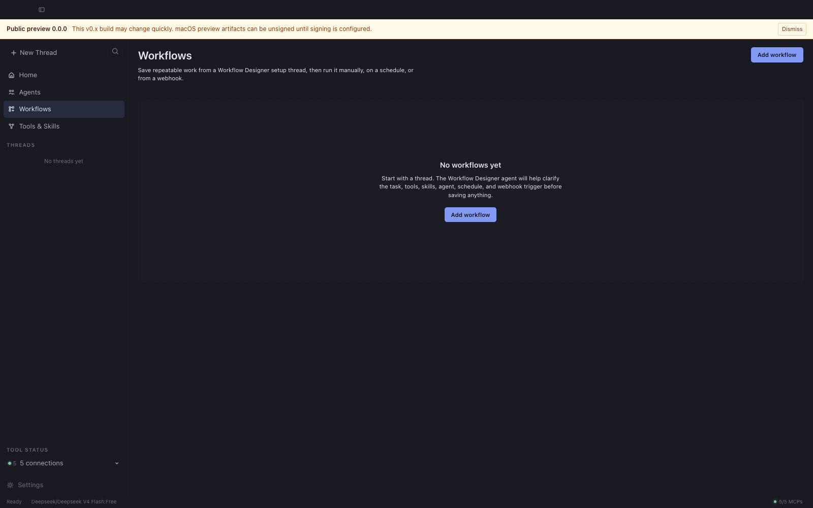

# Open Cowork

<div align="center">

[](LICENSE)
[](.nvmrc)
[](https://pnpm.io/)
[](https://joe-broadhead.github.io/open-cowork/)
[](https://github.com/joe-broadhead/open-cowork/actions/workflows/ci.yml)
[](https://github.com/joe-broadhead/open-cowork/releases)

</div>
<pre>
   ____                        ______                         __
  / __ \____  ___  ____       / ____/___ _      ______  _____/ /__
 / / / / __ \/ _ \/ __ \     / /   / __ \ | /| / / __ \/ ___/ //_/
/ /_/ / /_/ /  __/ / / /    / /___/ /_/ / |/ |/ / /_/ / /   / , <
\____/ .___/\___/_/ /_/     \____/\____/|__/|__/\____/_/   /_/|_|
    /_/
             The desktop workspace for agentic work
</pre>

<div align="center">

**Open Cowork is a polished Electron workspace for OpenCode — built for sessions, agents, tools, skills, workflows, artifacts, and branded downstream distributions.**

> Public preview: the `v0.x` line is intentionally unsigned while Apple Developer validation is pending. Expect rapid iteration before `v1.0.0`; signed macOS builds are planned before broad distribution.

It brings the power of OpenCode into a desktop experience that developers love and less technical teams can actually use.

[Docs](https://joe-broadhead.github.io/open-cowork/) • [Getting Started](docs/getting-started.md) • [Workflows](docs/workflows.md) • [Configuration](docs/configuration.md) • [Open Cowork Cloud](docs/open-cowork-cloud.md) • [Packaging & Migration](docs/oss-packaging-migration.md) • [Downstream](docs/downstream.md) • [Roadmap](docs/roadmap.md)

</div>

---

## What is Open Cowork?

OpenCode runs the work.

Open Cowork gives that work a home.

It turns OpenCode into a desktop-native AI workspace where developers and teams can manage chat sessions, agents, tools, skills, workflows, approvals, artifacts, and distributions from one clean interface.

Use it as a personal OpenCode cockpit, an internal AI workbench for your company, or the foundation for a branded downstream desktop product.

## Built on OpenCode

Open Cowork exists because [OpenCode](https://github.com/anomalyco/opencode) already does the hard part brilliantly.

OpenCode is the open source AI coding agent that powers execution: models, sessions, tools, context, and agentic coding workflows.

Open Cowork is an independent project built on top of OpenCode. It is not built by, sponsored by, or affiliated with the OpenCode team.

Open Cowork is the desktop product layer around it.

It makes OpenCode easier to adopt across real teams by giving people a polished interface, safer defaults, managed tools, reusable skills, and repeatable workflows that non-terminal-native users can understand and trust.

In other words:

**OpenCode is the engine. Open Cowork is the cockpit.**

## Product surfaces and sync contract

Open Cowork is organized around three surfaces on the same OpenCode boundary:

- **Desktop** can run a Local workspace with the current private-on-device
  behavior, or connect to a Cloud workspace.
- **Cloud workspace** is the shared control plane. Desktop, web, and gateway
  clients see the same cloud threads because they read and write the same
  tenant-scoped sessions, events, projections, artifacts, workflows, settings,
  and policy verdicts.
- **Gateway** is a headless client for Telegram, Slack, email, webhooks, and
  similar channels. It routes channel messages to cloud sessions; it does not
  spawn OpenCode or own a second runtime.

Local threads stay local. Open Cowork does not upload local projects, local
stdio MCPs, machine runtime config, provider keys, or local-only artifacts just
because a user connects a cloud org. Cloud-safe actions are explicit, policy
gated, and reported through the workspace support matrix.

The public product names, OCI image names, Gateway mode split, and migration
path from the historical `opencode-agent-gateway` prototype are documented in
[OSS Packaging and Gateway Migration](docs/oss-packaging-migration.md).

## Why it exists

AI coding agents are powerful.

But most teams cannot scale them from a terminal alone.

Real work needs more than a prompt box. It needs sessions, context, permissions, tools, skills, durable runs, sandboxes, packaging, and docs. It needs a place where people can see what the agent is doing, approve what matters, and turn repeatable work into saved workflows.

Open Cowork gives OpenCode that product layer.

It helps technical users move faster, while making agentic workflows accessible to product managers, analysts, operators, support teams, and other less technical users who need the outcome — not the terminal ceremony.

## Highlights

- **Desktop-native OpenCode workspace**
  Chat, sessions, approvals, tools, and sub-agents in one focused app.

- **Agent orchestration that feels visible**
  See delegation, tool calls, outputs, and review points directly in the transcript.

- **Tools, skills, and agents in one place**
  Manage built-ins and user-added MCPs, OpenCode skills, and custom agents from the UI.

- **Project and sandbox workflows**
  Use project threads for real filesystem work, or sandbox threads for private Cowork-managed artifacts.

- **Thread-native workflows**
  Create repeatable work by talking to Workflow Designer, then run it manually, on a schedule, or from a webhook.

- **Artifact-first experience**
  Keep generated files, outputs, and workspace artifacts organized instead of buried in chat.

- **Downstream-ready distribution**
  Configure branding, providers, defaults, bundled tools, bundled skills, docs, and release workflows.

- **Provider-neutral cloud shape**
  Run Open Cowork Cloud as all-in-one, web, worker, or scheduler roles on Docker or Helm/Kubernetes. The public repo currently claims `local-self-host-beta`; hosted/private-beta claims require private operations evidence from the target environment.

- **Production-grade gates**
  CI, CodeQL, Cloud Web browser smoke, release actor/check verification, protected publish environments, docs, audits, checksums, SBOMs, and provenance support.

## Screenshots

| Home | Chat | Agents |
|:---:|:---:|:---:|
|  |  |  |
| Composer-first landing surface with @-agent pills. | Sub-agent delegation through `@`-mentions in chat. | Built-in + custom agents in one composable grid. |

| Tools & Skills | Workflows | Settings |
|:---:|:---:|:---:|
|  |  |  |
| Tools, skills, and MCPs with per-source visibility. | Repeatable work created from setup threads, then run manually, on schedules, or from webhooks. | Provider, model, permission, and storage controls. |

> Screenshots are regenerated by `pnpm screenshots` — see
> [`docs/assets/README.md`](docs/assets/README.md) for capture guidelines.

## Built for

Open Cowork is designed for:

- **Individual developers** who want a better desktop workspace for OpenCode.
- **Engineering teams** that want a configurable internal AI workbench.
- **Less technical teams** that need guided access to approved agents, tools, skills, and workflows.
- **Platform teams** that want to package safe defaults, branded workflows, and curated capabilities.
- **Downstream distributors** that want branded builds, documentation, and release flows on top of OpenCode.

## Core features

- Desktop chat workspace for OpenCode sessions.
- Project threads for real filesystem work.
- Sandbox threads for private Cowork-managed workspaces.
- Built-in and user-added tools powered by MCP, presented in the UI as friendly team capabilities.
- Built-in and user-added OpenCode skill bundles.
- Custom agents with curated tool and skill access.
- Agent delegation from chat using `@agent`.
- Workflows created from Workflow Designer setup threads, with manual, scheduled, and webhook runs.
- Artifact storage and workspace management.
- Config-driven branding, auth mode, providers, and default capabilities.
- Packaged macOS, Linux, and Windows desktop builds.

## Supported platforms

- macOS 11+
  - `arm64`
  - `x64`
  - `.zip`
  - `.dmg`

- Linux `x64`
  - `.AppImage`
  - `.deb`

- Windows `x64`
  - `.exe` (NSIS installer)

## Install

Release artifacts are published on [GitHub Releases](https://github.com/joe-broadhead/open-cowork/releases) when a tagged build completes.
Signed macOS builds can check and install updates from Settings; downstream
builders can configure private update release sources such as generic HTTPS
feeds or Google Cloud Storage without exposing release credentials to the
renderer.

> **Important**
> The `v0.x` public preview is intentionally unsigned while Apple Developer validation is pending. The release workflow can publish unsigned `v0.x` artifacts only when the explicit preview override is enabled; macOS will warn on first launch in that mode.
>
> To open the preview on macOS: right-click **Open Cowork.app**, choose **Open**, then choose **Open** again in the Gatekeeper dialog. See Apple's [Gatekeeper guidance](https://support.apple.com/HT202491) for details, or build locally.

## Quick start

1. Download a release for your platform, or run from source.
2. Launch **Open Cowork**.
3. Complete first-run setup by choosing a provider, model, and whether the managed runtime can reuse standard developer config such as Git, SSH, cloud, Docker, and Kubernetes settings.
4. Connect a provider: OpenRouter API key, or OpenAI/Codex via ChatGPT Plus/Pro or API key.
5. Start a thread:
   - **Project thread** for real filesystem work in a chosen directory.
   - **Sandbox thread** for private Cowork-managed workspaces and artifacts.
6. Use `@agent` in the composer to invoke a sub-agent directly, or let the primary orchestrator delegate.
7. Use **Workflows** for repeatable work that should be saved from a Workflow Designer setup thread and run manually, on a schedule, or from a webhook.

## Local development

### Requirements

- Node `>=22.12`
- pnpm `>=10`
- Python `>=3.11` for docs builds

### Verify Node and install pnpm via Corepack

```bash
node -v
# Expected: v22.12.0 or newer

corepack enable
corepack prepare pnpm@10.32.1 --activate
pnpm -v
```

### Install dependencies

```bash
pnpm install
```

### Run the desktop app

```bash
pnpm dev
```

`pnpm dev` builds the workspace packages, design tokens, and bundled MCP
servers before launching the desktop app, so fresh clones do not need a
separate bootstrap command.

### Core validation

```bash
pnpm test
pnpm test:e2e
pnpm typecheck
pnpm lint
pnpm perf:check
```

Packaged-app smoke tests require a local packaged build first:

```bash
pnpm --dir apps/desktop dist:ci:mac
OPEN_COWORK_PACKAGED_EXECUTABLE="$(node scripts/find-macos-packaged-executable.mjs)" pnpm test:e2e:packaged
```

### Package desktop builds locally

```bash
pnpm --dir apps/desktop dist:ci:mac
pnpm --dir apps/desktop dist:ci:linux
```

### Build the docs locally

```bash
pnpm docs:build
```

## Documentation

Project docs live in [`docs/`](docs/) and are built with MkDocs Material.

The GitHub Pages publish URL follows the current repository name, so the workflow derives it at build time instead of hard-coding a pre-rename path.

Start here:

- [Getting Started](docs/getting-started.md)
- [Desktop App Guide](docs/desktop-app.md)
- [Glossary](docs/glossary.md)
- [Threads](docs/threads.md)
- [Workflows](docs/workflows.md)
- [Workflow Recipes](docs/workflow-recipes.md)
- [Agent Authoring](docs/agent-authoring.md)
- [Skills & MCPs](docs/skills-and-mcps.md)
- [Custom MCPs](docs/custom-mcps.md)
- [Configuration](docs/configuration.md)
- [Downstream Customization](docs/downstream.md)
- [Development Environment](docs/development-environment.md)
- [Performance](docs/performance.md)
- [Security Model](docs/security-model.md)
- [Telemetry and Privacy](docs/privacy.md)
- [Architecture](docs/architecture.md)
- [Packaging and Releases](docs/packaging-and-releases.md)
- [Release Checklist](docs/release-checklist.md)
- [Versioning and Cadence](docs/versioning.md)
- [Troubleshooting](docs/troubleshooting.md)
- [Roadmap](docs/roadmap.md)
- [First Contribution](docs/first-contribution.md)
- [Contributing](CONTRIBUTING.md)
- [Changelog](CHANGELOG.md)

## Repository layout

```text
apps/desktop                       Electron shell — main process, preload bridge, and packaging — that loads the packages/app renderer; also hosts runtime composition and the cloud control plane
apps/gateway                       Cloud Channel Gateway daemon
apps/standalone-gateway            Standalone Team Gateway appliance
packages/app                       Unified renderer UI — runs on Electron (real IPC) and in the browser via the CoworkAPI shim (cloud)
packages/ui                        Shared design-system primitives
packages/cloud-server              Cloud HTTP/SSE server
packages/runtime-host              OpenCode runtime host/supervisor
packages/shared                    Shared types, IPC contracts, and cloud projection contracts
packages/cloud-client              Workspace Cloud HTTP/SSE client package
packages/gateway-*                 Provider-neutral gateway contracts, testing helpers, and provider adapters
mcps/*                             Bundled Open Cowork MCP servers
skills                             Bundled OpenCode skill bundles
docker, helm, deploy               Cloud, Gateway, release, and launch-readiness deployment artifacts
docs                               MkDocs documentation source
tests                              Repo-level Node test suite
```

## Release automation

The repo includes GitHub Actions for:

- CI validation
- documentation deployment to GitHub Pages
- tagged release builds for macOS and Linux artifacts
- monthly maintenance and dependency-drift checks
- release preflight verification for allowed actors, required green checks, signed tags, and protected `release-publish` environments before publishing artifacts or images

See [Packaging and Releases](docs/packaging-and-releases.md) for the workflow model and release gates.

## Contributing

Contributions are welcome.

See [CONTRIBUTING.md](CONTRIBUTING.md).

`AGENTS.md` is for coding agents and automated contributor tooling working in
this repository; human contributors should start with `CONTRIBUTING.md`.

## Security

See [SECURITY.md](SECURITY.md).

## Support

See [SUPPORT.md](SUPPORT.md).

## License

[MIT](LICENSE). See [THIRD_PARTY_NOTICES.md](THIRD_PARTY_NOTICES.md) for bundled production dependencies.
