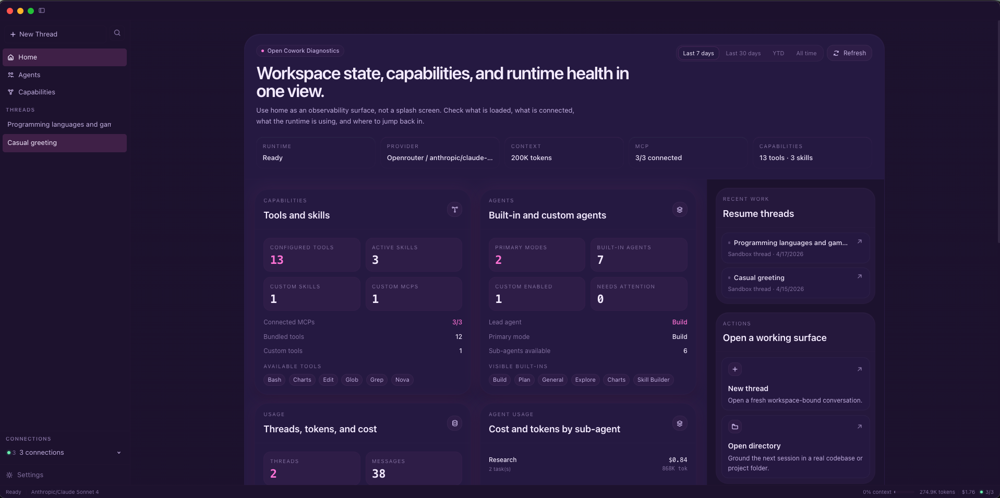
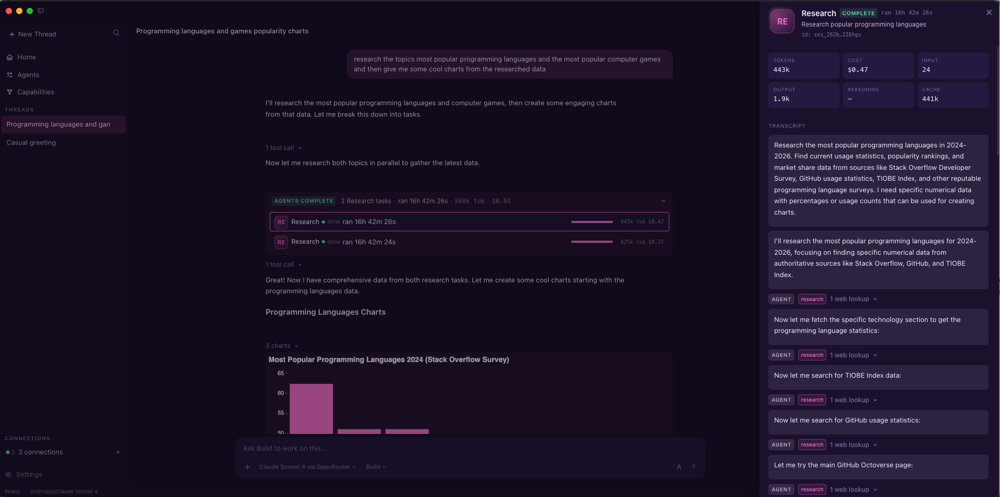
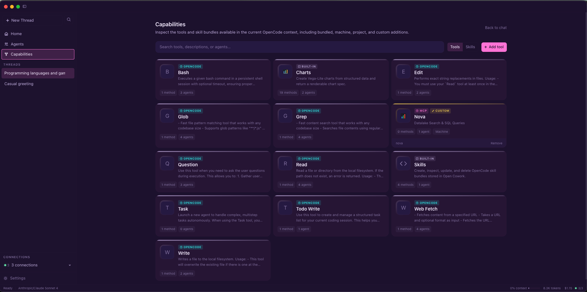

# Open Cowork

> The desktop workspace for OpenCode.

[](https://github.com/joe-broadhead/open-cowork/actions/workflows/ci.yml)
[](package.json)
[](https://github.com/joe-broadhead/open-cowork/releases)
[](https://joe-broadhead.github.io/open-cowork/)
[](https://github.com/joe-broadhead/open-cowork/releases)
[](.nvmrc)
[](LICENSE)

Open Cowork is an Electron desktop app built on top of OpenCode. It gives
OpenCode a polished desktop surface for chat, sessions, agents, MCPs, skills,
artifacts, packaging, and downstream customization without turning Cowork into
a second runtime.

OpenCode owns execution. Open Cowork owns product composition.

**Quick links:** [Docs](https://joe-broadhead.github.io/open-cowork/) · [Getting Started](docs/getting-started.md) · [Automations](docs/automations.md) · [Releases](https://github.com/joe-broadhead/open-cowork/releases) · [Downstream Customization](docs/downstream.md) · [Operations and CI](docs/operations.md)

> **Forking for an internal distribution?** `docs/downstream.md` covers
> rebranding, bundling your own MCPs/skills/agents, and customizing i18n with
> a config-driven overlay. `docs/versioning.md` and `docs/operations.md`
> document the release and maintenance model around it.

## Why Open Cowork

- Desktop-native workspace for OpenCode sessions, approvals, tools, and agents.
- Clear project-thread vs sandbox-thread model so generated work stays tidy.
- First-class MCP, skill, and custom-agent management from the app itself.
- Review-first automations with schedules, heartbeat supervision, retries, and in-app delivery.
- Downstream-ready packaging and branding model without source-level forking.
- Production-minded repo gates: CI, smoke tests, docs deploy, checksums, SBOMs, and provenance.

## What you get

- Desktop chat workspace for OpenCode sessions
- Built-in and user-added MCP support
- Built-in and user-added OpenCode skill bundles
- Built-in and user-added agents
- Always-on automations with inbox, work items, runs, and deliveries
- Project threads and private sandbox threads
- Artifact-first sandbox UX with storage management
- Config-driven branding, auth mode, providers, and default capabilities
- Packaged macOS and Linux desktop builds

## Screenshots

| Pulse | Chat | Capabilities |
|:---:|:---:|:---:|
|  |  |  |
| Runtime health, usage, and workspace status at a glance. | Live tool delegation and sub-agent execution in one transcript. | Built-in and custom MCPs, skills, and tool visibility in one place. |

> Asset capture guidelines live in [`docs/assets/README.md`](docs/assets/README.md).

## Who it is for

- Individual developers who want a desktop OpenCode workspace.
- Teams that want a configurable internal AI workbench.
- Downstream distributors that want branded packaging, docs, and operations on top of OpenCode.

## Supported platforms

- macOS 11+ (`arm64` + `x64`) via `.zip` and `.dmg`
- Linux `x64` via `.AppImage` and `.deb`
- Windows is not currently supported

## Install

Prebuilt binaries are published on [GitHub Releases](https://github.com/joe-broadhead/open-cowork/releases).

> **Important:** public releases should be signed and notarized. The release
> workflow only permits unsigned macOS artifacts when the explicit preview
> override is enabled, and macOS will warn on first launch in that mode. See
> Apple's [Gatekeeper guidance](https://support.apple.com/HT202491) for
> opening an unsigned preview build, or build locally.

## Quick start

1. Download a release for your platform, or run from source.
2. Launch **Open Cowork**.
3. Complete first-run setup by choosing a provider and model.
4. Paste an [OpenRouter API key](https://openrouter.ai/keys), or ship your own provider configuration downstream.
5. Start a thread:
   - **Project thread** for real filesystem work in a chosen directory
   - **Sandbox thread** for private Cowork-managed workspaces and artifacts
6. Use `@agent` in the composer to invoke a sub-agent directly, or let the
   primary orchestrator delegate.
7. Use **Automations** when you want recurring or managed work to run through
   a review-first schedule + inbox flow instead of a one-off thread.

## Local development

Requirements:

- Node `>=22.12`
- pnpm `>=10`
- Python `>=3.11` for docs builds

Install dependencies:

```bash
pnpm install
```

Core validation:

```bash
pnpm test
pnpm test:e2e
pnpm --dir apps/desktop dist:ci:mac
OPEN_COWORK_PACKAGED_EXECUTABLE="$(node scripts/find-macos-packaged-executable.mjs)" pnpm test:e2e:packaged
pnpm typecheck
pnpm lint
pnpm perf:check
```

Run the desktop app in development:

```bash
pnpm dev
```

Package desktop builds locally:

```bash
pnpm --dir apps/desktop dist:ci:mac
pnpm --dir apps/desktop dist:ci:linux
```

Build the documentation site locally:

```bash
python -m pip install -r docs/requirements.txt
mkdocs build --strict
```

## Documentation

Project docs live in [`docs/`](docs/) and are built with MkDocs Material.
The GitHub Pages publish URL follows the current repository name, so the
workflow derives it at build time instead of hard-coding a pre-rename path.

Start here:

- [Getting Started](docs/getting-started.md)
- [Automations](docs/automations.md)
- [Configuration](docs/configuration.md)
- [Downstream Customization](docs/downstream.md)
- [Desktop App Guide](docs/desktop-app.md)
- [Architecture](docs/architecture.md)
- [Operations and CI](docs/operations.md)
- [Packaging and Releases](docs/packaging-and-releases.md)
- [Release Checklist](docs/release-checklist.md)
- [Roadmap](docs/roadmap.md)
- [Contributing](CONTRIBUTING.md)
- [Changelog](CHANGELOG.md)

## Repository layout

- `apps/desktop` — Electron main process, preload bridge, renderer UI, packaging
- `packages/shared` — shared types, IPC contracts, and shortcuts
- `mcps/charts` — bundled charts MCP
- `mcps/skills` — bundled skill bundle MCP
- `skills` — bundled OpenCode skill bundles
- `docs` — MkDocs documentation source
- `tests` — repo-level Node test suite

## Release automation

The repo includes GitHub Actions for:

- CI validation
- documentation deployment to GitHub Pages
- tagged release builds for macOS and Linux artifacts
- monthly maintenance and dependency-drift checks

See [docs/packaging-and-releases.md](docs/packaging-and-releases.md) for the
workflow model and [docs/operations.md](docs/operations.md) for the operator
view.

## Contributing

See [CONTRIBUTING.md](CONTRIBUTING.md).

## Security

See [SECURITY.md](SECURITY.md).

## Support

See [SUPPORT.md](SUPPORT.md).

## License

[MIT](LICENSE)
