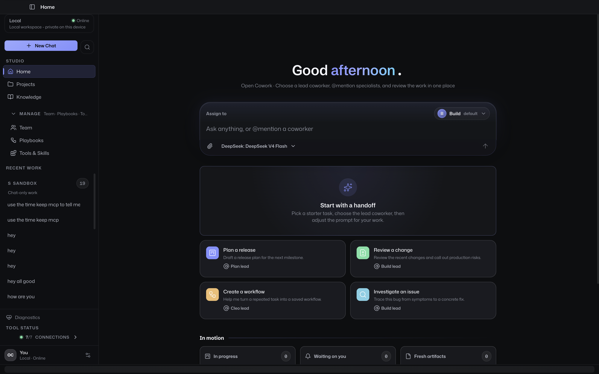
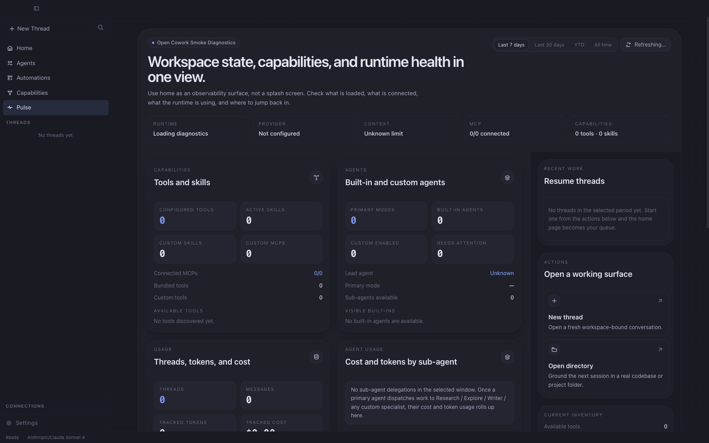
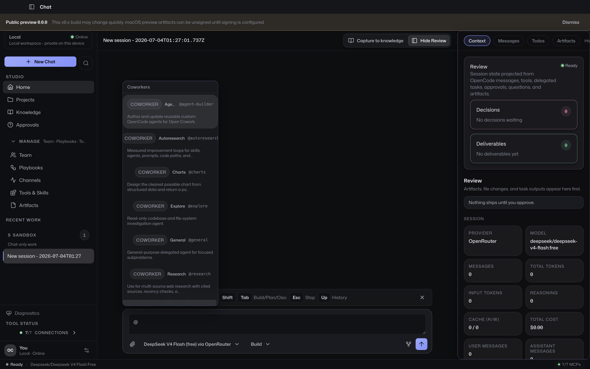
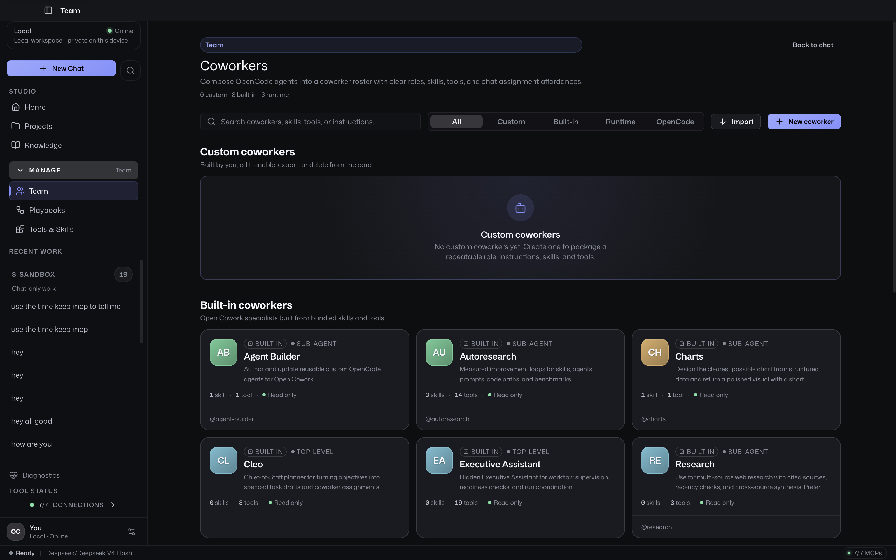
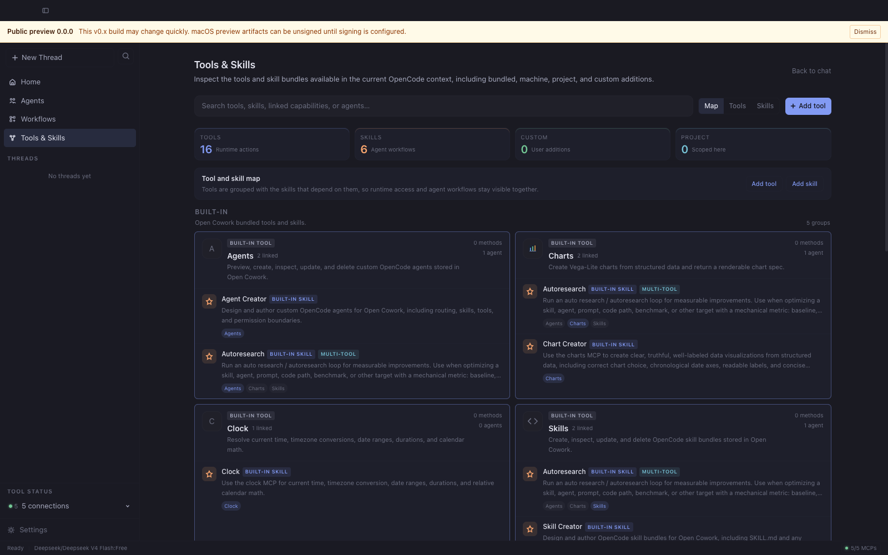
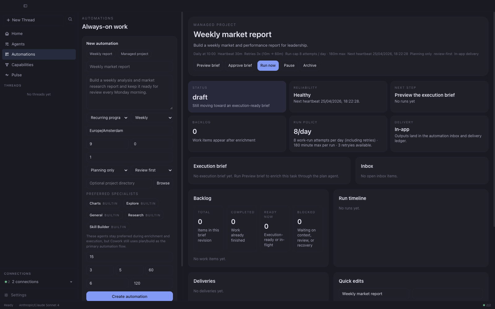

# Open Cowork

<div align="center">

[](LICENSE)
[](.nvmrc)
[](https://pnpm.io/)
[](https://joe-broadhead.github.io/open-cowork/)
[](https://github.com/joe-broadhead/open-cowork/actions/workflows/ci.yml)
[](https://github.com/joe-broadhead/open-cowork/releases)

</div>
<pre>
   ____                        ______                         __
  / __ \____  ___  ____       / ____/___ _      ______  _____/ /__
 / / / / __ \/ _ \/ __ \     / /   / __ \ | /| / / __ \/ ___/ //_/
/ /_/ / /_/ /  __/ / / /    / /___/ /_/ / |/ |/ / /_/ / /   / , <
\____/ .___/\___/_/ /_/     \____/\____/|__/|__/\____/_/   /_/|_|
    /_/
             The desktop workspace for agentic work
</pre>

<div align="center">

**Open Cowork is a polished Electron workspace for OpenCode — built for sessions, agents, tools, skills, automations, artifacts, and branded downstream distributions.**

> Public preview: `v0.0.0` is intentionally unsigned while Apple Developer validation is pending. Expect rapid iteration before `v1.0.0`; signed macOS builds are planned from `v0.0.1`.

It brings the power of OpenCode into a desktop experience that developers love and less technical teams can actually use.

[Docs](https://joe-broadhead.github.io/open-cowork/) • [Getting Started](docs/getting-started.md) • [Automations](docs/automations.md) • [Configuration](docs/configuration.md) • [Downstream](docs/downstream.md) • [Operations](docs/operations.md)

</div>

---

## What is Open Cowork?

OpenCode runs the work.

Open Cowork gives that work a home.

It turns OpenCode into a desktop-native AI workspace where developers and teams can manage chat sessions, agents, tools, skills, automations, approvals, artifacts, and distributions from one clean interface.

Use it as a personal OpenCode cockpit, an internal AI workbench for your company, or the foundation for a branded downstream desktop product.

## Built on OpenCode

Open Cowork exists because [OpenCode](https://github.com/anomalyco/opencode) already does the hard part brilliantly.

OpenCode is the open source AI coding agent that powers execution: models, sessions, tools, context, and agentic coding workflows.

Open Cowork is an independent project built on top of OpenCode. It is not built by, sponsored by, or affiliated with the OpenCode team.

Open Cowork is the desktop product layer around it.

It makes OpenCode easier to adopt across real teams by giving people a polished interface, safer defaults, clearer workflows, review points, managed tools, reusable skills, and automations that non-terminal-native users can understand and trust.

In other words:

**OpenCode is the engine. Open Cowork is the cockpit.**

## Why it exists

AI coding agents are powerful.

But most teams cannot scale them from a terminal alone.

Real work needs more than a prompt box. It needs sessions, context, permissions, tools, skills, review flows, durable runs, sandboxes, packaging, docs, and operations. It needs a place where people can see what the agent is doing, approve what matters, and turn repeatable work into managed workflows.

Open Cowork gives OpenCode that product layer.

It helps technical users move faster, while making agentic workflows accessible to product managers, analysts, operators, support teams, and other less technical users who need the outcome — not the terminal ceremony.

## Highlights

- **Desktop-native OpenCode workspace**
  Chat, sessions, approvals, tools, and sub-agents in one focused app.

- **Agent orchestration that feels visible**
  See delegation, tool calls, outputs, and review points directly in the transcript.

- **Tools, skills, and agents in one place**
  Manage built-ins and user-added MCPs, OpenCode skills, and custom agents from the UI.

- **Project and sandbox workflows**
  Use project threads for real filesystem work, or sandbox threads for private Cowork-managed artifacts.

- **Review-first automations**
  Schedule recurring work with heartbeat supervision, retries, inbox delivery, and durable run history.

- **Artifact-first experience**
  Keep generated files, outputs, and workspace artifacts organized instead of buried in chat.

- **Downstream-ready distribution**
  Configure branding, providers, defaults, bundled tools, bundled skills, docs, and release workflows.

- **Production-grade gates**
  CI, CodeQL, smoke tests, docs, audits, checksums, SBOMs, and provenance support.

## Screenshots

| Home | Pulse | Chat |
|:---:|:---:|:---:|
|  |  |  |
| Composer-first landing surface with @-agent pills. | Runtime, usage, agents, and capabilities at a glance. | Sub-agent delegation through `@`-mentions in chat. |

| Agents | Capabilities | Automations |
|:---:|:---:|:---:|
|  |  |  |
| Built-in + custom agents in one composable grid. | Tools, skills, and MCPs with per-source visibility. | Durable scheduling, runs, and delivery around OpenCode. |

> Screenshots are regenerated by `pnpm screenshots` — see
> [`docs/assets/README.md`](docs/assets/README.md) for capture guidelines.

## Built for

Open Cowork is designed for:

- **Individual developers** who want a better desktop workspace for OpenCode.
- **Engineering teams** that want a configurable internal AI workbench.
- **Less technical teams** that need guided access to approved agents, tools, skills, and automations.
- **Platform teams** that want to package safe defaults, branded workflows, and curated capabilities.
- **Downstream distributors** that want branded builds, documentation, operations, and release flows on top of OpenCode.

## Core features

- Desktop chat workspace for OpenCode sessions.
- Project threads for real filesystem work.
- Sandbox threads for private Cowork-managed workspaces.
- Built-in and user-added tools powered by MCP, presented in the UI as friendly team capabilities.
- Built-in and user-added OpenCode skill bundles.
- Custom agents with curated tool and skill access.
- Agent delegation from chat using `@agent`.
- Always-on automations with inbox, work items, runs, and deliveries.
- Artifact storage and workspace management.
- Config-driven branding, auth mode, providers, and default capabilities.
- Packaged macOS and Linux desktop builds.

## Supported platforms

- macOS 11+
  - `arm64`
  - `x64`
  - `.zip`
  - `.dmg`

- Linux `x64`
  - `.AppImage`
  - `.deb`

Windows is not currently supported.

## Install

Prebuilt binaries are published on [GitHub Releases](https://github.com/joe-broadhead/open-cowork/releases).

> **Important**
> The `v0.0.0` public preview is intentionally unsigned while Apple Developer validation is pending. The release workflow can publish unsigned `v0.x` artifacts only when the explicit preview override is enabled; macOS will warn on first launch in that mode.
>
> To open the preview on macOS: right-click **Open Cowork.app**, choose **Open**, then choose **Open** again in the Gatekeeper dialog. See Apple's [Gatekeeper guidance](https://support.apple.com/HT202491) for details, or build locally.

## Quick start

1. Download a release for your platform, or run from source.
2. Launch **Open Cowork**.
3. Complete first-run setup by choosing a provider and model.
4. Connect a provider: OpenRouter API key, or OpenAI/Codex via ChatGPT Plus/Pro or API key.
5. Start a thread:
   - **Project thread** for real filesystem work in a chosen directory.
   - **Sandbox thread** for private Cowork-managed workspaces and artifacts.
6. Use `@agent` in the composer to invoke a sub-agent directly, or let the primary orchestrator delegate.
7. Use **Automations** for recurring or managed work that should run through a review-first schedule and inbox flow instead of a one-off thread.

## Local development

### Requirements

- Node `>=22.12`
- pnpm `>=10`
- Python `>=3.11` for docs builds

### Verify Node and install pnpm via Corepack

```bash
node -v
# Expected: v22.12.0 or newer

corepack enable
corepack prepare pnpm@10.32.1 --activate
pnpm -v
```

### Install dependencies

```bash
pnpm install
```

### Run the desktop app

```bash
pnpm dev
```

`pnpm dev` builds the shared workspace package and bundled MCP servers
before launching the desktop app, so fresh clones do not need a separate
bootstrap command.

### Core validation

```bash
pnpm test
pnpm test:e2e
pnpm --dir apps/desktop dist:ci:mac
OPEN_COWORK_PACKAGED_EXECUTABLE="$(node scripts/find-macos-packaged-executable.mjs)" pnpm test:e2e:packaged
pnpm typecheck
pnpm lint
pnpm perf:check
```

### Package desktop builds locally

```bash
pnpm --dir apps/desktop dist:ci:mac
pnpm --dir apps/desktop dist:ci:linux
```

### Build the docs locally

```bash
python -m pip install -r docs/requirements.txt
mkdocs build --strict
```

## Documentation

Project docs live in [`docs/`](docs/) and are built with MkDocs Material.

The GitHub Pages publish URL follows the current repository name, so the workflow derives it at build time instead of hard-coding a pre-rename path.

Start here:

- [Getting Started](docs/getting-started.md)
- [Automations](docs/automations.md)
- [Configuration](docs/configuration.md)
- [Downstream Customization](docs/downstream.md)
- [Desktop App Guide](docs/desktop-app.md)
- [Architecture](docs/architecture.md)
- [Operations and CI](docs/operations.md)
- [Packaging and Releases](docs/packaging-and-releases.md)
- [Release Checklist](docs/release-checklist.md)
- [Roadmap](docs/roadmap.md)
- [Contributing](CONTRIBUTING.md)
- [Changelog](CHANGELOG.md)

## Repository layout

```text
apps/desktop     Electron main process, preload bridge, renderer UI, packaging
packages/shared  Shared types, IPC contracts, and shortcuts
mcps/charts      Bundled charts MCP
mcps/skills      Bundled skill bundle MCP
skills           Bundled OpenCode skill bundles
docs             MkDocs documentation source
tests            Repo-level Node test suite
```

## Release automation

The repo includes GitHub Actions for:

- CI validation
- documentation deployment to GitHub Pages
- tagged release builds for macOS and Linux artifacts
- monthly maintenance and dependency-drift checks

See [Packaging and Releases](docs/packaging-and-releases.md) for the workflow model and [Operations and CI](docs/operations.md) for the operator view.

## Contributing

Contributions are welcome.

See [CONTRIBUTING.md](CONTRIBUTING.md).

`AGENTS.md` is for coding agents and automated contributor tooling working in
this repository; human contributors should start with `CONTRIBUTING.md`.

## Security

See [SECURITY.md](SECURITY.md).

## Support

See [SUPPORT.md](SUPPORT.md).

## License

[MIT](LICENSE). See [THIRD_PARTY_NOTICES.md](THIRD_PARTY_NOTICES.md) for bundled production dependencies.
