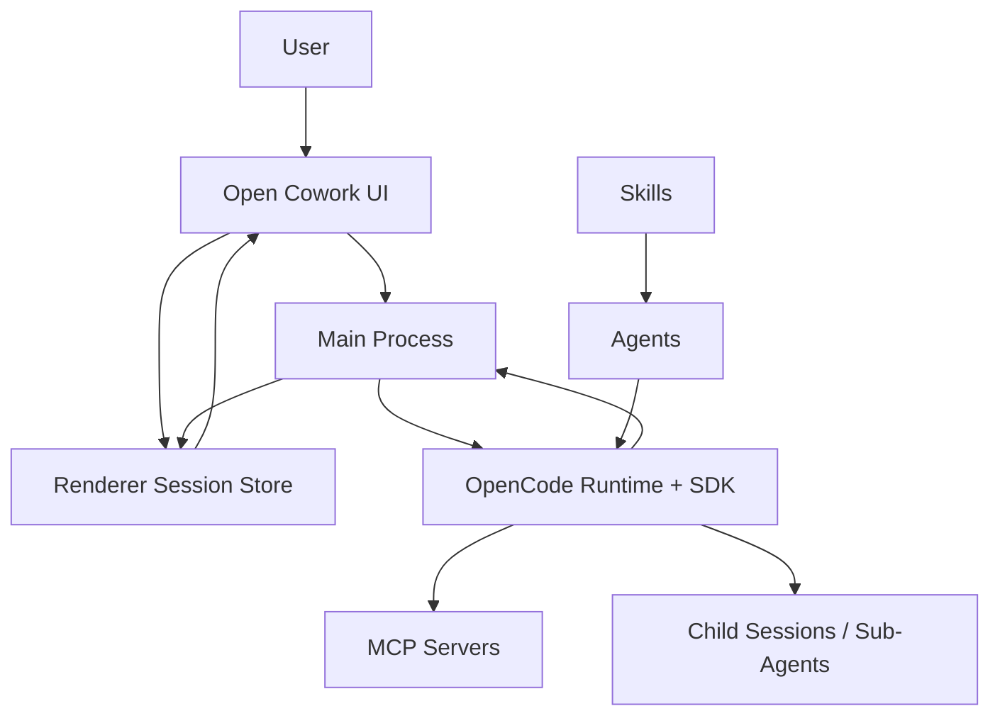

# Open Cowork Architecture

## Purpose

Open Cowork is a product layer on top of OpenCode.

OpenCode owns execution:
- agents
- sessions and child sessions
- permissions and approvals
- MCP execution
- compaction
- streaming events

Open Cowork owns product composition:
- configuration and branding
- integration bundle wiring
- built-in and custom agent definitions
- deterministic team policy for explicit multi-branch work
- desktop UI and session projection

The design goal is to keep Open Cowork thin. It should compose OpenCode well rather than acting like a second runtime.

## Core Concepts

### MCPs
MCPs provide tools.

Open Cowork can expose MCPs from:
- config-defined integration bundles
- user-added custom MCPs
- the bundled Charts MCP

An integration bundle can define:
- one or more MCP servers
- optional bundled skills
- UI metadata
- credential requirements
- agent access profiles

### Skills
Skills teach agents how to use tools well.

They are reusable instruction packs, not execution engines. Skills can come from:
- integration bundles
- user-added custom skills
- downstream distributions that ship extra skill directories

### Agents
Agents package role, instructions, and permissions.

The generic upstream built-ins are:
- `assistant`
- `plan`
- `research`
- `explore`

Users can also create custom sub-agents. These compile into native OpenCode agent config at runtime.

### Teams
A team is a coordinated set of child sessions working under one root thread.

In the normal case, OpenCode can delegate through native task permissions.

For explicit multi-branch work, Open Cowork can use a narrow deterministic team path:
- create child sessions under the root session
- run branch work concurrently
- synthesize compact branch results
- hand a short final answer back into the root thread

This is product policy on top of OpenCode primitives. It is not a separate runtime.

## Mental Model

Short version:
- MCPs provide capability.
- Skills provide method.
- Agents provide role and permission boundaries.
- Teams provide concurrency.

## Design Principles

1. OpenCode owns execution.
2. Open Cowork owns composition, policy, and UI.
3. The session tree is the source of truth.
4. Permissions are runtime controls, not prompt-only suggestions.
5. Real OpenCode todos and Open Cowork execution progress are different concepts.
6. Parent threads should stay small; large branch context should not be pushed back into the root session.
7. Busy threads must render optimistically and reconcile from history without clobbering live state.
8. Background threads should stay lightweight so many teams can run at once.

## Layered Architecture

### 1. Configuration Layer
Defines branding, providers, integrations, and default permissions.

The config-first model lets downstream distributions customize the app without forking the runtime architecture.

Sources:
- [open-cowork.config.json](/Users/joe/Documents/Joe/Github/cowork/open-cowork.config.json:1)
- [open-cowork.config.schema.json](/Users/joe/Documents/Joe/Github/cowork/open-cowork.config.schema.json:1)
- [apps/desktop/src/main/config-loader.ts](/Users/joe/Documents/Joe/Github/cowork/apps/desktop/src/main/config-loader.ts:1)

### 2. Integration Layer
Defines the product-facing tool surface.

Enabled integrations determine which MCPs and bundled skills enter the runtime.

Sources:
- [apps/desktop/src/main/integration-bundles.ts](/Users/joe/Documents/Joe/Github/cowork/apps/desktop/src/main/integration-bundles.ts:1)
- [apps/desktop/src/main/plugin-manager.ts](/Users/joe/Documents/Joe/Github/cowork/apps/desktop/src/main/plugin-manager.ts:1)

### 3. Runtime Composition Layer
Builds the OpenCode runtime config dynamically.

Responsibilities:
- choose provider and model
- configure compaction
- enable MCPs
- inject credentials, headers, and environment variables
- copy enabled bundled skills into the runtime sandbox
- compile built-in and custom agents into `config.agent`

Source:
- [apps/desktop/src/main/runtime.ts](/Users/joe/Documents/Joe/Github/cowork/apps/desktop/src/main/runtime.ts:1)

### 4. Agent Policy Layer
Defines how built-in agents are meant to behave.

This layer contains:
- built-in prompts
- permission maps
- task delegation rules
- deterministic team limits

Sources:
- [apps/desktop/src/main/agent-config.ts](/Users/joe/Documents/Joe/Github/cowork/apps/desktop/src/main/agent-config.ts:1)
- [apps/desktop/src/main/team-policy.js](/Users/joe/Documents/Joe/Github/cowork/apps/desktop/src/main/team-policy.js:1)

### 5. Orchestration Layer
Uses native OpenCode sessions and child sessions to execute work.

Normal work:
- root session prompt
- OpenCode may delegate using native sub-agent behavior

Deterministic team work:
- narrow Open Cowork planner path for explicit multi-branch requests
- child sessions are still native OpenCode child sessions

Source:
- [apps/desktop/src/main/team-orchestration.ts](/Users/joe/Documents/Joe/Github/cowork/apps/desktop/src/main/team-orchestration.ts:1)

### 6. Event Projection Layer
Projects OpenCode events into UI-safe session state.

Responsibilities:
- bind child sessions to task runs
- stream text and tool calls
- forward approvals
- preserve ordering
- reconcile history on reload or thread switch

Sources:
- [apps/desktop/src/main/events.ts](/Users/joe/Documents/Joe/Github/cowork/apps/desktop/src/main/events.ts:1)
- [apps/desktop/src/main/ipc-handlers.ts](/Users/joe/Documents/Joe/Github/cowork/apps/desktop/src/main/ipc-handlers.ts:1)
- [apps/desktop/src/renderer/hooks/useOpenCodeEvents.ts](/Users/joe/Documents/Joe/Github/cowork/apps/desktop/src/renderer/hooks/useOpenCodeEvents.ts:1)

### 7. UI State Layer
Keeps thread switching fast and background sessions lightweight.

Responsibilities:
- per-session state cache
- task-run state
- real todos
- derived execution plan
- optimistic busy state
- hydration guards

Sources:
- [apps/desktop/src/renderer/stores/session.ts](/Users/joe/Documents/Joe/Github/cowork/apps/desktop/src/renderer/stores/session.ts:1)
- [apps/desktop/src/renderer/helpers/loadSessionMessages.ts](/Users/joe/Documents/Joe/Github/cowork/apps/desktop/src/renderer/helpers/loadSessionMessages.ts:1)
- [apps/desktop/src/renderer/helpers/session-history.ts](/Users/joe/Documents/Joe/Github/cowork/apps/desktop/src/renderer/helpers/session-history.ts:1)

## How MCPs, Skills, Agents, and Teams Work Together

1. A provider model runs the main session through OpenCode.
2. MCPs provide the tool surface available to the runtime.
3. Skills teach agents how to use those tools well.
4. Agents package instructions and permission boundaries.
5. Teams use child sessions when work needs to branch in parallel.

This gives Open Cowork a clean layering:
- OpenCode executes
- Open Cowork composes and presents

## Todos vs Execution Plan

Open Cowork keeps two different kinds of progress state:

- `todos`
  - real OpenCode todo state from `todowrite` or `session.todo()`
- `executionPlan`
  - Open Cowork UI projection of deterministic multi-branch team progress

Execution-plan items must not be treated as real model todos.

## What OpenCode Owns vs What Open Cowork Owns

### OpenCode Owns
- session runtime
- child-session lifecycle
- approvals
- compaction
- MCP execution
- tool call semantics
- native todo state

### Open Cowork Owns
- configuration and branding
- integration composition
- built-in agent defaults
- custom agent packaging
- narrow deterministic team policy
- event projection and desktop UI

## Scaling Model

For many simultaneous threads and teams:
- the session tree remains the source of truth
- background threads stay lightweight
- child session detail is hydrated lazily
- ordered child transcript and tool rendering happens on demand
- Open Cowork should keep using OpenCode-native session APIs before adding custom orchestration layers

## Guiding Constraint

Open Cowork should not:
- build a second execution runtime
- simulate OpenCode todos
- push large raw branch context back into root threads
- replace OpenCode-native approvals or compaction with custom systems

If that boundary stays clean, Open Cowork can scale from a single useful assistant to many concurrent skilled agent teams without becoming an unmaintainable custom runtime.
