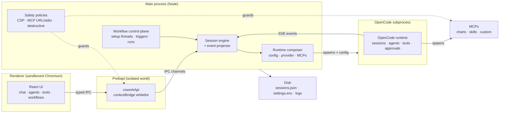

# Architecture

## First principle

Open Cowork is not a second runtime.

It is a desktop product layer built on top of OpenCode.

The clean architectural split is:

- **OpenCode owns execution**
- **Open Cowork owns composition, packaging, and UI**

## At a glance

The diagram captures the load-bearing boundaries: the renderer can only
talk to main through the preload's whitelist; main is the only process
that touches disk, spawns OpenCode, or applies safety policy; OpenCode
owns its own subprocess for sessions and MCP tool calls.

## OpenCode dependency

Open Cowork embeds the OpenCode SDK v2 API surface from the
`@opencode-ai/sdk` package. The pinned package version is tracked in
`apps/desktop/package.json`, with the exact installed version locked in
`pnpm-lock.yaml`. The packaged desktop app ships the OpenCode CLI
binary alongside the Electron bundle (see
`runtime-opencode-cli.ts`).

SDK upgrades can change:

- event shapes (consumed by `events.ts`,
  `event-runtime-handlers.ts`, `event-message-handlers.ts`)
- Config schema (consumed by `runtime-config-builder.ts` — now typed
  against the SDK's exported `Config` so drift surfaces at typecheck)
- client method signatures (consumed across the runtime layer)

When bumping the SDK, run `pnpm typecheck` first; anything that fails
is real drift, not a cosmetic update.

The detailed import allowlist, shared event contract, and SDK v2 upgrade
checklist live in [OpenCode SDK v2 Boundary](opencode-sdk-v2-boundary.md).

## What OpenCode owns

- session execution
- child sessions
- agent runtime behavior
- approvals
- MCP execution
- event streaming
- tool semantics
- native skill loading

## What Open Cowork owns

- branding and configuration
- provider/model selection UX
- desktop shell and session UI
- custom MCP, skill, and agent authoring surfaces
- workflow setup-thread, trigger, run, and webhook metadata
- sandbox artifact UX
- runtime composition for the packaged app
- event projection into a renderer-safe state model

## Product surface contract

Open Cowork exposes three product surfaces without changing the execution
owner:

- **Desktop Local workspace** uses the local Electron main process and local
  OpenCode runtime. Threads, local project paths, local stdio MCPs, machine
  runtime config, local settings, and local artifacts remain on that device.
- **Cloud workspace** uses Open Cowork Cloud as the control plane. Desktop and
  web clients sync because both read and write the same tenant-scoped cloud
  sessions, event log, projections, workflows, artifacts, settings metadata,
  and policy verdicts.
- **Gateway** is a headless cloud client. It adapts Telegram, Slack, email,
  webhooks, and other channels onto the cloud HTTP/SSE contract. It never
  imports the OpenCode SDK, starts OpenCode, or owns control-plane Postgres
  state.

A thread belongs to exactly one workspace. Local threads do not become cloud
threads unless a user intentionally creates or imports cloud-safe content
through an explicit product flow. Normal sync is product-state sync, not
OpenCode runtime-home replication and not peer-to-peer desktop sync.

Renderer code should treat `workspace.support()` as the canonical capability
source for workspace-scoped actions. The support matrix distinguishes local
actions, cloud-safe actions, policy-disabled actions, offline cached state, and
future/deferred surfaces before the renderer opens project pickers, exposes
host-path diffs, enables custom content, or sends mutations.

Laptop-independent execution is specified as a managed worker service plane,
not as a new runtime. Managed workers are registered cloud execution capacity
that claim fenced work from the Cloud control plane, run OpenCode, and write
durable events/projections/checkpoints back through the same contracts used by
web, desktop cloud workspaces, and gateway clients. The architecture,
lifecycle, lease, threat model, and operations contract are defined in
[Managed Worker Service Plane](managed-workers.md).

## Cloud Core Modularity

Cloud code is split by domain before it is split by provider. The public store
surface stays available from `control-plane-store.ts`, but narrow domain
contracts live under `control-plane-domains/` so identity, sessions,
workflows, channels, BYOK, billing, settings, and thread index code can be
tested independently. Postgres row mappers live under `postgres-domains/`
so SQL result shapes are owned beside their domain instead of being embedded
in the compatibility store facade. HTTP routes live under `http-routes/`, and the
`@open-cowork/cloud-client` package exposes both the backward-compatible
top-level barrel and domain barrels under `src/domains/`.

Cloud source files should stay below 2,000 lines. Current documented
exceptions have explicit budgets and are implementation backlogs, not target
architecture:

- `in-memory-control-plane-store.ts` (budget 4,200 lines): compatibility
  implementation for the full domain store contract, including managed work
  claim fencing until the store contract is split further.
- `postgres-control-plane-store.ts` (budget 4,400 lines): compatibility
  implementation for the full Postgres-backed store plus webhook security
  store and managed work claim fencing. Domain row mappers belong in
  `postgres-domains/`.
- `session-service.ts` (budget 4,200 lines): compatibility orchestration
  facade around runtime execution, workflows, quotas, channel coordination,
  BYOK, billing, projection services, and the focused command payload service
  under `services/session-command-service.ts`.

New cloud domains should not be added to those exception files. Add a domain
contract, service, route module, or client domain module first, then wire the
legacy facade only where compatibility requires it.

## High-level layers

Each layer maps to a small cluster of files. If you are making changes, start
at the layer that owns the concept, not at the entry point.

### 1. Configuration layer

Configuration starts from:
- `open-cowork.config.json`
- `open-cowork.config.schema.json`

This layer defines:
- branding
- auth mode
- providers
- bundled tools
- bundled skills
- bundled MCPs
- built-in agents
- default permissions

Code:
- `apps/desktop/src/main/config-loader.ts` — merges bundled config, override
  files, user config, and managed system config.
- `apps/desktop/src/main/config-schema.ts` — schema validation.
- `apps/desktop/src/main/settings.ts` — per-user settings and credentials.

See [Downstream Customization](downstream.md) for the merge order and
environment variables that feed this layer.

### 2. Runtime composition layer

The desktop app builds the OpenCode runtime configuration at startup.

This includes:
- provider/model resolution
- permission composition
- bundled content sync
- Cowork-managed MCP integration
- directory-scoped runtime behavior

Code:
- `apps/desktop/src/main/runtime.ts` — starts and stops the OpenCode server,
  manages the directory client cache, owns the token-refresh timer.
- `apps/desktop/src/main/runtime-config-builder.ts` — builds the JSON config
  handed to OpenCode (provider, compaction, MCP wiring).
- `apps/desktop/src/main/runtime-opencode-cli.ts` — resolves and wraps the
  bundled OpenCode binary.
- `apps/desktop/src/main/runtime-mcp.ts`,
  `apps/desktop/src/main/runtime-content.ts`,
  `apps/desktop/src/main/effective-skills.ts` — skill and MCP overlay
  resolution (the "downstream wins" behavior).

### 3. Main-process integration layer

The Electron main process:
- starts and stops the runtime
- bridges IPC
- manages window lifecycle
- owns local storage, session registry access, and rebuildable sidecar
  projections such as the Threads index
- enforces desktop-side policy and safety boundaries

Code:
- `apps/desktop/src/main/index.ts` — app bootstrap, single-instance lock,
  main window lifecycle.
- `apps/desktop/src/main/ipc-handlers.ts` plus `apps/desktop/src/main/ipc/` —
  IPC registration and per-domain handlers.
- `apps/desktop/src/preload/index.ts` — the contextBridge surface between
  renderer and main.
- `apps/desktop/src/main/content-security-policy.ts`,
  `apps/desktop/src/main/destructive-actions.ts`,
  `apps/desktop/src/main/mcp-stdio-policy.ts`,
  `apps/desktop/src/main/shell-env.ts` — policy and safety boundaries.
- `apps/desktop/src/main/thread-index/thread-index-store.ts` and
  `apps/desktop/src/main/thread-index/thread-index-service.ts` — the local Threads
  search/tag projection over the session registry and session history.

### 4. Event projection layer

OpenCode events are normalized and projected into a renderer-safe session
model.

This layer is responsible for:
- streamed text updates
- tool call projection
- task run projection
- approval and question state
- notifications

Code:
- `apps/desktop/src/main/events.ts` — SSE subscription to the OpenCode
  runtime.
- `apps/desktop/src/main/event-subscriptions.ts` — subscription manager with
  retry and directory-scoped clients.
- `apps/desktop/src/main/event-runtime-handlers.ts`,
  `apps/desktop/src/main/event-message-handlers.ts`,
  `apps/desktop/src/main/event-task-state.ts` — normalizers for each event
  class.
- `apps/desktop/src/main/session-engine.ts` — the state machine that applies
  normalized events and derives the view model.
- `apps/desktop/src/main/session-history-loader.ts`,
  `apps/desktop/src/main/session-history-projector.ts` — hydration from
  OpenCode-persisted history.

Key invariant: when history hydration and live event streams race,
`SessionEngine.setSessionFromHistory` preserves streamed state whose
`lastEventAt` is newer than the latest history timestamp. If you touch this
layer, keep that guarantee.

### 5. Renderer layer

The renderer owns:
- navigation
- chat UX
- the welcoming Home composer
- the Threads workspace for indexed history search, tags, saved filters, and
  suggestions
- tools, skills, and agents UI
- settings
- artifact presentation

The renderer does not access the local filesystem or network directly. It
goes through the preload bridge and IPC contract.

Code:
- `apps/desktop/src/renderer/App.tsx` — root component and routing.
- `apps/desktop/src/renderer/components/` — UI trees for each main area.
- `apps/desktop/src/renderer/stores/` — renderer-side state stores.
- `apps/desktop/src/renderer/hooks/useOpenCodeEvents.ts` — the single event
  consumer on the renderer side.
- `apps/desktop/src/lib/session-view-model.ts` — shared view-model builders
  used by the main-process session engine.

### 6. Workflow control plane

Workflows are a small product layer wrapped around OpenCode-native execution.

This layer owns:
- saved repeatable-work definitions
- manual, scheduled, and webhook triggers
- local webhook secret generation and header-based request authorization
- durable run records
- links from workflow setup/run records back to OpenCode sessions

It does **not** replace OpenCode sessions or subagents. It creates and tracks
them.

Code:
- `apps/desktop/src/main/workflow/workflow-store.ts` — durable workflow definitions and
  run ledger
- `apps/desktop/src/main/workflow/workflow-service.ts` — setup-thread creation,
  scheduler ticks, run-thread creation, and run completion projection
- `apps/desktop/src/main/workflow/workflow-tool-bridge.ts` and
  `apps/desktop/src/main/workflow/workflow-tool-actions.ts` — local MCP bridge used by
  Workflow Designer to preview and save workflows after user confirmation
- `apps/desktop/src/main/workflow/workflow-webhook-server.ts` — loopback webhook intake
  for saved workflows
- `apps/desktop/src/renderer/components/workflows/` — saved workflow list,
  manual run controls, webhook invocation details, and setup/run thread links

## Sessions and thread model

Open Cowork uses OpenCode sessions as the execution source of truth.

Thread types:

### Project thread

- bound to a real directory
- appropriate for code and file work

### Sandbox thread

- bound to a private Cowork-managed workspace
- surfaced to the user as artifacts
- designed to avoid polluting a real project by default

## MCPs, skills, and agents

### MCPs

MCPs provide tools.

Open Cowork can surface:
- bundled MCPs
- user-added custom MCPs

Bundled authoring MCPs such as `agents` and `workflows` call a local,
main-process bridge and reuse the same validation/store paths as the UI.
They create product metadata only; OpenCode still owns execution.

### Skills

Skills are OpenCode skill bundles.

Open Cowork can ship bundled skills and let users add custom skills, but skills are still used through OpenCode’s native model rather than a parallel Cowork invocation system. At runtime, Cowork builds a deterministic skill catalog and passes it to OpenCode with the SDK-native `skills.paths` config field. The isolated XDG skills directory is reserved for user-authored custom skills so bundled skills are not discovered twice.

### Agents

Agents package:
- role
- instructions
- permissions

Built-in and custom agents compile into OpenCode-native agent definitions.
The bundled Agents tool can create or update custom agents only; code-owned
built-ins such as Autoresearch remain read-only product policy, while the
configurable built-ins documented in `builtInAgents` can be tuned by downstream
configuration.

## Naming and storage namespaces

The public repository, packages, docs, and GitHub URLs use `open-cowork`.
The upstream bundle identifier and project overlay namespace intentionally
retain the historical `opencowork` form:

- `com.opencowork.desktop` for the desktop bundle id
- `.opencowork/` for project-local overlay state

That split is deliberate compatibility policy, not drift. Changing those
values creates a distinct downstream distribution and requires an explicit
state-migration plan.

Renderer-only preference keys use the public `open-cowork.*` prefix.
The app reads the earlier `opencowork.*` keys during v0.x migrations and
rewrites them to the public prefix on the next preference save.

## Sandbox artifacts

Sandbox workspaces are real Cowork-managed directories under private app control.

The UI presents them as artifacts first:
- save as
- reveal
- storage accounting
- cleanup controls

This keeps the runtime practical while preserving the user-facing sandbox mental model.

## Invariants to preserve

When editing the main-process layers above, several invariants are
load-bearing and easy to regress:

1. **History hydration does not overwrite newer streaming state.**
   `SessionEngine.setSessionFromHistory` preserves live state whose
   `lastEventAt` is newer than the latest history timestamp. Removing
   the comparison re-introduces a class of bugs where switching
   threads during a stream drops the in-flight response.

2. **Session-ID resolution is SDK-driven.** Any lineage tracking
   (`event-task-state.ts`) is a memoized cache fed from
   `session.created` / `session.updated`. Do not introduce a
   second resolution path (e.g., heuristic suffix matching).

3. **Credentials stay out of `process.env`.** Provider credentials
   flow through the OpenCode runtime config (`provider.<id>.options`)
   handed to `createOpencode({ config })`, never through
   `process.env`, so user-added MCPs can't inherit them.

4. **Chart rendering is sandboxed in main.** The chart IPC handler
   uses a restricted Vega loader with pre-parse size caps and a
   timeout; the renderer CSP intentionally blocks `'unsafe-eval'` so
   a compromised renderer cannot reach Vega's expression runtime.

5. **Destructive actions require a scoped confirmation token.** Never
   add a new delete/overwrite path that skips
   `destructive-actions.ts`.

## Design goals

1. Keep OpenCode as the execution runtime.
2. Keep Open Cowork configurable for downstream builds.
3. Keep main-process boundaries explicit and testable.
4. Keep sandbox behavior safe and understandable.
5. Keep renderer state derived from projected runtime events instead of ad hoc local state.

## OpenCode SDK version policy

This repo pins `opencode-ai` (the runtime) and
`@opencode-ai/sdk` (the client) explicitly in
`apps/desktop/package.json`. Treat that manifest and `pnpm-lock.yaml`
as the source of truth for the current pair.

Why the pin is load-bearing:

- SDK shapes (`SessionView`, `SessionPatch`, event payloads)
  are directly consumed by the projector + engine. Minor
  version changes usually compose additively; major bumps
  rename fields or change semantics and require a Cowork
  change.
- The monthly maintenance workflow at
  `.github/workflows/monthly-maintenance.yml` probes the
  **latest** SDK against our typecheck + tests as an advisory
  signal, so drift is surfaced in the next maintenance window
  rather than discovered only during a release push.

Upgrade recipe for downstream forks:

1. Bump both versions in `apps/desktop/package.json`.
2. `pnpm install` (lockfile refreshes).
3. `pnpm typecheck && pnpm test && pnpm perf:check`.
4. `pnpm --dir apps/desktop test:e2e` for the runtime
   smoke check.
5. Document the bump in the fork's CHANGELOG.

Upstream promise: every `v*` tag on this repo corresponds to
a tested SDK pair. Forks that track our tags inherit that
guarantee; forks that live off `master` own their own bisect if
a drift lands between tags.
