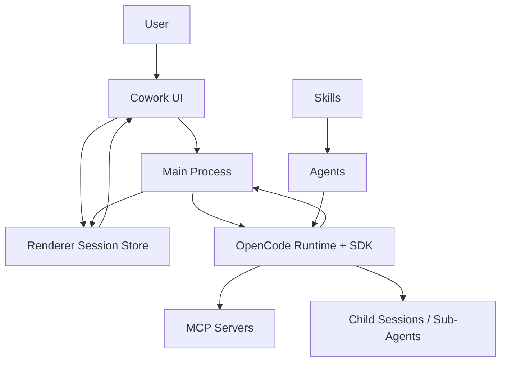
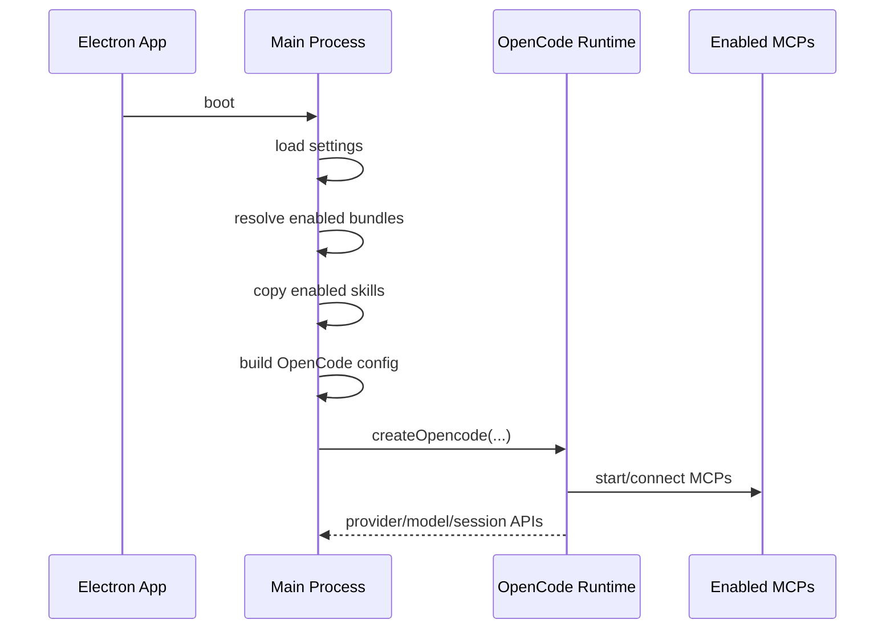

# Cowork Architecture

## Purpose

Cowork is a product layer on top of OpenCode.

OpenCode is the execution harness:
- agent runtime
- session tree
- child sessions
- permissions
- MCP execution
- approvals
- compaction
- streaming events

Cowork is the product harness:
- built-in integrations
- bundled skills
- built-in and custom agents
- deterministic team policy for explicit multi-branch work
- session/task UI
- fast thread switching and local persistence

The goal is to keep Cowork thin. We should compose OpenCode well, not build a second agent runtime.

## Core Concepts

### MCPs
MCPs are tools.

In Cowork, MCPs are packaged as integration bundles. A bundle can include:
- one or more MCP servers
- bundled skills
- app-level metadata for the UI
- agent access profiles
- credential requirements

Examples:
- `nova-analytics`
- `google-workspace`
- `atlassian-rovo`
- `amplitude`
- `github`
- `perplexity`

Source:
- [integration-bundles.ts](/Users/joe/Documents/Joe/Github/cowork/apps/desktop/src/main/integration-bundles.ts:1)

### Skills
Skills teach agents how to use tools well.

They are reusable instruction packs, not execution engines. A skill narrows how an agent should approach a class of work such as:
- KPI analysis
- document authoring
- sheet formatting
- Gmail workflows
- calendar scheduling

Skills are bundled with integrations and copied into the OpenCode runtime sandbox when the relevant bundle is enabled.

Sources:
- [runtime.ts](/Users/joe/Documents/Joe/Github/cowork/apps/desktop/src/main/runtime.ts:1)
- [apps/desktop/runtime-config/skills](/Users/joe/Documents/Joe/Github/cowork/apps/desktop/runtime-config/skills:1)

### Agents
Agents package purpose plus permissions.

An agent combines:
- instructions
- skill access
- MCP/tool permissions
- task/delegation permissions

Cowork defines built-in agents such as:
- `cowork`
- `plan`
- `analyst`
- `research`
- `explore`
- `sheets-builder`
- `docs-writer`
- `gmail-drafter`

Users can also create custom sub-agents. These are compiled into native OpenCode agent config at runtime, not implemented in a separate Cowork runtime.

Sources:
- [agent-config.ts](/Users/joe/Documents/Joe/Github/cowork/apps/desktop/src/main/agent-config.ts:1)
- [custom-agents.ts](/Users/joe/Documents/Joe/Github/cowork/apps/desktop/src/main/custom-agents.ts:1)

### Teams
A team is a coordinated set of child sessions working under one root thread.

In the normal case, OpenCode can delegate to sub-agents through native `task` permissions.

For explicit multi-branch work, Cowork can use a narrow deterministic team path:
- plan branches
- create child sessions under the root session
- run branches concurrently
- synthesize results
- hand a short final answer back to the root thread

This is product policy on top of OpenCode primitives. It is not a separate runtime.

Sources:
- [team-orchestration.ts](/Users/joe/Documents/Joe/Github/cowork/apps/desktop/src/main/team-orchestration.ts:1)
- [team-orchestration-utils.ts](/Users/joe/Documents/Joe/Github/cowork/apps/desktop/src/main/team-orchestration-utils.ts:1)
- [team-policy.js](/Users/joe/Documents/Joe/Github/cowork/apps/desktop/src/main/team-policy.js:1)

## Mental Model

Short version:
- MCPs provide capability.
- Skills provide method.
- Agents provide role and permission boundaries.
- Teams provide concurrency.

## Design Principles

1. OpenCode owns execution.
2. Cowork owns composition, policy, and UI.
3. The session tree is the source of truth.
4. Permissions are real runtime controls, not prompt-only suggestions.
5. Real OpenCode todos and Cowork execution progress are different concepts.
6. Parent threads should stay small; large branch context should not be stuffed back into the root session.
7. Busy threads must render optimistically and reconcile from history without clobbering live state.
8. Background threads should stay lightweight so many teams can run at once.

## Layered Architecture

### 1. Integration Layer
Defines the product-facing tool surface.

Each integration bundle contains:
- MCP definitions
- bundled skills
- UI metadata
- access profiles for agents
- credential requirements

Key point:
- users enable integrations
- enabled integrations determine which MCPs and bundled skills enter the runtime

Source:
- [integration-bundles.ts](/Users/joe/Documents/Joe/Github/cowork/apps/desktop/src/main/integration-bundles.ts:1)

### 2. Runtime Composition Layer
Builds the OpenCode runtime config dynamically.

Responsibilities:
- choose provider/model
- configure compaction
- enable MCPs
- inject credentials/headers/env
- copy enabled skills into the runtime sandbox
- compile built-in and custom agents into `config.agent`

Key point:
- Cowork does not ship a static runtime config
- it builds OpenCode config from app settings and enabled bundles

Source:
- [runtime.ts](/Users/joe/Documents/Joe/Github/cowork/apps/desktop/src/main/runtime.ts:1)

### 3. Agent Policy Layer
Defines how agents are meant to behave.

This layer contains:
- built-in agent prompts
- permission maps
- task delegation rules
- team limits and fanout policy

It should contain stable product policy, not UI behavior.

Sources:
- [agent-config.ts](/Users/joe/Documents/Joe/Github/cowork/apps/desktop/src/main/agent-config.ts:1)
- [team-policy.js](/Users/joe/Documents/Joe/Github/cowork/apps/desktop/src/main/team-policy.js:1)

### 4. Orchestration Layer
Uses native OpenCode sessions and child sessions to execute work.

Normal work:
- root session prompt
- OpenCode may delegate using native sub-agent/task behavior

Deterministic team work:
- narrow Cowork-owned planner path for explicit multi-branch requests
- child sessions are still native OpenCode child sessions

Key point:
- Cowork may orchestrate a team
- OpenCode still runs the sessions

Source:
- [team-orchestration.ts](/Users/joe/Documents/Joe/Github/cowork/apps/desktop/src/main/team-orchestration.ts:1)

### 5. Event Projection Layer
Converts OpenCode events into UI-safe session state.

Responsibilities:
- bind child sessions to task runs
- stream text and tool calls
- forward approvals
- project compaction
- preserve order
- reconcile history on reload/switch

Sources:
- [events.ts](/Users/joe/Documents/Joe/Github/cowork/apps/desktop/src/main/events.ts:1)
- [ipc-handlers.ts](/Users/joe/Documents/Joe/Github/cowork/apps/desktop/src/main/ipc-handlers.ts:1)
- [useOpenCodeEvents.ts](/Users/joe/Documents/Joe/Github/cowork/apps/desktop/src/renderer/hooks/useOpenCodeEvents.ts:1)

### 6. UI State Layer
Keeps thread switching fast and preserves responsiveness.

Responsibilities:
- per-session state cache
- task-run state
- real todos
- derived execution plan
- optimistic busy state
- history hydration guards

Key point:
- `todos` are only real OpenCode todo state
- `executionPlan` is Cowork’s UI projection of multi-branch progress

Sources:
- [session.ts](/Users/joe/Documents/Joe/Github/cowork/apps/desktop/src/renderer/stores/session.ts:1)
- [loadSessionMessages.ts](/Users/joe/Documents/Joe/Github/cowork/apps/desktop/src/renderer/helpers/loadSessionMessages.ts:1)
- [session-history.ts](/Users/joe/Documents/Joe/Github/cowork/apps/desktop/src/renderer/helpers/session-history.ts:1)

## How MCPs, Skills, Agents, and Teams Work Together

### MCP -> Skill -> Agent

Example:
- `google-workspace` bundle enables Google Docs, Sheets, Drive, Gmail, Calendar MCPs
- the same bundle also contributes skills like `docs-writing`, `sheets-reporting`, and `gmail-management`
- a built-in agent like `docs-writer` gets:
  - Google Docs tool permissions
  - `docs-writing` skill access
  - write actions gated by approval

The bundle provides capability.
The skill provides best practice.
The agent provides a safe role.

### Agent -> Team

Example:
- root `cowork` agent receives a request with four independent research branches
- deterministic team logic decides this is explicit multi-branch work
- Cowork creates four child sessions under the root
- each child runs a focused branch with `research`, `explore`, or `analyst`
- a helper session synthesizes branch results
- the root session delivers the final answer

This produces a real session tree, not fake parallelism.

## Runtime Startup Flow

Key details:
- only enabled integrations are included
- only enabled bundled skills are copied
- custom agents are compiled into the same OpenCode config as built-ins
- compaction is configured explicitly in the runtime

## Main Execution Flows

### 1. Standard Thread

1. User submits a prompt.
2. Renderer immediately adds the user bubble and marks the session busy.
3. Main calls OpenCode `session.prompt`.
4. OpenCode streams root events and optional child-session events.
5. Cowork projects events into session state.
6. UI renders root messages, approvals, compaction notices, and child task cards.

### 2. Direct `@agent` Invocation

1. User types `@research` or another visible sub-agent.
2. Cowork maps that to the OpenCode `agent` parameter.
3. The turn runs directly on that agent.
4. No extra Cowork orchestration is needed.

### 3. Deterministic Team Flow

Used only for clearly multi-branch work.

1. Cowork decides whether the prompt is a deterministic team candidate.
2. A temporary planning session can produce branch definitions.
3. Cowork creates child sessions with `parentID=root`.
4. Each child session runs concurrently through native OpenCode prompt APIs.
5. Cowork gathers compact branch findings.
6. A temporary helper session synthesizes the combined answer.
7. Cowork hands a short final answer into the real root thread.

Important:
- large raw branch transcripts should not be pushed into the root session
- helper sessions absorb heavy synthesis pressure
- the root thread stays compact and user-facing

## Event and UI Flow

### Event Sources
OpenCode emits:
- root session text
- child session text
- tool calls
- permission requests
- todos
- compaction events
- busy/idle/done/error lifecycle

### Main Process Projection
Cowork maps those into:
- root session updates
- task-run updates keyed by child session
- approval requests
- history refresh signals when needed

### Renderer Projection
The renderer:
- buffers stream text
- batches updates per frame
- keeps session detail cached
- guards against stale history replacing fresher live state

### Ordering Rule
Inside a task card, sub-agent text and tool calls should render in arrival order so the user can understand what the branch is doing.

That is a non-negotiable UI invariant for teams.

## Todos vs Execution Plan

This distinction matters.

### Real Todos
These come from OpenCode `todowrite` and `session.todo()`.

They belong to the session that created them:
- root session todos
- child session todos

### Execution Plan
This is a Cowork-derived UI view for deterministic team progress.

It shows:
- launch branches
- branch running/completed state
- final synthesis state

Cowork must not pretend that execution-plan items are model todos.

Reason:
- fake todo mirroring caused drift, false completions, and reload bugs
- the execution plan is product UI
- todos are native model state

## Permissions and Approvals

Permissions are enforced in OpenCode config, not just described in prompts.

Important patterns:
- `allow`
- `ask`
- `deny`

Examples:
- read-only research agents can use web tools but not write tools
- writer agents can access Google Docs/Sheets/Gmail with `ask` on side-effect actions
- GitHub write actions should be permission-gated, not just prompt-gated

Approval flow is native:
- OpenCode emits a permission request
- Cowork renders an approval card
- user approves or denies
- the runtime continues accordingly

## Compaction

Compaction is OpenCode-native.

Cowork configures it explicitly and surfaces it in the UI:
- current context usage
- compaction state
- compaction notices in root and child sessions

Cowork should not implement its own parallel compaction system.

Use OpenCode:
- runtime compaction config
- `session.summarize()`
- compaction events

## Scale Model

The target is many simultaneous threads and many teams.

### What Must Scale
- many root sessions in parallel
- many child sessions under each root
- fast switching between active threads
- lightweight background thread updates
- correct ordering and status in every task card

### Current Strategy
- session index stays lightweight
- session detail is cached, not globally authoritative
- busy threads stay warm
- history hydrate is guarded so stale reloads cannot overwrite fresh live state
- child session id is the canonical branch identity

### Next Constraints To Preserve
- task cards default collapsed
- unopened child cards should not force heavy transcript work
- background threads should project to summary state first
- UI updates should be frame-batched and append-only where possible

## What OpenCode Owns vs What Cowork Owns

### OpenCode Owns
- agent runtime
- built-in async prompt execution
- child sessions
- permissions
- approvals
- MCP execution
- session history
- compaction
- streaming events

### Cowork Owns
- which integrations are enabled
- which skills ship with an integration
- which agents exist and what they are for
- custom agent authoring
- deterministic team policy for explicit multi-branch work
- event projection into UI
- fast thread switching and cache strategy

## File Map

### Runtime and Bundles
- [integration-bundles.ts](/Users/joe/Documents/Joe/Github/cowork/apps/desktop/src/main/integration-bundles.ts:1)
- [runtime.ts](/Users/joe/Documents/Joe/Github/cowork/apps/desktop/src/main/runtime.ts:1)
- [plugin-manager.ts](/Users/joe/Documents/Joe/Github/cowork/apps/desktop/src/main/plugin-manager.ts:1)

### Agents and Policy
- [agent-config.ts](/Users/joe/Documents/Joe/Github/cowork/apps/desktop/src/main/agent-config.ts:1)
- [custom-agents.ts](/Users/joe/Documents/Joe/Github/cowork/apps/desktop/src/main/custom-agents.ts:1)
- [team-policy.js](/Users/joe/Documents/Joe/Github/cowork/apps/desktop/src/main/team-policy.js:1)

### Orchestration
- [team-orchestration.ts](/Users/joe/Documents/Joe/Github/cowork/apps/desktop/src/main/team-orchestration.ts:1)
- [team-orchestration-utils.ts](/Users/joe/Documents/Joe/Github/cowork/apps/desktop/src/main/team-orchestration-utils.ts:1)
- [team-context-utils.ts](/Users/joe/Documents/Joe/Github/cowork/apps/desktop/src/main/team-context-utils.ts:1)

### Event Projection
- [events.ts](/Users/joe/Documents/Joe/Github/cowork/apps/desktop/src/main/events.ts:1)
- [ipc-handlers.ts](/Users/joe/Documents/Joe/Github/cowork/apps/desktop/src/main/ipc-handlers.ts:1)
- [useOpenCodeEvents.ts](/Users/joe/Documents/Joe/Github/cowork/apps/desktop/src/renderer/hooks/useOpenCodeEvents.ts:1)

### UI State and Rendering
- [session.ts](/Users/joe/Documents/Joe/Github/cowork/apps/desktop/src/renderer/stores/session.ts:1)
- [loadSessionMessages.ts](/Users/joe/Documents/Joe/Github/cowork/apps/desktop/src/renderer/helpers/loadSessionMessages.ts:1)
- [session-history.ts](/Users/joe/Documents/Joe/Github/cowork/apps/desktop/src/renderer/helpers/session-history.ts:1)
- [ChatView.tsx](/Users/joe/Documents/Joe/Github/cowork/apps/desktop/src/renderer/components/chat/ChatView.tsx:1)
- [TaskRunCard.tsx](/Users/joe/Documents/Joe/Github/cowork/apps/desktop/src/renderer/components/chat/TaskRunCard.tsx:1)
- [ThinkingIndicator.tsx](/Users/joe/Documents/Joe/Github/cowork/apps/desktop/src/renderer/components/chat/ThinkingIndicator.tsx:1)

## Non-Goals

Cowork should not:
- become a second agent runtime
- invent fake session trees
- mirror execution-plan UI into synthetic model todos
- stuff large branch transcripts back into the root thread
- use prompts as the only safety boundary for write-side effects

## Summary

Cowork is a business agent product built on OpenCode.

The architecture is intentionally compositional:
- MCPs provide capability
- skills provide operational know-how
- agents provide purpose and safety boundaries
- teams provide concurrency
- OpenCode provides execution
- Cowork provides product structure and UI

If we keep that boundary clean, Cowork can scale from one useful assistant to a company worth of skilled agent teams without becoming an unmaintainable custom runtime.
