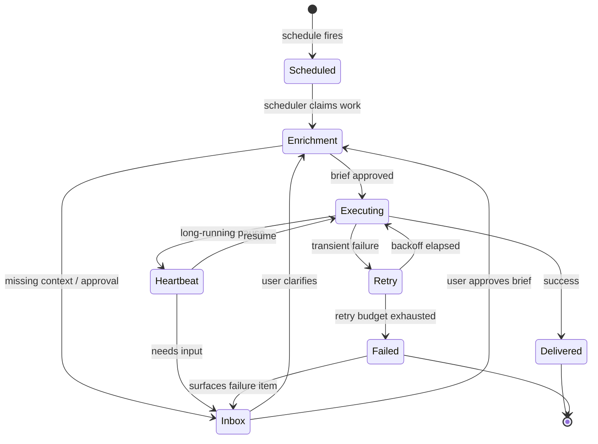

# Automations

Automations are Open Cowork's durable control plane for scheduled and managed
work.

The design goal is the same as the rest of the product:

- **OpenCode executes**
- **Open Cowork coordinates**

That means automations do **not** introduce a second runtime. They use the
same OpenCode session, agent, approval, and tool machinery that chat threads
use, but wrap it in a more durable product layer.

## Automation run lifecycle

Every transition is durable — a crash mid-run resumes from the last
recorded state, not from scratch. The Inbox is the universal escape
hatch: clarification asks, approvals, and failure handling all flow
through it instead of through the chat thread list.

## What automations add

Automations add durable product state around OpenCode execution:

- schedules
- heartbeat review
- execution briefs
- inbox items
- work items
- runs
- delivery records

The execution path still goes through OpenCode-native agents:

- `plan` for enrichment
- `build` for execution
- specialist subagents for branch work

Open Cowork adds the durable scheduling, approval, retry, and visibility layer
around that flow.

Automation runs now also claim operations queue authority before dispatching to
OpenCode. Planning and heartbeat runs are queued as low-risk coordination work,
while scoped execution runs claim their project workspace key. That means two
write-capable automation or SOP-backed runs cannot mutate the same project at
the same time unless queue policy explicitly permits more parallelism. Waiting
runs stay durable and visible in Pulse instead of becoming hidden in-memory
work.

The Settings automation tab exposes the global queue guardrails: maximum
autonomy, shared write-target parallelism, max run duration, queue budget, and
retry ceilings. These are ceilings, not permission grants. Lowering them makes
future automation, SOP, and crew queue items more conservative; raising write
parallelism is the explicit opt-in for concurrent writes to the same authority.

Completed automation runs can also be saved as **SOPs**. A SOP is a reusable,
versioned process definition derived from a successful run: it preserves the
brief shape, work graph, approval boundary, retry/run policy, and delivery
policy without copying OpenCode's runtime. Later SOP edits create new versions,
and SOP-triggered runs link back to the exact SOP version that launched them.

## Current automation model

Each automation has:

- a title and goal
- a schedule
- a timezone
- an autonomy policy
- an execution mode
- retry policy
- run policy
- optional preferred specialists

### Schedules

The current UI supports:

- `one_time`
- `daily`
- `weekly`
- `monthly`

The scheduler creates durable runs when work is due. Heartbeat is separate; it
is a lightweight supervisory review loop, not the primary scheduler.

### Review-first by default

The default posture is review-first:

1. The automation enters enrichment.
2. `plan` turns the raw goal into an execution brief.
3. Missing context or approvals become inbox items.
4. Only an approved brief moves into execution.

This is deliberate. Automations should stop and ask instead of guessing.

### Preferred specialists

Users can pick preferred specialists for an automation.

This does **not** replace `plan` / `build`. It biases routing and delegation so
the automation prefers the chosen specialist team during enrichment and
execution.

## What the UI shows

The Automations page is split into durable operational surfaces:

- **Automations** — the list of standing programs
- **Inbox** — approvals, clarifications, failures, and informational notices
- **Work items** — the durable backlog derived from the current brief
- **Runs** — actual execution attempts linked to OpenCode sessions
- **Deliveries** — current output records (in-app today)
- **SOP actions** — completed runs can be promoted into reusable, versioned
  processes from the run detail surface

This keeps operational state separate from the chat thread list.

## Heartbeat

Heartbeat is a lightweight supervisory review pass.

It can:

- do nothing
- request user input
- refresh the brief
- trigger execution

Heartbeat does not replace the main scheduler. It exists to keep automations
moving when review, stale state, or changed context requires a supervisory
decision.

## Retries and run caps

Automations include:

- bounded exponential retry backoff
- failure classification
- a simple circuit breaker after repeated failed work runs
- a daily work-run attempt cap
- a max duration per non-heartbeat run

These controls exist to keep always-on work bounded and reviewable.

## Delivery

The current upstream build records delivery in-app only.

Successful runs create delivery records and inbox-visible output. That keeps the
public upstream focused and safe while leaving room for downstream integrations
later.

## When to use automations vs chat

Use **chat** when:

- the work is ad hoc
- you want to steer interactively
- you are exploring or iterating in the moment

Use **automations** when:

- the work should recur on a schedule
- the task needs durable review / retry / resume behavior
- you want a standing workflow rather than a one-off conversation

## Architectural boundary

The important invariant is:

- OpenCode remains the execution substrate
- Open Cowork remains the product/control layer

If a future change makes automations look like a separate runtime, it is moving
in the wrong direction.
