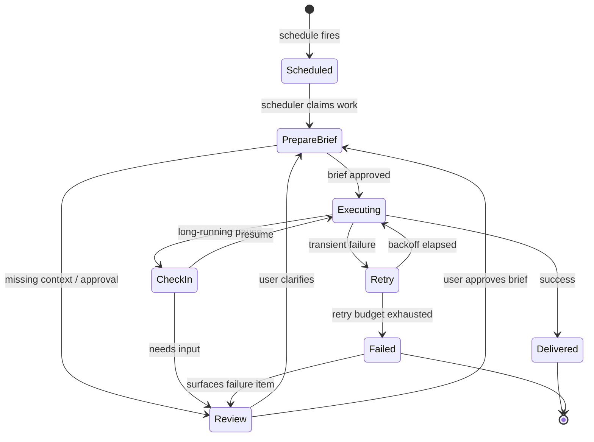

# Automations

Automations are Open Cowork's durable control plane for scheduled and managed
work.

The design goal is the same as the rest of the product:

- **OpenCode executes**
- **Open Cowork coordinates**

That means automations do **not** introduce a second runtime. They use the
same OpenCode session, agent, approval, and tool machinery that chat threads
use, but wrap it in a more durable product layer.

## Automation run lifecycle

Every transition is durable — a crash mid-run resumes from the last
recorded state, not from scratch. The Reviews queue is the universal escape
hatch: clarification asks, approvals, and failure handling all flow
through it instead of through the chat thread list.

## What automations add

Automations add durable product state around OpenCode execution:

- schedules
- review check-ins
- prepared briefs
- review items
- tasks
- runs
- delivery records

The execution path still goes through OpenCode-native agents:

- `plan` for brief preparation
- `build` for execution
- specialist subagents for branch work

Open Cowork adds the durable scheduling, approval, retry, and visibility layer
around that flow.

Automation runs now also claim operations queue authority before dispatching to
OpenCode. Brief preparation and check-in runs are queued as low-risk coordination work,
while scoped execution runs claim their project workspace key. That means two
write-capable automation or saved-workflow-backed runs cannot mutate the same project at
the same time unless queue policy explicitly permits more parallelism. Waiting
runs stay durable and visible in Pulse instead of becoming hidden in-memory
work.

The Settings automation tab exposes the global queue guardrails: maximum
autonomy, shared write-target parallelism, max run duration, queue budget, and
retry ceilings. These are ceilings, not permission grants. Lowering them makes
future automation, saved workflow, and crew queue items more conservative; raising write
parallelism is the explicit opt-in for concurrent writes to the same authority.

Completed automation runs can also be saved as **saved workflows**. A saved workflow is a reusable,
versioned process definition derived from a successful run: it preserves the
brief shape, task graph, approval boundary, retry/run policy, and delivery
policy without copying OpenCode's execution engine. Later workflow edits create new versions,
and saved-workflow runs link back to the exact version that launched them.

## Current automation model

Each automation has:

- a title and goal
- a schedule
- a timezone
- an autonomy policy
- an execution mode
- retry policy
- run policy
- optional preferred specialists

### Schedules

The current UI supports:

- one-time runs
- daily runs
- weekly runs
- monthly runs

The renderer presents those schedules in operator language instead of schema
labels. For example, a weekly schedule becomes “Every Monday at 09:00,” and the
creation wizard previews the first run, the check-in cadence, and whether the
run time overlaps desktop-notification quiet hours. Quiet hours suppress alerts;
they do not prevent durable work from queueing.

The scheduler creates durable runs when work is due. Check-ins are separate;
they are lightweight supervisory review loops, not the primary scheduler.

### Review-first by default

The default posture is review-first:

1. The automation prepares a brief.
2. `plan` turns the raw goal into a prepared brief.
3. Missing context or approvals become review items.
4. Only an approved brief moves into execution.

This is deliberate. Automations should stop and ask instead of guessing.

### Preferred specialists

Users can pick preferred specialists for an automation.

This does **not** replace `plan` / `build`. It biases routing and delegation so
the automation prefers the chosen specialist team during brief preparation and
execution.

## What the UI shows

The Automations page is split into durable operational surfaces:

- **Automations** — the board or gated table of standing programs
- **Reviews** — approvals, clarifications, failures, and informational notices
- **Tasks** — the durable backlog derived from the current brief
- **Runs** — actual execution attempts linked to OpenCode sessions
- **Deliveries** — current output records (in-app today)
- **Saved workflow actions** — completed runs can be promoted into reusable, versioned
  processes from the run detail surface

This keeps operational state separate from the chat thread list.

The automation detail drawer follows the same operator IA as the desktop app:
Overview, Schedule, Reviews, Runs, Outputs, Settings, and History. Board movement
still maps to the same underlying services, but the daily workflow is explicit:
prepare the brief, approve review items, run now, pause or resume, cancel an
active run, retry failures, archive completed programs, or save a successful run
as a reusable workflow.

## Check-ins

Check-ins are lightweight supervisory review passes.

They can:

- do nothing
- request user input
- refresh the brief
- trigger execution

Check-ins do not replace the main scheduler. They exist to keep automations
moving when review, stale state, or changed context requires a supervisory
decision.

## Retries and run caps

Automations include:

- bounded exponential retry backoff
- failure classification
- a simple circuit breaker after repeated failed execution runs
- a daily execution attempt cap
- a max duration per execution run

These controls exist to keep always-on work bounded and reviewable.

## Delivery

The current upstream build records delivery in-app only.

Successful runs create delivery records and review-visible output. That keeps the
public upstream focused and safe while leaving room for downstream integrations
later.

## When to use automations vs chat

Use **chat** when:

- the work is ad hoc
- you want to steer interactively
- you are exploring or iterating in the moment

Use **automations** when:

- the work should recur on a schedule
- the task needs durable review / retry / resume behavior
- you want a standing workflow rather than a one-off conversation

## Architectural boundary

The important invariant is:

- OpenCode remains the execution substrate
- Open Cowork remains the product/control layer

If a future change makes automations look like a separate runtime, it is moving
in the wrong direction.
