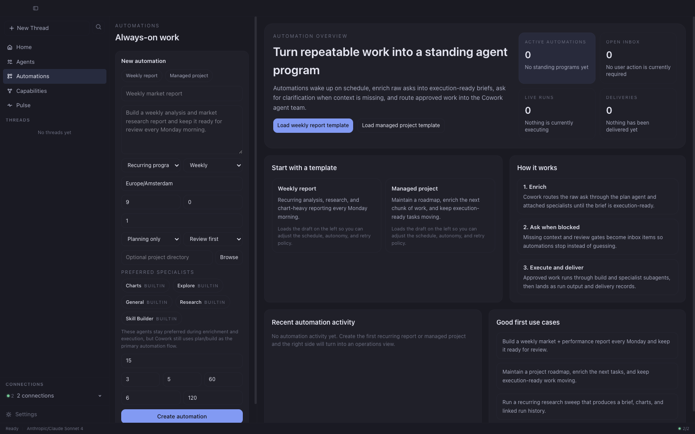
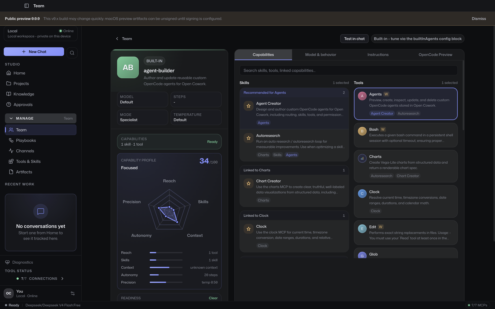
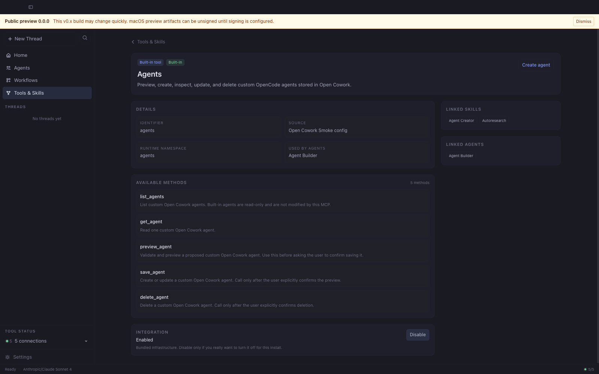
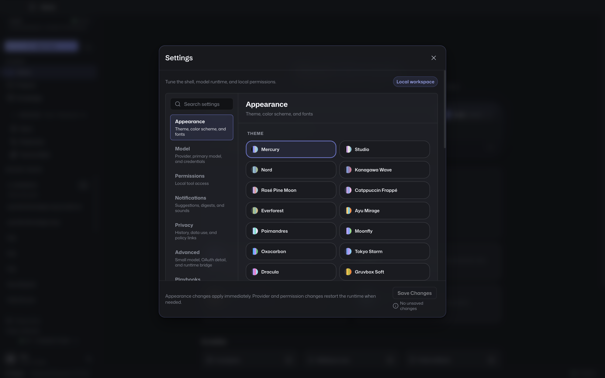
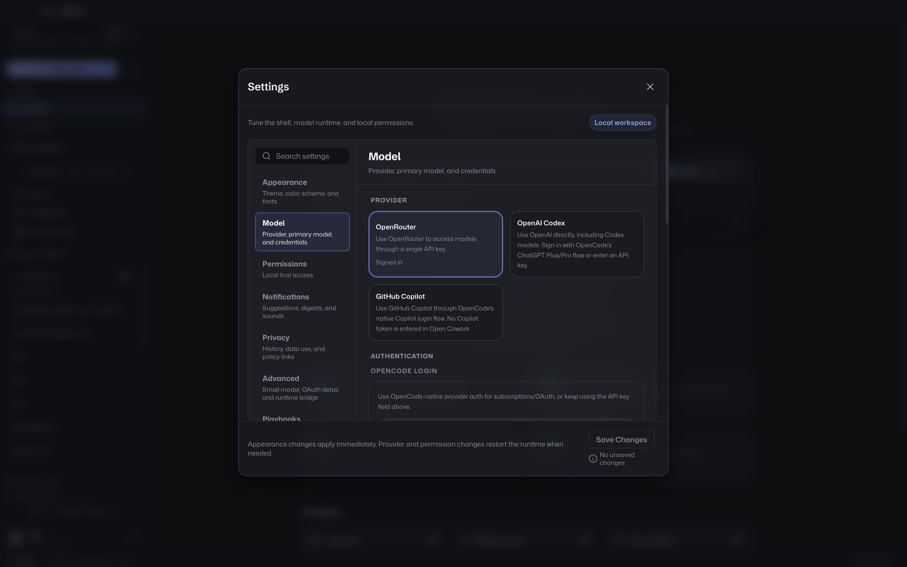

# Desktop App Guide

## Main sections

The desktop app is centered around six areas:
- `Home` — welcoming landing surface
- `Chat` — where OpenCode sessions run
- `Automations` — the durable schedule / inbox / run control plane
- `Agents` — manage built-in and custom agents
- `Capabilities` — browse tools, skills, and MCPs
- `Pulse` — diagnostic workspace dashboard

```mermaid
flowchart TD
    Home["Home<br/>composer · recent threads · @-agent pills"]
    Chat["Chat<br/>session UI · streamed events · approvals"]
    Auto["Automations<br/>list · inbox · work items · runs · deliveries"]
    Agents["Agents<br/>built-in + custom"]
    Caps["Capabilities<br/>tools · skills · MCPs"]
    Pulse["Pulse<br/>runtime · usage · perf · inventory"]
    Settings["Settings<br/>appearance · models · permissions · storage"]

    Home -->|submit prompt| Chat
    Home -->|status strip| Pulse
    Chat -->|@agent| Agents
    Chat -->|tool calls| Caps
    Auto -->|run links| Chat
    Pulse -->|capability counts| Caps
    Pulse -->|agent inventory| Agents
    Pulse -.linked from sidebar.-> Settings
```

Home is the landing surface; submitting a prompt routes to Chat in one
motion. Pulse, Capabilities, Agents, and Automations each present a
dedicated operational surface; Settings holds appearance, models,
permissions, and storage.

## Home


Home is the app's welcoming landing surface. It opens with a single ask
so business users aren't greeted by a wall of diagnostics on first
launch:

- a friendly greeting ("What shall we cowork on today?")
- a composer with drag-and-drop file attachment and paste-to-attach
  for screenshots
- @-agent suggestion pills that pre-fill the composer with a mention
- up to three recent-thread cards to jump back into prior work
- a quiet status strip that links to Pulse when users want the
  diagnostic view

Submitting from the Home composer creates and activates a new session,
routes the view to Chat, and fires the first prompt in a single motion.

## Pulse


Pulse is the workspace-at-a-glance surface. It's one click away in the
sidebar and is where the runtime / health / usage / agent telemetry
that used to live on Home now lives.

Pulse mixes:
- runtime health and provider / model status
- capability inventory (tools, skills, MCP connections)
- agent inventory (built-ins + enabled custom agents)
- usage summaries — history-backed, with time ranges:
  - last 7 days
  - last 30 days
  - year to date
  - all time
- agent cost + token breakdowns
- recent performance metrics

Power users and downstream evaluators can pin this page; it's the
fastest way to see the state of every moving part of the workspace.

## Chat


Chat is where OpenCode sessions run.

Important behavior:
- `@agent` selects a target agent for the prompt
- skills are OpenCode-native and are not invoked through a custom `$skill` syntax
- streamed text, tool calls, approvals, and task runs are projected into a UI-safe session model

## Automations



Automations are the durable product layer for always-on work.

They keep the runtime split clean:
- OpenCode still executes `plan`, `build`, subagents, approvals, questions, and tools
- Open Cowork adds the durable scheduling, inbox, work-item, retry, and delivery surfaces around that execution

The current upstream surface includes:
- recurring schedules (`one_time`, `daily`, `weekly`, `monthly`)
- review-first enrichment before execution
- heartbeat supervision for due or blocked work
- inbox items for clarification, approval, and failure handling
- durable work items, runs, and in-app deliveries
- optional preferred specialists that bias routing without replacing the `plan` / `build` flow

Once an automation exists it gets a dedicated detail surface for
brief, run timeline, reliability, and run policy:


## Project vs sandbox threads

### Project thread

A project thread is bound to a real directory and is appropriate for:
- code generation
- file editing
- repository work

### Sandbox thread

A sandbox thread uses a private Cowork-managed workspace and surfaces outputs as artifacts.

This is appropriate for:
- generated reports
- drafts
- charts
- private experimentation

## Artifacts

Sandbox-generated files are treated as artifacts first.

Artifact actions include:
- save as
- reveal in Finder/file manager
- storage cleanup from Settings

## Agents


The Agents page lets users:
- inspect built-in agents
- create custom agents
- bind custom agents to specific tools and skills

Custom agents compile into OpenCode-native agent configuration rather than a parallel Open Cowork execution system.

Clicking a card opens the builder, which shows the same skills, tools,
instructions, and inference panels for both built-in and custom agents:



## Capabilities


The Capabilities page lets users inspect:
- built-in tools
- custom tools from MCPs
- bundled skills
- custom skills

This page is the main visibility surface for the tool and skill catalog.

Selecting a tool drills into a detail view that lists the resolved
methods, the source scope, and the option to spin up an agent bound
to that tool:



## Settings



Settings currently cover:
- appearance — theme, color scheme, fonts
- models — provider, model, and credentials
- automations — schedule, notifications, and defaults
- permissions — local tool access (bash, file write) and the developer
  config bridge into the managed OpenCode runtime
- storage — sandbox artifacts and cleanup

The Models tab is where providers and credentials are managed, and is
typically the first stop on a fresh install:



The Storage section reports sandbox usage and provides cleanup
controls for old or unused sandbox workspaces.
