# Downstream Customization

Open Cowork is designed to be repackaged as an internal build without forking
the code. Branding, providers, agents, skills, MCPs, and bundled prompts are
all expressed in files the app reads at runtime, and a small set of environment
variables lets a downstream distribution point the app at its own copy of those
files.

This page is the reference for that model.

The workspace ownership, sync, status/reason, and non-sync guarantees that
downstream builds must preserve are defined in
[Product Contract](product-contract.md).
The versioned downstream configuration, branding, packaging, template hygiene,
and extension contract is defined in
[Downstream Contract](downstream-contract.md). Current public config files use
`contractVersion: 1`.

## Distribution modes

Downstream operators should choose the product surface intentionally:

- **Local-only desktop** sets `cloudDesktop.enabled=false`. Users get the
  current private desktop behavior with local OpenCode runtime ownership,
  local project directories, local stdio MCPs, local settings, and no cloud
  dependency.
- **Cloud-enabled desktop** sets `cloudDesktop.enabled=true` and can allow
  user-added cloud connections. Local and cloud workspaces appear side by side,
  but local threads remain local and cloud threads sync through Open Cowork
  Cloud.
- **Managed-org-only desktop** sets `cloudDesktop.enabled=true`,
  `allowUserAddedConnections=false`, `requireManagedOrg=true`, and
  `preconfiguredConnections[]`. This is the right mode for internal company
  builds that must pin users to approved cloud orgs.
- **Gateway-enabled deployment** runs Open Cowork Gateway next to a cloud org.
  The gateway is a headless client for approved channels; it uses cloud service
  tokens and channel bindings but does not spawn OpenCode or own a second
  control plane.

Open Cowork also supports two commercial/operational packaging modes without
changing the OSS boundary:

- **Internal enterprise distribution** ships a branded desktop config, pins
  `cloudDesktop.preconfiguredConnections` to the company's cloud, runs cloud
  behind company OIDC, and deploys gateway inside the company's infrastructure.
- **Managed BYOK SaaS distribution** ships the same open desktop/cloud/gateway
  code while the operator hosts cloud, billing, BYOK, object storage, and
  managed channel bindings for paying orgs.

Branding, providers, skills, MCPs, agents, cloud connections, gateway
credentials, and telemetry are configurable, but the workspace contract is not:
no build should implicitly upload local threads, local project files, provider
keys, local stdio MCP commands, or machine runtime config into cloud. Use
cloud-safe remote MCPs, explicit artifact upload, or admin-managed profiles
when a capability must be available in cloud.

For a complete Acme-style deployment that covers desktop config, cloud Helm
values, gateway Helm values, OIDC, branding, and profile/tool/agent allowlists,
see `examples/downstream/acme/`.

## Mental model

Everything downstream-customizable goes through two layers:

1. **Configuration** — a JSON file validated against
   `open-cowork.config.schema.json` and the versioned
   `contractVersion: 1` downstream contract. The app merges the bundled config
   with up to three additional layers in a fixed order.
2. **Content** — skill bundles (`skills/<name>/SKILL.md`) and MCP packages
   (`mcps/<name>/dist/index.js`) that the config can reference. The app
   resolves these from a stack of roots, with the downstream root winning over
   the bundled one.

A downstream distribution typically ships a directory with this layout:

```text
acme-cowork/
├── config.json           # or open-cowork.config.json
├── skills/
│   ├── acme-reports/
│   │   └── SKILL.md
│   └── acme-tickets/
│       └── SKILL.md
└── mcps/
    └── acme-crm/
        └── dist/
            └── index.js
```

Then launches the app with `OPEN_COWORK_DOWNSTREAM_ROOT=/etc/acme-cowork`.

## Config merge order

```mermaid
flowchart LR
    D["DEFAULT_CONFIG<br/>compiled-in"]
    B["bundled<br/>open-cowork.config.json"]
    P["OPEN_COWORK_CONFIG_PATH<br/>single file override"]
    R["OPEN_COWORK_DOWNSTREAM_ROOT<br/>or CONFIG_DIR"]
    U["per-user<br/>~/.config/&lt;dataDirName&gt;/config.json"]
    S["managed system<br/>/etc/&lt;dataDirName&gt;/config.json"]
    Active["Active config<br/>(deep-merged)"]

    D --> B --> P --> R --> U --> S --> Active

    style D fill:#e0e7ff,stroke:#6366f1
    style B fill:#e0e7ff,stroke:#6366f1
    style P fill:#fef3c7,stroke:#f59e0b
    style R fill:#fef3c7,stroke:#f59e0b
    style U fill:#dcfce7,stroke:#10b981
    style S fill:#dcfce7,stroke:#10b981
    style Active fill:#fae8ff,stroke:#a855f7,stroke-width:2px
```



Layers later in the chain override earlier ones via deep merge — so a
downstream layer only carries the keys it wants to change. Indigo layers
are baked in; amber layers come from environment variables; green layers
are user/admin overlays.

When the app starts, `apps/desktop/src/main/config-loader.ts` builds the active
config by merging these sources in order (later entries override earlier ones):

1. `DEFAULT_CONFIG` compiled into the app.
2. The bundled `open-cowork.config.json` shipped inside the package.
3. `OPEN_COWORK_CONFIG_PATH` — a single JSON file, if set and it exists.
4. `OPEN_COWORK_CONFIG_DIR` or `OPEN_COWORK_DOWNSTREAM_ROOT` — a directory
   containing `config.json` or `open-cowork.config.json`, if set and it exists.
5. `~/.config/<dataDirName>/config.json` — per-user config.
6. `/Library/Application Support/<dataDirName>/config.json` (macOS),
   `C:\ProgramData\<dataDirName>\config.json` (Windows), or
   `/etc/<dataDirName>/config.json` (Linux) — managed system config.

`deepMerge` runs at each step, so downstream layers only have to carry the
keys they want to change. `<dataDirName>` comes from `branding.dataDirName` in
the active config.

## Cloud, desktop, and gateway knobs

Downstream deployments should keep one deployer-facing config file as the
source of product policy and then let infrastructure manifests inject secrets.
The public schema now covers the three product surfaces:

| Surface | Config keys | What belongs here |
|---|---|---|
| Desktop | `branding`, `cloudDesktop` | App name, sidebar/home copy, managed cloud URLs, cache mode, and whether users may add their own cloud orgs. |
| Cloud Web/control plane | `cloud.publicBranding`, `cloud.auth`, `cloud.storage`, `cloud.features`, `cloud.profiles`, `cloud.projectSources`, `cloud.abuse`, `cloud.billing` | Public dashboard name/logo/legal links, OIDC metadata, database/object-store/secret refs, profile allowlists, project-source policy, quotas, and self-host or managed billing mode. |
| Gateway | `gateway.branding`, `gateway.server`, `gateway.providers`, `gateway.metrics`, `gateway.diagnostics` | Headless channel branding, public gateway URL, provider bindings, and operator endpoints. Cloud URL and gateway service token belong in env or deployment secrets. |

Use [Downstream Contract](downstream-contract.md) for the full field inventory
and to distinguish runtime config, packaging-time config, infrastructure
config, and private downstream config.

Gateway can load the same central file as Desktop and Cloud through
`OPEN_COWORK_CONFIG_PATH`, `OPEN_COWORK_CONFIG_DIR`, or
`OPEN_COWORK_DOWNSTREAM_ROOT`. Gateway-specific env and
`OPEN_COWORK_GATEWAY_CONFIG` / `OPEN_COWORK_GATEWAY_CONFIG_JSON` remain
available as overrides. Gateway config JSON intentionally ignores
`gateway.cloud.baseUrl`, `gateway.cloud.serviceToken`, and
`gateway.cloud.allowInsecureHttp`, plus `gateway.timeouts.cloudRequestMs`; use
`OPEN_COWORK_CLOUD_BASE_URL`, `OPEN_COWORK_GATEWAY_SERVICE_TOKEN`,
`OPEN_COWORK_GATEWAY_ALLOW_INSECURE_HTTP`, and
`OPEN_COWORK_GATEWAY_CLOUD_REQUEST_TIMEOUT_MS` from your deployment secret
manager instead. This lets an internal deployment keep `branding`,
`cloud.publicBranding`, `cloudDesktop`, and `gateway.branding` in one audited
file while Kubernetes, Compose, or a VPS process manager supplies endpoint
bindings and secrets from the local secret manager.

Production safety rules are enforced in config validation:

- public cloud, desktop, gateway, telemetry, update, and logo/legal URLs must
  be HTTPS, except loopback/local development URLs
- `cloud.billing.provider=none` or `stub` keeps self-host deployments free of
  commercial billing dependencies
- gateway provider enablement is explicit; no provider is started unless it is
  configured through `gateway.providers`, gateway provider env, or the local
  fake-provider development flag
- public gateway metrics or diagnostics require `gateway.server.adminToken`
- webhook gateway ingress requires a shared secret
- the fake gateway provider cannot be exposed from a public bind unless
  `OPEN_COWORK_GATEWAY_ALLOW_PUBLIC_FAKE_PROVIDER=true` is set deliberately for
  a self-hosted demo
- public `cloud.auth.mode=header` deployments require a header auth secret and
  signed timestamped identity headers from the trusted proxy
- environment placeholders such as `{env:OPEN_COWORK_GATEWAY_SERVICE_TOKEN}`
  only resolve when listed in `allowedEnvPlaceholders`

Managed BYOK SaaS deployments should keep downstream-specific prices, project
ids, legal URLs, and brand assets outside this public repository. The public
repo should contain only generic examples and these portable supply points:

| Area | Public config/env surface | Secret source |
|---|---|---|
| Billing mode | `cloud.billing.enabled`, `cloud.billing.provider`, `OPEN_COWORK_CLOUD_BILLING_ENABLED`, `OPEN_COWORK_CLOUD_BILLING_PROVIDER`, `OPEN_COWORK_CLOUD_BILLING_DEFAULT_PLAN` | None for `none`/`stub`; provider credentials through refs for managed SaaS. |
| Stripe | `cloud.billing.stripe.*`, `OPEN_COWORK_CLOUD_STRIPE_API_KEY_REF`, `OPEN_COWORK_CLOUD_STRIPE_WEBHOOK_SECRET_REF`, `OPEN_COWORK_CLOUD_STRIPE_PRICE_ID`, `OPEN_COWORK_CLOUD_STRIPE_SUCCESS_URL`, `OPEN_COWORK_CLOUD_STRIPE_CANCEL_URL`, `OPEN_COWORK_CLOUD_STRIPE_PORTAL_RETURN_URL` | Platform secret manager or env refs for API key and webhook secret. |
| BYOK | `cloud.profiles`, `cloud.billing.plans.*.entitlements.allowedProviders`, provider validators in cloud process wiring | Provider keys enter only through `/api/byok`; plaintext is never stored in config. |
| Quotas | `cloud.abuse.*`, `OPEN_COWORK_CLOUD_MAX_*` env overrides | No secrets. |
| Public URLs | `cloud.publicBranding`, `cloudDesktop.preconfiguredConnections`, Gateway `publicUrl` | Use generic URLs here; downstream managed repo owns real domains. |

Self-host OSS deployments can leave `cloud.billing.enabled=false` and
`cloud.billing.provider=none`; hosted SaaS deployments should require signed
billing webhooks, BYOK validator/override evidence, quotas, and launch
readiness gates before public traffic.

Downstream deployment recipes must also preserve these production contracts:

- images are pinned by immutable release tag or digest; `latest`, `stable`,
  and other mutable aliases are not acceptable defaults
- local/demo Compose defaults are replaced before shared use: auth, public
  URLs, cookie/internal/service tokens, object-store credentials, and fake
  providers
- multi-worker Cloud requires checkpointing plus a shared object store for
  artifacts, uploaded snapshots, workspace snapshots, and runtime checkpoints
- Kubernetes overlays own HPA/KEDA policy, PodDisruptionBudgets, and
  topology spread constraints; they should not change cloud runtime or gateway
  code
- self-host OSS keeps a billing-free path with `cloud.billing.provider=none`
  or the stub provider

## Extension Points And Ownership

Downstream deployments should extend Open Cowork through the surface that owns
the product concept. Do not patch core execution code to add deployer-specific
behavior. OpenCode owns execution; Open Cowork owns composition, policy,
projection, channel adapters, and deployment ergonomics.

| Extension point | Owning modules | Contract |
|---|---|---|
| Gateway providers | `packages/gateway-provider-*`, `packages/gateway-channel`, `apps/gateway/src/provider-registry.ts` | Implement the provider contract and register capabilities. Gateway providers send/receive channel messages only; they do not spawn OpenCode, import Cloud stores, or own execution state. |
| Deployment recipes | `deploy/`, `helm/`, `docker-compose*.yml`, `scripts/validate-deployment-configs.mjs` | Compose public templates from config/env refs. Keep real project ids, domains, account ids, customer values, prices, and secrets in private deployment repos. |
| Billing adapters | `apps/desktop/src/main/cloud/billing-adapter.ts`, `stripe-billing-adapter.ts`, `stub-billing-adapter.ts` | Add provider-specific billing behind the adapter. Core entitlement and quota logic consumes provider-neutral subscription records. |
| Object-store adapters | `apps/desktop/src/main/cloud/object-store.ts`, deployment object-store config | Add storage providers behind the object-store interface. Artifact, upload, snapshot, and checkpoint callers should not branch on cloud provider names. |
| Secret adapters | `apps/desktop/src/main/cloud/secret-adapter.ts`, BYOK secret store, config refs | Resolve or protect secrets behind refs. Raw provider keys, OAuth tokens, cookies, channel secrets, and signed URLs must never enter renderer state, cache, diagnostics, or public templates. |
| Worker pool modes | `docs/managed-workers.md`, `managed-worker-types.ts`, `services/managed-worker-service.ts` | Add worker modes only after the trust model is documented. Customer-hosted workers remain deferred until a separate review covers updates, liability, networking, and data residency. |
| Runtime profiles and policy packs | `cloud.profiles`, `cloud.runtime`, `cloud-config.ts`, `runtime-config-builder.ts` | Cloud profiles own feature flags and allowlists. Machine runtime config, arbitrary local stdio MCPs, and host project directories stay disabled unless explicitly reviewed and allowlisted. |
| Cloud Web feature modules and admin panels | `apps/website/src`, `docs/cloud-web-workbench.md`, route/API matrix tests | Cloud Web is a cloud API client. It must not import server-only stores, runtime adapters, secret adapters, or provider-specific internals. |
| BYOK validation and injection hooks | `byok-secret-store.ts`, `runtime-config-builder.ts`, `opencode-runtime-adapter.ts`, `cloud-config.ts` | Provider keys enter OpenCode through runtime config provider options. They never enter process env, logs, renderer state, diagnostics, cache, or read APIs. |
| Cloud event and projection contract | `packages/shared/src/cloud-session-projection.ts`, `opencode-runtime-adapter.ts`, `session-projection-service.ts`, gateway renderers | Runtime translation happens once at the worker/runtime boundary. Desktop, Web, and Gateway consume canonical Cloud events/projections rather than raw SDK events. |

Module changes should stay narrow:

- route modules validate/auth/parse and delegate to services
- services own orchestration and policy decisions
- store/domain modules persist atomically and do not own channel or renderer
  behavior
- package-boundary tests guard against clients importing server-only Cloud
  internals
- source-size budgets are regressions gates, not targets to grow into

## Environment variables

| Variable | Purpose | Default |
|---|---|---|
| `OPEN_COWORK_DOWNSTREAM_ROOT` | Root directory for a downstream distribution. Supplies config, skills, and MCPs. | unset |
| `OPEN_COWORK_CONFIG_PATH` | Absolute path to a single override config file. Takes priority over `CONFIG_DIR` / `DOWNSTREAM_ROOT` config discovery. | unset |
| `OPEN_COWORK_CONFIG_DIR` | Directory containing `config.json` or `open-cowork.config.json`. Merged after the single-file override. | unset |
| `OPEN_COWORK_GATEWAY_CONFIG` | Gateway-only JSON config file. Overrides the shared `gateway` section when running `apps/gateway`. | unset |
| `OPEN_COWORK_GATEWAY_CONFIG_JSON` | Inline gateway-only JSON config. Highest-priority gateway override for process managers and tests. | unset |
| `OPEN_COWORK_SANDBOX_DIR` | Root directory where sandbox threads create workspaces. | `~/Open Cowork Sandbox` |
| `OPEN_COWORK_CHART_TIMEOUT_MS` | Main-process chart render timeout. Clamped to `[250, 10000]` ms. | `1500` |

`OPEN_COWORK_CUSTOM_SKILLS_DIR` is set by the app itself when spawning the
bundled `skills` MCP and is not intended for downstream use. The skills
MCP rejects relative paths, filesystem roots, and the user's home
directory; keep custom skill storage inside the app-managed runtime home.

## Skills overlay

Skill bundles are resolved from these roots, in order (first match wins):

1. `$OPEN_COWORK_DOWNSTREAM_ROOT/skills/<name>/`
2. `<cwd>/skills/<name>/` — the repo's own `skills/` directory during
   development.
3. `<app>/Contents/Resources/skills/<name>/` — skills shipped with the
   packaged app.

This means a downstream distribution can either **replace** a bundled skill
(by shipping a directory with the same name) or **add** new skills that the
downstream config references.

Skills only become visible to the runtime when they are listed under `skills`
in the active config — a skill directory that nobody references is ignored.

See `apps/desktop/src/main/runtime-content.ts` and
`apps/desktop/src/main/effective-skills.ts` for the resolution code.

## MCPs overlay

MCP packages are resolved from:

1. `$OPEN_COWORK_DOWNSTREAM_ROOT/mcps/<name>/dist/index.js`
2. `<resourcesPath>/mcps/<name>/dist/index.js` — MCPs shipped with the packaged
   app (`mcps/agents`, `mcps/charts`, `mcps/clock`, `mcps/skills`, `mcps/workflows`).

As with skills, the MCP must be declared in the active config (`mcps` section)
before the runtime spawns it.

See `apps/desktop/src/main/runtime-mcp.ts`.

## Environment placeholders in config

Config strings may reference environment variables using `{env:NAME}`.

For safety, placeholders only resolve when the variable name is explicitly
listed in `allowedEnvPlaceholders`:

```json
{
  "allowedEnvPlaceholders": ["ACME_LLM_GATEWAY_URL"],
  "providers": {
    "custom": {
      "acme-gateway": {
        "options": {
          "baseURL": "{env:ACME_LLM_GATEWAY_URL}"
        }
      }
    }
  }
}
```

Unknown placeholders fail config loading with a clear error. This is
deliberate: Open Cowork does not implicitly pull arbitrary secrets from the
host environment, so downstream configs have to opt each variable in.

Provider credentials the user enters in the app's UI take a separate path
(through the app settings store, `settings.enc` in production, and
`provider.options.<runtimeKey>` in the built OpenCode config) and do not
need to be listed in `allowedEnvPlaceholders`.

## Worked example

A downstream distribution that brands the app "Acme Cowork", ships one custom
provider, one internal MCP, and one internal skill would look like:

```text
/etc/acme-cowork/
├── config.json
├── skills/
│   └── acme-tickets/
│       └── SKILL.md
└── mcps/
    └── acme-crm/
        └── dist/
            └── index.js
```

`config.json`:

```jsonc
{
  "contractVersion": 1,
  "allowedEnvPlaceholders": ["ACME_GATEWAY_URL", "ACME_GATEWAY_KEY"],
  "branding": {
    "name": "Acme Cowork",
    "appId": "com.acme.cowork",
    "dataDirName": "acme-cowork",
    "helpUrl": "https://internal.acme.example/cowork",
    "sidebar": {
      "top": {
        "variant": "logo-text",
        "logoAsset": "branding/acme-logo.svg",
        "mediaSize": 36,
        "mediaFit": "vertical",
        "mediaAlign": "center",
        "title": "Acme AI",
        "subtitle": "Private workspace"
      },
      "lower": {
        "text": "Acme internal build",
        "secondaryText": "Support from Data Platform.",
        "linkLabel": "Get help",
        "linkUrl": "https://internal.acme.example/cowork-help"
      }
    },
    "home": {
      "greeting": "What should {{brand}} work on today?",
      "subtitle": "Ask a question or delegate to an approved agent.",
      "composerPlaceholder": "Ask {{brand}} anything",
      "suggestionLabel": "Start with",
      "statusReadyLabel": "Online"
    }
  },
  "providers": {
    "available": ["acme-gateway"],
    "descriptors": {
      "acme-gateway": {
        "runtime": "custom",
        "name": "Acme Gateway",
        "description": "Internal LLM gateway.",
        "defaultModel": "acme-large",
        "credentials": []
      }
    },
    "custom": {
      "acme-gateway": {
        "name": "Acme Gateway",
        "defaultModel": "acme-large",
        "options": {
          "baseURL": "{env:ACME_GATEWAY_URL}",
          "apiKey": "{env:ACME_GATEWAY_KEY}"
        },
        "models": {
          "acme-large": { "name": "Acme Large" }
        }
      }
    },
    "defaultProvider": "acme-gateway",
    "defaultModel": "acme-large"
  }
  // ...tools, skills, mcps, agents, permissions as needed
}
```

Launch the packaged app with:

```bash
OPEN_COWORK_DOWNSTREAM_ROOT=/etc/acme-cowork \
  ACME_GATEWAY_URL=https://llm.internal.acme.example \
  ACME_GATEWAY_KEY="$(cat /run/secrets/acme-gateway-key)" \
  ./Acme\ Cowork
```

## Rebranding the packaged app

The build reads three env vars to set the product identity without
forking `electron-builder.yml`:

| Variable              | Default                  | What it controls              |
|-----------------------|--------------------------|-------------------------------|
| `APP_PRODUCT_NAME`    | `Open Cowork`            | macOS menu bar + Dock name      |
| `APP_ID`              | `com.opencowork.desktop` | Bundle identifier / reverse-DNS |
| `APP_ARTIFACT_PREFIX` | `Open-Cowork`            | macOS / Linux artifact filenames |

Example downstream build:

```bash
APP_PRODUCT_NAME="Acme Cowork" \
  APP_ID="com.acme.cowork" \
  APP_ARTIFACT_PREFIX="Acme-Cowork" \
  pnpm --dir apps/desktop dist:ci:mac
```

The in-app brand name (window title, first-run copy, log prefixes) is
driven separately by `branding.name` inside `open-cowork.config.json`
or the downstream config overlay — see the Configuration section
above.

Downstream builds can also configure sidebar and Home copy under
`branding.sidebar` and `branding.home`. Those fields only affect UI surfaces:
they do not change OpenCode runtime providers, agents, permissions, MCPs, or
skills. For logo-backed sidebar variants, place image files under the repo-level
`branding/` directory and reference them with `branding.sidebar.top.logoAsset`,
for example `branding/acme-logo.svg`. The app rejects absolute paths, traversal,
remote URLs, and unsupported extensions.

Sidebar top branding can also tune the rendered media with
`branding.sidebar.top.mediaSize` (`16`-`96` pixels, default `28`),
`mediaFit` (`vertical` or `horizontal`; unset keeps the legacy square bounding
box), and `mediaAlign` (`start`, `center`, or `end` for icon-only or logo-only
placement).

The repo name, bundle identifier, and project namespace are separate
concerns. Upstream now uses the public repo name `open-cowork`, but
retains `com.opencowork.desktop` and `.opencowork/` as the default
internal identifiers for back-compat. Downstreams should only change
`APP_ID` or `branding.projectNamespace` when they intentionally want a
new install identity and are prepared to migrate existing state.

## Localization (i18n)

Open Cowork ships with inline English strings. The config schema
has an optional `i18n` overlay so downstream forks can localize
without forking the codebase:

```json
{
  "i18n": {
    "locale": "de-DE",
    "strings": {
      "settings.language.label": "Sprache",
      "chat.awaitingApproval": "Wartet auf Freigabe"
    }
  }
}
```

Two things happen when this is set:

1. **Date formatting** (`formatDate` from
   `apps/desktop/src/renderer/helpers/i18n.ts`) switches to the
   configured locale. Dates render as `31.12.2026` in `de-DE` and
   `12/31/2026` in `en-US`.

2. **String catalog** — `t('settings.language.label', 'Language')`
   looks up the configured translation and falls back to the
   inline English default when no translation exists. Partial
   catalogs are fine; untranslated keys stay in English.

The upstream source hasn't migrated every string to the catalog
yet — only the highest-visibility ones (see the focused roadmap in
`docs/roadmap.md`). Downstream forks that need
broader coverage can either:

- Submit a PR migrating more strings to `t(key, fallback)` in the
  renderer source, then translate the key in their config.
- Fork and translate inline strings directly.

`locale` flows into every Intl formatter without string-catalog
migration, so even an untranslated fork sees locale-appropriate
numbers / dates / currencies.

## Telemetry forwarding

Every in-app event tracked by `apps/desktop/src/main/telemetry.ts`
(app launch, auth
login, session creation, perf-slow, error) is written to a local
NDJSON file by default — no data leaves the user's machine.
Downstream installs that want their own telemetry collector
(PostHog, Mixpanel, an internal HTTP endpoint) set:

```json
{
  "allowedEnvPlaceholders": ["ACME_TELEMETRY_TOKEN"],
  "telemetry": {
    "enabled": true,
    "endpoint": "https://events.acme.example/ingest",
    "headers": {
      "Authorization": "Bearer {env:ACME_TELEMETRY_TOKEN}"
    }
  }
}
```

Each tracked event is POSTed to the endpoint as JSON — fire-and-
forget with a 2-second timeout. Failures are silent; the local
NDJSON file stays the source of truth. `headers` is passed to
`fetch` after normal config placeholder resolution, so auth tokens,
CSRF tokens, or routing hints go through unchanged. Use `{env:VAR}`
placeholders for secrets and list each variable in
`allowedEnvPlaceholders` so the config file itself stays safe to commit.

Upstream distributions ship with telemetry disabled by default —
no remote calls happen unless a downstream opts in.

## Signing, notarization, and distribution

This repository ships **unsigned** artifacts by default. Downstream
distributions that ship to end users should add:

- macOS code signing and notarization (via the standard `CSC_LINK`,
  `CSC_KEY_PASSWORD`, `APPLE_ID`, `APPLE_APP_SPECIFIC_PASSWORD`,
  `APPLE_TEAM_ID` environment variables that electron-builder reads)
- Linux package signing as required by the target repositories
- any internal release approval, artifact mirror, or provenance requirements

See [Packaging and Releases](packaging-and-releases.md) for the upstream
release flow those hooks plug into.
