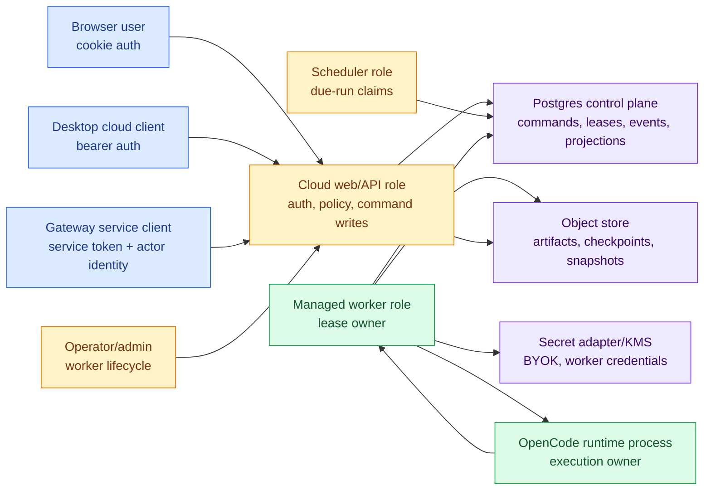

# Managed Worker Service Plane

The managed worker service plane is the execution-capacity layer for cloud work
that should continue without a user's desktop staying online. It
composes the existing Open Cowork Cloud control plane and the OpenCode runtime.
It is not a second agent runtime, session store, scheduler, tool system, MCP
host, or approval engine.

## Decision

V1 supports **control-plane-owned worker pools**:

- managed SaaS workers operated by the Open Cowork Cloud operator for hosted
  BYOK deployments
- fully self-hosted internal worker pools operated by the same organization
  that owns the Cloud control plane

V1 does not support customer-hosted workers connecting to a separate managed
SaaS control plane. That mode needs a separate trust, liability, networking,
update, and data-residency review because the worker would hold scoped
execution credentials while running outside the control-plane operator's
boundary.

This choice keeps the first implementation concrete: the same operator owns
the Cloud API, Postgres control plane, object store, secret adapter, worker
images, network policy, and incident response.

## Ownership Boundary

OpenCode owns execution:

- sessions and child sessions
- runtime event streaming
- tool and MCP execution semantics
- approvals and questions
- native skills and native provider auth behavior
- provider/model calls through runtime config

Open Cowork owns the service-plane composition:

- worker identity, credentials, lifecycle, and heartbeats
- work eligibility, claims, leases, fencing, and recovery
- tenancy, policy, quotas, entitlements, and audit
- object-store artifact and checkpoint metadata
- BYOK secret reveal policy and runtime-config injection
- Web, Desktop cloud workspace, and Gateway projections
- deployment, update, restore, and operator runbooks

Only worker/runtime adapter code may import OpenCode runtime surfaces. Browser,
Gateway, Desktop renderer, route modules, and control-plane store modules remain
product/control-plane code.

## Trust Boundary

Clients never talk to OpenCode directly for cloud work. Clients write commands
or decisions to the Cloud API. Workers claim eligible work from durable state,
run OpenCode, and publish fenced events/projections/checkpoints back to the
control plane.

## Work Classes

V1 work classes are cloud-only:

| Work class | Required inputs | Durable owner |
| --- | --- | --- |
| Cloud session command | tenant, session, command id, profile, provider/model, project source or restored workspace | session command record |
| Manual workflow run | tenant, workflow, run id, agent/profile, trigger actor | workflow run record |
| Scheduled workflow run | tenant, workflow, schedule trigger, due timestamp, scheduler claim id | workflow run record |
| Webhook workflow run | tenant, workflow, webhook replay claim, signed request metadata | workflow run record |
| Gateway prompt | tenant, channel binding, resolved actor, session binding, prompt command | session command record |
| Artifact/checkpoint write | tenant, session/run, claim token, object metadata, checksum/size | artifact/checkpoint metadata |

The worker may restore an approved Git source, uploaded snapshot, or managed
workspace checkpoint into an app-managed sandbox before OpenCode starts.

Excluded by default:

- local desktop-only threads
- arbitrary host-path project directories
- unsandboxed local file access
- local stdio MCP commands
- machine runtime config
- provider credentials outside approved BYOK/runtime-config paths
- direct Gateway-owned execution
- peer-to-peer desktop sync

## Gateway Edge Capacity

Standalone Team Gateway can optionally connect to Cloud through the
[Cloud Gateway Registration](cloud-gateway-registration.md) contract. This
does not change the V1 managed-worker decision: edge execution is allowed only
when the Cloud/Gateway trust model is `self_hosted_same_operator` or
`saas_operator_managed`. Customer-hosted Gateway edge workers connected to a
separate managed SaaS control plane remain
`customer_hosted_managed_saas_deferred`.

The registration kind decides the boundary:

| Registration kind | Managed-worker relationship |
| --- | --- |
| `external_workspace` | Not a worker. Cloud may store redacted Gateway workspace metadata, health, capabilities, cursors, and audit summaries. Gateway remains source of truth for Gateway-owned sessions. |
| `edge_worker` | Worker-like capacity. Gateway claims only eligible Cloud-owned work and writes Cloud-owned output with managed-worker lease-token fencing. |
| `external_workspace_edge_worker` | Both lanes. Gateway-owned work stays Gateway-owned; Cloud-owned work uses the managed-worker claim/fencing path. |

Edge Gateway credentials are distinct from Cloud Channel Gateway service
tokens and from human/admin credentials. They are scoped to registration
heartbeat, capability advertisement, optional metadata sync, and, when
enabled, edge work claim/renew/fenced-output operations. They cannot call BYOK
read/reveal APIs, billing APIs, tenant admin APIs, Desktop APIs, or operator
APIs.

Cloud must never merge Gateway Postgres with Cloud Postgres. Cloud-owned edge
work uses Cloud command, lease, event, projection, artifact, checkpoint, usage,
and audit records. Gateway-owned external-workspace work uses Gateway records,
with only explicitly allowed redacted metadata syncing to Cloud.

## Worker Lifecycle

Worker records use these states:

| State | Meaning | Allowed next states |
| --- | --- | --- |
| `pending` | Registration exists but the worker is not trusted to claim work. | `active`, `revoked` |
| `active` | Worker can heartbeat, claim eligible work, renew leases, and write fenced output. | `draining`, `paused`, `unhealthy`, `retired`, `revoked` |
| `draining` | Worker keeps renewing active leases but cannot claim new work. | `active`, `retired`, `revoked`, `unhealthy` |
| `paused` | Worker cannot claim or renew work until resumed by an admin/operator. | `active`, `retired`, `revoked` |
| `unhealthy` | Control plane has detected stale heartbeat or repeated failures. | `active`, `draining`, `retired`, `revoked` |
| `retired` | Worker exited intentionally after drain. It cannot claim work again. | terminal |
| `revoked` | Credential or worker was emergency-blocked. It cannot heartbeat, claim, renew, or write. | terminal |

Lifecycle transitions emit audit events and are role-checked. Tenant admins see
tenant-scoped summaries. Operators see cross-pool health only through operator
auth or private networking.

## Enrollment And Credentials

Worker enrollment is explicit:

1. An operator or tenant admin creates a worker pool.
2. A worker registration record is created in `pending` state.
3. The control plane issues a one-time credential. Only the token hash is
   stored after issuance.
4. The worker starts with that credential and calls heartbeat.
5. An authorized admin/operator activates the worker or policy auto-activates it
   for self-host mode.

Worker credentials are:

- scoped to worker id, pool id, tenant id where tenant-scoped, and allowed
  operations
- expiring, rotatable, and revocable
- stored hash-only in the control plane
- never returned after initial issuance
- never accepted for broad tenant admin APIs

The worker principal contains `workerId`, `poolId`, tenant scope, credential
id, scopes, expiry, and status. It does not inherit user/admin authority.

### Phase 1 Control Plane Surface

Phase 1 implements worker identity and lifecycle only. It intentionally does
not implement work claiming or execution routing.

Admin-managed endpoints:

- `GET /api/admin/worker-pools`
- `POST /api/admin/worker-pools`
- `POST /api/admin/worker-pools/{poolId}/update`
- `GET /api/admin/workers`
- `POST /api/admin/workers`
- `GET /api/admin/workers/{workerId}`
- `POST /api/admin/workers/{workerId}/activate`
- `POST /api/admin/workers/{workerId}/pause`
- `POST /api/admin/workers/{workerId}/resume`
- `POST /api/admin/workers/{workerId}/drain`
- `POST /api/admin/workers/{workerId}/retire`
- `POST /api/admin/workers/{workerId}/revoke`
- `GET /api/admin/workers/{workerId}/credentials`
- `POST /api/admin/workers/{workerId}/credentials`
- `POST /api/admin/workers/{workerId}/credentials/{credentialId}/rotate`
- `POST /api/admin/workers/{workerId}/credentials/{credentialId}/revoke`
- `GET /api/admin/workers/{workerId}/heartbeats`

Worker self endpoint:

- `POST /api/workers/{workerId}/heartbeat`

Worker credentials authenticate only the worker self endpoint. They cannot call
tenant admin APIs, Desktop APIs, Gateway APIs, BYOK APIs, billing APIs, or
work-claim APIs. Raw worker credential values are returned once at issuance and
are never returned by list/detail APIs.

## Lease And Fencing Contract

Every claimable work unit must carry or reference:

- `tenant_id`
- `work_type`
- `work_id`
- `session_id`
- `workflow_id`
- `workflow_run_id`
- `status`
- `priority`
- `available_at`
- `leased_by`
- `lease_expires_at`
- `lease_token`
- `checkpoint_version`
- `last_heartbeat_at`
- `claimed_at`
- `completed_at`
- `failed_at`
- idempotency key or command/run sequence

Claiming work is a single transaction:

1. Select eligible work for the worker's tenant, pool, capabilities, profile,
   provider, quota, and entitlement.
2. Verify worker status and credential validity.
3. Assign `leased_by`, `lease_token`, and `lease_expires_at`.
4. Increment attempt and checkpoint metadata.
5. Return the claimed payload.

No database transaction may remain open while OpenCode runs.

Every worker-produced write includes the active `lease_token`. The control
plane rejects stale-owner writes for:

- events
- projections
- session command status
- workflow run status
- workflow finalization
- checkpoint metadata
- object-store artifact metadata
- gateway/channel delivery records derived from worker output
- execution usage/metering records

Fencing is mandatory even when there is one worker replica. It is the mechanism
that makes failover safe once the topology scales.

## Checkpoint And Artifact Ownership

Workers may write object payloads only through scoped object-store adapters.
Object metadata is durable control-plane state and must be written with the
active lease token.

Rules:

- object keys are generated by the control plane or scoped helper, not by raw
  runtime paths
- object metadata includes tenant, session/run id, claim token, size, checksum,
  content type, and retention class
- artifact bodies are downloadable only through authorized API routes or signed
  URLs with bounded TTL
- checkpoint restores validate manifest checksums before runtime use
- a worker crash after object upload but before metadata write leaves an
  orphan that cleanup can delete; it does not expose the object to clients
- a stale worker cannot overwrite checkpoint metadata after lease loss

## Heartbeats And Liveness

Workers heartbeat with:

- worker id and pool id
- version and runtime compatibility
- capabilities
- region or deployment label
- current load
- active work ids
- last error code and redacted summary
- monotonic heartbeat sequence where available

Heartbeat acceptance requires an active, unexpired, non-revoked worker
credential. Heartbeats do not grant admin powers and cannot mutate pool policy.

Liveness policy:

- active workers renew leases before `lease_expires_at`
- missed heartbeat moves workers to `unhealthy`
- expired leases become recoverable work
- draining workers renew current leases but do not claim new work
- paused or revoked workers cannot renew leases

## Recovery Rules

| Failure | Required behavior |
| --- | --- |
| Worker crash before execution | Lease expires; reaper makes work eligible for retry. |
| Worker crash during OpenCode execution | Lease expires; replacement restores checkpoint or restarts from durable command state. |
| Worker crash after runtime output before projection write | Replacement rebuilds projection from durable events; missing event output is retried only through idempotent command semantics. |
| Worker crash after object upload before metadata write | Object remains invisible until metadata write; orphan cleanup can remove it. |
| Worker loses lease then writes output | Control plane rejects the write by lease token and records stale-owner evidence. |
| Scheduler double-fire | Claim plus workflow-run creation happens atomically; one scheduler wins. |
| Gateway prompt with no capacity | Command remains queued or returns `capacity_unavailable` according to profile policy. |
| BYOK becomes invalid mid-run | Worker fails the command with a redacted provider/credential state; no plaintext is surfaced. |

Recovery is driven by durable state. Workers do not infer completion from local
process memory.

## Secret Access

Secrets are least-privilege:

- BYOK plaintext reveal is worker-role-only and tenant/provider/session bounded
- provider keys enter OpenCode through runtime config provider options, never
  ambient `process.env`
- object-store credentials are scoped to tenant/session/run prefixes where the
  provider supports it
- worker credentials cannot call tenant admin APIs
- Gateway service tokens cannot reveal BYOK secrets
- Browser and Desktop cloud clients receive only secret metadata, status, and
  policy verdicts

Diagnostics, logs, audit records, usage records, launch reports, and support
bundles redact tokens, provider keys, signed URLs, local paths, headers,
cookies, and raw attachment payloads where policy requires.

## Capacity And Quota Model

The service plane enforces limits before expensive work starts:

- max concurrent managed sessions per org
- max concurrent workflow runs per org
- max workers per pool
- max queue depth per org/pool
- prompt and workflow run rate limits
- worker-minute usage
- provider/model quota gates
- billing entitlement gates for hosted mode

Self-host mode can run with the billing adapter disabled or stubbed. Quotas are
still useful for abuse containment and runaway-cost prevention.

## Audit Events

Audit records are emitted for:

- worker pool created, updated, paused, resumed, retired
- worker registered, activated, paused, resumed, draining, retired, revoked,
  unhealthy
- worker credential issued, rotated, expired, revoked
- heartbeat rejected
- work claimed, renewed, completed, failed, retried, dead-lettered
- stale-owner write rejected
- BYOK reveal attempted, succeeded, failed
- checkpoint saved, restored, rejected
- artifact metadata written, rejected, cleaned up
- quota, entitlement, and capacity denials
- emergency operator actions

Audit payloads include ids and reason codes, not raw prompt text or secrets.

## Operations Skeleton

Public runbooks must cover:

- worker pool creation
- worker registration and activation
- credential rotation
- pause, drain, resume, retire
- emergency revoke
- rolling update and rollback
- stuck queue
- stale lease spike
- worker crash loop
- BYOK reveal failures
- checkpoint/artifact restore failure
- scheduler double-fire investigation
- Gateway delivery lag caused by worker backlog
- tenant offboarding
- suspected key exposure

Public docs define the evidence shape only. Real project ids, account ids,
domains, customer names, prices, support rosters, and incident evidence belong
in downstream/private operations repositories.

## Compatibility Policy

Workers declare:

- Open Cowork version
- OpenCode runtime version
- service-plane protocol version
- runtime capability flags
- supported checkpoint schema version
- supported event/projection contract version

The control plane can reject, pause, or drain incompatible workers. Rolling
updates use drain first, then revoke only for emergency response.

## Phase 5 Operations Contract

Production worker operations are template-based. Public repo artifacts define
the safe shape; real provider values and customer evidence live in downstream
private operations repositories.

Supported deployment modes:

- `self_hosted`: the same organization operates Cloud, workers, scheduler,
  object storage, Postgres, and Gateway. Billing can be `none` or `stub`.
- `saas_operated`: the managed Open Cowork operator runs Cloud and workers for
  BYOK customers. Public templates define the evidence format; private repos
  hold real project ids, domains, customer data, prices, and go/no-go reports.
- `customer_hosted`: deferred from v1. Do not connect customer-hosted workers
  to a separate managed SaaS control plane until a separate trust, update,
  networking, liability, and data-residency review is complete.

Required deployer artifacts:

- config template for Cloud web, worker, scheduler, object store, secret
  adapter, auth, observability, quotas, and billing mode
- secret inventory with refs only, not plaintext
- network requirements for private Postgres/object store/KMS and public Web
  ingress
- worker pool sizing guidance and queue/claim-based scaling policy
- rolling update, drain, rollback, and emergency revoke workflow
- SLO/alert template and dashboard mapping
- backup/restore drill with Postgres and object-store consistency checks
- release evidence template with image digest/checksum/signature and
  compatibility decision

The concrete public templates live under `deploy/managed-workers/`.

### Deployment Modes

| Mode | Required proof | Failure behavior |
| --- | --- | --- |
| Self-hosted internal pool | `pnpm deploy:validate`, `pnpm ops:validate`, one worker smoke, one restore rehearsal | keep reads available, scale worker to zero, recover through durable claims |
| SaaS-operated pool | release evidence, SLO evidence, restore drill, support/on-call path, BYOK redaction proof | pause/drain affected pool, preserve tenant reads/exports, revoke compromised workers |
| Customer-hosted pool | unsupported in v1 | fail closed in config/docs until trust review is done |

### Rolling Updates

Worker updates must preserve durable ownership:

1. Set the worker or pool to `draining`.
2. Wait for current load to reach zero or for approved active commands to
   checkpoint.
3. Confirm queue age, claim latency, BYOK reveal errors, object-store errors,
   stale-owner rejections, and dead letters are within SLO.
4. Roll the worker image by immutable digest or release tag with
   `maxUnavailable=0`, `maxSurge=1`, and a termination grace at least as long
   as `OPEN_COWORK_CLOUD_SHUTDOWN_GRACE_MS`.
5. Confirm new heartbeats report the expected Open Cowork version, OpenCode
   runtime version, service-plane protocol, event/projection contract, and
   checkpoint schema.
6. Resume the pool and run a bounded session prompt, workflow, checkpoint, and
   Gateway-originated prompt smoke where applicable.

The worker role waits for an active command loop to finish during process
shutdown until the configured shutdown grace elapses. Operators should still
drain before termination; the grace window is a last line of defense, not the
primary rollout mechanism.

### Rollback And Emergency Revoke

Rollback is image-based. Additive schema changes stay in place and are fixed
forward. Roll back workers first when OpenCode execution, BYOK injection,
checkpointing, or provider/model execution regresses. Roll back web or
scheduler only when their own route, projection, auth, or claim behavior is
the failing surface.

Emergency revoke is for suspected worker token, host, image, runtime, BYOK, or
object-store compromise:

1. Revoke the worker credential.
2. Mark the worker `revoked`.
3. Stop the worker host or deployment.
4. Let existing leases expire or be reaped; do not hand-edit command/session
   records.
5. Start a replacement worker from a known-good image and verify stale-owner
   writes are rejected.
6. Preserve redacted audit events, heartbeat rejections, metrics, and
   diagnostics for incident review.

### SLO And Alert Template

Operators should define concrete targets per environment. Public examples
should remain generic:

| Signal | Suggested private-beta starting point | Alert trigger |
| --- | --- | --- |
| Worker heartbeat age | p95 under 60s | no active worker heartbeat for 2 minutes |
| Queue age | p95 under 5 minutes | oldest command over 10 minutes |
| Claim latency | p95 under 5 seconds | p95 over 30 seconds |
| Command latency | p95 under 10 minutes | p95 over 30 minutes |
| Workflow latency | p95 under schedule interval + 10 minutes | due workflows do not start |
| Projection lag | latest projection within 25 events | lag keeps growing |
| Checkpoint failure rate | under 1 percent | sustained failures |
| Object-store error rate | under 1 percent | any sustained write failure |
| BYOK reveal failure rate | under 1 percent | sustained failures by org/provider |
| Stale lease reclaim count | near zero outside drills | spike after release |
| Dead-letter count | zero | any new dead letter |
| Quota denial count | expected under load tests | unexpected spike |
| Auth failure count | low and bounded | spike by IP/org/token |
| Gateway delivery lag | p95 under 5 minutes | lag caused by worker backlog |

Metrics, alert rules, and dashboard starter assets live in
`deploy/observability/`; `managed-worker-slo-template.json` defines the
public-safe SLO evidence shape. Run `pnpm ops:validate` when these artifacts
change.

### Backup And Restore

The restore order is fixed:

1. Scale workers, scheduler, and Gateway to zero.
2. Restore Postgres control-plane records first.
3. Restore object-store artifacts/checkpoints to the same point in time.
4. Start web only and verify sessions, projections, workflows, BYOK metadata,
   worker records, audit rows, metrics, and diagnostics.
5. Start one worker and run a bounded smoke prompt with checkpoint save.
6. Start scheduler and verify a due workflow claim without double-fire.
7. Start Gateway and verify delivery cursors resume without duplicates.

Restore reports must prove checkpoint/artifact metadata matches restored
blobs, session projection replay/repair works, workflow run status is
consistent, and BYOK secret refs remain valid without exporting plaintext.

## Threat Model

| Threat | Boundary affected | Mitigation | Evidence required | Residual risk |
| --- | --- | --- | --- | --- |
| Worker token compromise | worker to control plane | scoped expiring credentials, token hash storage, revoke, audit, no admin API scope | credential revoke tests, heartbeat rejection tests, audit assertions | active work may continue until revoke/lease expiry |
| Stale worker writes after lease expiry | worker to store/object metadata | lease-token fencing on every write, stale-owner audit | Postgres concurrency tests, stale projection/checkpoint write tests | object payload orphan cleanup may be needed |
| BYOK plaintext leakage | worker to secret adapter/runtime | worker-role-only reveal, AAD-bound ciphertext, provider options not env, redaction tests | BYOK boundary tests, diagnostics/log scans | compromised worker during active reveal can misuse key until revoked |
| Object-store prefix escape | worker to object store | scoped key builder, traversal rejection, prefix-limited credentials where available | object key policy tests, restore tamper tests | object stores without scoped credentials rely on app policy |
| Checkpoint corruption | object store to runtime restore | manifest checksums, schema version, tenant/session binding, restore validation | restore tamper tests, backup/restore drill | old valid checkpoint may contain user bug or bad project state |
| Tenant crossover | control plane and object store | tenant keys on every record, tenant-scoped queries, object prefix isolation | tenant isolation API/store tests | operator-level accounts remain high-trust |
| Gateway/channel impersonation | gateway to Cloud API | service token authenticates gateway only; actor identity resolves separately; approval RBAC uses actor membership | gateway identity and interaction tests | compromised channel account can act as that user until revoked |
| Malicious webhook-triggered work | public webhook to scheduler/workflow | mandatory HMAC/timestamp/replay claim, workflow policy, quota gates | webhook replay/rate tests, workflow policy tests | signed secret compromise enables authorized trigger until rotated |
| Scheduler double-fire | scheduler to workflow store | atomic due-run claim plus run creation, idempotency keys | scheduler concurrency tests | clock skew can delay work but must not duplicate it |
| Operator endpoint exposure | operator API to global state | separate operator auth/private networking, no tenant-user access | operator auth tests, deployment validators | misconfigured private networking remains operator responsibility |
| Diagnostic/log leakage | all surfaces | centralized redaction, no raw prompt/secret in usage/audit, bundle redaction | redaction tests, support bundle tests | novel provider field names may need redaction updates |
| Worker image/version compromise | release to worker host | signed/checksummed images, compatibility gate, revoke/drain rollback | release validator, version rejection tests | running compromised image can act within scoped worker privileges |
| Customer-hosted worker trust ambiguity | managed control plane to external worker | deferred from v1, separate design required before enablement | explicit unsupported config tests/docs | customers needing this mode wait for later phase |

## Phase Readiness

Phase 1 implemented worker identity/lifecycle. It does not by itself make work
claiming safe.

Phase 2 implements claims/fencing/recovery and is the correctness gate for
workflow execution, gateway execution, quotas, and operations. Real Postgres
concurrency tests must stay green for every change to leases, claims, queues,
workflow due-run claims, or stale-owner rejection.

Phase 5 is complete only when public deployer templates, runbooks, SLO/alert
templates, restore drill templates, release evidence templates, and validators
prove the worker path can be deployed, drained, rolled forward, rolled back,
emergency-revoked, and restored without committing private managed-SaaS values
to the public repository.
