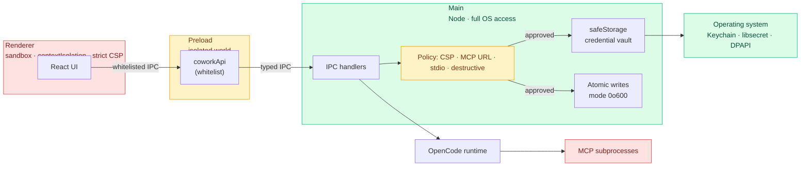

# Security Model

This page describes Open Cowork's security posture at a level that
answers the questions a careful downstream reviewer is most likely to
ask: where does user data live, how are credentials protected, what
prevents a malicious MCP or chart spec from escalating privileges, and
how is the supply chain verified.

Open Cowork is an Electron application that embeds the OpenCode
runtime. The runtime owns session execution and tool semantics; the
desktop layer owns UI, config, credential storage, and the process
boundary between the untrusted renderer and the trusted Node main
process.

## Process model

Electron enforces a three-process split:

- **Main process** (Node). Config loading, IPC, session registry, file
  I/O, process spawning, and credential storage. This is the only
  place with full OS access.
- **Preload script** (Node, isolated world). Exposes a hand-audited
  `coworkApi` surface via `contextBridge`. Every IPC channel is
  enumerated in `apps/desktop/src/preload/index.ts` — nothing outside
  that whitelist is reachable from the renderer.
- **Renderer process** (sandboxed Chromium). Runs with
  `contextIsolation: true`, `sandbox: true`, `nodeIntegration: false`,
  and a strict CSP. No direct filesystem, no Node modules, no arbitrary
  IPC — only the preload's typed methods.

`will-navigate` and `setWindowOpenHandler` both reject any navigation
whose target origin differs from the app's own shell, so even a
compromised renderer cannot redirect itself to an attacker-controlled
origin.



The two tinted regions are the boundary: untrusted code (renderer,
external MCPs) on the left, trusted code (main, OS keychain) on the
right, with the preload bridge and policy layer (yellow) as the only
connections between them. Every IPC call goes through the whitelist;
every credential write goes through `safeStorage`; every MCP gets its
own subprocess.

## Project directory grants

Project-scoped runtime, explorer, workflow, custom agent, custom MCP,
and custom skill IPC calls only accept directories that the main process
already trusts. A directory becomes trusted when the user chooses it in
the native directory picker, or when it is already attached to a
Cowork-owned session or workflow record. Renderer-provided path strings
are therefore treated as references to main-owned grants, not as
standalone authority to read or run OpenCode in arbitrary filesystem
roots.

## Local workflow webhooks

Workflow webhooks are local desktop triggers. The webhook server binds to
`127.0.0.1` only, accepts JSON `POST` requests with a bounded payload, and
does not put the generated secret in the URL. Callers authenticate with either
an `Authorization: Bearer <secret>` header or the signed
`X-Open-Cowork-Timestamp` / `X-Open-Cowork-Signature` HMAC headers. Rotating a
webhook secret keeps the local URL stable and invalidates old headers.

## Hybrid security gates

Desktop, Cloud, Gateway, and Desktop pairing modes have separate authority and
audit boundaries. The production contract for those boundaries is documented in
[Hybrid Security Gates](hybrid-security-gates.md) and enforced by
`deploy/security/hybrid-security-gates.json` through `pnpm deploy:validate`.
The core rules are that every thread has one execution authority, Desktop
pairing defaults remote approvals and questions to `local_confirmation`, public
Gateway ingress requires provider signing or HMAC, and production Cloud/Gateway
deployments fail closed without durable stores, TLS, admin auth, backups, and
redaction posture.

## Data at rest

User data is stored under Electron's `userData` path, which is branded
per install (`<appData>/<brand name>` — e.g.
`~/Library/Application Support/Open Cowork` on macOS). Within that
directory:

- **`sessions.json`** — session index (ids, titles, `updatedAt`, cached
  usage summary). Written atomically through
  `writeFileAtomic(path, body, { mode: 0o600 })` in `fs-atomic.ts`:
  the payload is written to `path.tmp-<pid>-<rand>`, `fsync`'d, then
  renamed over the stable name. A crash mid-write cannot truncate
  the existing index.
- **`settings.enc`** — the effective settings blob, including provider
  and integration credentials. In production it is only written when
  Electron `safeStorage` is available (Keychain on macOS, libsecret on
  Linux, DPAPI on Windows); otherwise the save fails closed rather than
  falling back to plaintext. Dev/test contexts may still use a
  plaintext `settings.json` fallback for local iteration.
- **`google-tokens.json`** — Google OAuth refresh/access tokens when a
  downstream build enables `auth.mode: google-oauth`. Production builds
  apply the same fail-closed policy as `settings.enc`: encrypted via
  `safeStorage` or not persisted at all.
- **Logs** — `<dataDir>/logs/open-cowork-YYYY-MM-DD.log`. Session
  ids are truncated via `shortSessionId()` before logging; full API
  keys are never emitted.

All writes go through `writeFileAtomic` with `mode: 0o600` so a stray
`chmod -R` isn't the last line of defense.

The fail-closed decision for `settings.enc` and `google-tokens.json` is
centralised in `secure-storage-policy.ts`: `resolveSecretStorageMode()`
returns one of `encrypted` (packaged or dev with `safeStorage` working),
`plaintext` (dev-only fallback when `safeStorage` is missing — e.g.
Linux without a keyring), or `unavailable` (packaged with no
`safeStorage`, where we refuse the write and surface an error rather
than leak credentials to disk). `auth.ts` and `settings.ts` both route
through this policy so they can't diverge.

## MCP sandbox boundaries

Custom MCPs are the most common extensibility point, and the one most
likely to be probed for holes. The runtime enforces three separate
policies:

### URL policy (HTTP MCPs)

`evaluateHttpMcpUrl` / `evaluateHttpMcpUrlResolved` in
`packages/runtime-host/src/mcp-url-policy.ts` reject literal and
DNS-resolved targets for:

- Non-`http`/`https` schemes.
- Loopback (`127.0.0.0/8`, `::1`, `localhost`) — blocks tunnels to
  local services that could exfiltrate data.
- Link-local (`169.254.0.0/16`, `fe80::/10`) — blocks cloud metadata
  endpoints (`169.254.169.254`).
- Private-network RFC1918 ranges (`10/8`, `172.16/12`, `192.168/16`)
  and IPv6 ULAs (`fc00::/7`) — blocks corporate-internal pivot.

The `allowPrivateNetwork` flag on `CustomMcpConfig` relaxes the private-IP
guard (the UI surfaces a warning when it's set) — but cloud-metadata endpoints
(`169.254.169.254`, `metadata.google.internal`, etc.) stay blocked even with the
flag, so it cannot be used to reach an instance metadata service. The guard
runs at save time (`custom:add-mcp`), test time (`custom:test-mcp`), and
runtime registration, so public-looking hostnames that resolve into
private networks at those policy checkpoints are skipped before OpenCode
receives the MCP entry.

**DNS pin / residual SSRF (JOE-826):** At runtime handoff, cleartext `http:`
MCP entries are rewritten to connect to a policy-validated resolved address
while preserving the original `Host` header (`pinHttpMcpRemoteEntry`). That
closes the DNS-rebinding window for HTTP. **HTTPS residual:** OpenCode owns
the TLS transport; IP-pinning would break SNI and certificate hostname checks,
so `https:` MCPs stay hostname-based after the pre-connect DNS policy check.
Operators who need stronger guarantees for HTTPS MCPs should terminate TLS at
a trusted reverse proxy with a fixed upstream IP, or restrict MCPs to known
static endpoints. Cloud-metadata targets remain hard-denied on every policy
check regardless of protocol.

### stdio policy (stdio MCPs)

`validateCustomMcpStdioCommand` in `mcp-stdio-policy.ts` requires the
executable name (or absolute path) to match a safe-command shape before
the MCP can be saved. Shell metacharacters, `..` segments, and
redirection operators are all rejected.

Package runners such as `npx`, `bunx`, and `uvx` remain explicit trust
decisions **and require a version-pinned package argument** (JOE-827).
Floating names (`npx some-package`) and `@latest` / `@*` tags are rejected
at save/validate time. Use `some-package@1.2.3`, scoped
`@scope/name@1.2.3`, `uvx name==1.2.3`, or a local script path.
Unpinned installs are equivalent to remote code execution under the MCP
privilege boundary.

### MCP tool approvals

User-added custom MCPs are ask-first by default. Assigning a custom MCP to
an agent exposes the MCP namespace to that agent, but OpenCode still
raises approval requests before tool calls. The only exception is an
explicit user trust decision in Tools & Skills, persisted as
`permissionMode: "allow"` in Open Cowork's MCP sidecar metadata. That
trust flag generates OpenCode-native allow rules for assigned agents, and
agent-specific denied method patterns still win last.

### Agent permission boundary

Open Cowork composes OpenCode-native permission config for agents, tools,
skills, and MCP namespaces. OpenCode owns enforcement of those runtime
permissions at execution time; Open Cowork's security role is to validate
and curate the config before it reaches the runtime, keep credentials out of
ambient process env, and avoid running a parallel tool-enforcement layer.

### Runtime isolation

OpenCode spawns each MCP as its own subprocess. Each MCP sees only the
env it was configured with (plus an opt-in `GOOGLE_APPLICATION_CREDENTIALS`
when `googleAuth: true`), never the user's full shell env. Tool
responses are typed at the runtime boundary; a misbehaving MCP cannot
inject arbitrary IPC events into Open Cowork's renderer.

Bundled authoring MCPs that mutate Open Cowork metadata use per-runtime
loopback bridge URLs and bearer tokens instead of direct renderer or
filesystem access. For example, the Agents MCP can write only custom
agents and routes every save through the same main-process validation and
permission builder as the desktop UI.

By default, the managed OpenCode runtime runs with a Cowork-owned
runtime `HOME` and Cowork-owned XDG roots so OpenCode does not discover
unmanaged machine-local agents, skills, MCPs, provider auth, or state.
Cowork injects its generated runtime config in memory and keeps
user-authored Cowork skills and agents inside the app sandbox.

Advanced users can switch Settings → Permissions → OpenCode config
source to **Machine OpenCode**. In that mode Cowork still owns the
desktop UI and local server lifecycle, but OpenCode reads the user's
normal machine OpenCode config, skills, agents, tools, and provider
auth from the real `HOME`/XDG roots. Cowork does not inject its
generated runtime config in that mode.

To keep app-isolated developer workflows usable, Open Cowork can bridge
a curated set of standard tooling paths such as Git, npm/pnpm/yarn, SSH,
GitHub CLI, Docker, Kubernetes, AWS, Azure, and Google Cloud config into
the app runtime home. Those bridged files are a deliberate trust
boundary: tools invoked by OpenCode may read the linked developer-tool
config. The bridge deliberately omits OpenCode, Claude, and agent
compatibility roots. Users can disable it during first-run setup or
later in Settings → Permissions → Developer config bridge; disabling it
removes the curated symlinks from the managed runtime home on the next
runtime restart.

The OpenCode server process also receives a curated environment, not the
user's full login shell environment. On macOS/Linux, Open Cowork may execute a
trusted login shell (`bash`, `dash`, `sh`, or `zsh` from a fixed allowlist, with nushell
blocked) to discover the user's normal toolchain `PATH`. That shell execution is
only an environment-discovery step. The result is filtered before it reaches
OpenCode: Open Cowork preserves toolchain basics such as `PATH`, locale,
temp-directory, proxy variables, custom CA trust-store variables, and
app-managed OpenCode variables, then sets Cowork-owned `HOME`/XDG paths and the
app-scoped Google ADC path when available. Arbitrary exported secrets,
SSH-agent sockets, and command overrides such as `OPENAI_API_KEY`, cloud
session tokens, `SSH_AUTH_SOCK`, and `GIT_SSH_COMMAND` are not forwarded into
the managed runtime.

Provider authentication is app-owned. OpenCode still owns provider login
flows, but the managed runtime writes provider auth under Open Cowork's
runtime data directory so app credentials do not pollute a machine-local
OpenCode install. There is no setting that links OpenCode's native
`auth.json` into the managed runtime; the Machine OpenCode config source
described above is the only mode in which OpenCode reads native provider
auth, and it repoints the whole runtime at the real `HOME`/XDG roots
rather than bridging the app-owned auth store.
Credentialless OpenCode-native providers such as GitHub Copilot still follow
this boundary: Open Cowork may activate the provider in runtime config, but
OpenCode owns the login/device-code flow and token storage. Copilot tokens are
not entered into Open Cowork settings, copied into cloud sync payloads, or
forwarded to the gateway.

## Managed cloud worker boundary

The managed worker service plane is a cloud execution-capacity layer, not a
new runtime. Workers claim tenant-scoped cloud work from durable control
plane records, run OpenCode, and write events, projections, checkpoints,
artifacts, and workflow status back with lease-token fencing. Browser clients,
Desktop cloud clients, and Gateway clients never receive worker credentials and
never talk to OpenCode directly for cloud execution.

The first supported deployment mode is control-plane-owned worker pools: hosted
BYOK operators run their own workers, and self-hosters run workers beside their
own Cloud control plane. Customer-hosted workers connected to a separate
managed SaaS control plane are intentionally deferred until a separate trust
review exists.

Standalone Gateway can optionally register with Cloud as an external workspace
or as trusted edge capacity only through the
[Cloud Gateway Registration](cloud-gateway-registration.md) contract.
`external_workspace` registration does not make Cloud the source of truth for
Gateway sessions. `edge_worker` registration keeps Cloud as the source of truth
for Cloud-owned work and requires managed-worker lease-token fencing on every
event, projection, artifact, checkpoint, usage, and status write. Customer-hosted
Gateway edge execution against a separate managed SaaS Cloud is deferred and
must fail closed.

Worker credentials are scoped, expiring, hash-stored after issuance, rotatable,
and revocable. BYOK plaintext reveal is worker-role-only and
tenant/provider/session bounded. Provider keys enter OpenCode through runtime
config provider options, not ambient process environment variables. The full
lifecycle, lease/fencing contract, recovery behavior, and threat model live in
[Managed Worker Service Plane](managed-workers.md).

## Chart frame isolation

Chart rendering uses Vega, which compiles its specs with `new Function()`
(the reactive dataflow interpreter evaluates expressions at runtime).
That means the chart iframe *must* allow `unsafe-eval` — there is no
AOT path we can use without reimplementing Vega.

We scope the risk by keeping charts inside a dedicated iframe
(`chart-frame.html`) with a separate, stricter CSP than the main
renderer:

- `default-src 'none'`, `connect-src 'none'` in packaged builds —
  even arbitrary JS cannot exfiltrate over the network.
- `sandbox="allow-scripts"` on the iframe tag. The chart frame can run
  Vega scripts, but it intentionally does **not** get
  `allow-same-origin`; its origin stays opaque, and popups, forms, and
  top-level navigation remain blocked.
- `frame-ancestors 'self'` — only the host renderer can embed the
  chart; blocks click-jacking from untrusted origins.
- The chart-frame preload is empty — no `nodeIntegration`, no
  `coworkApi`, no filesystem, no IPC.
- Incoming chart specs pass through the shared `validateInlineChartSpec`
  guard before static rendering and inside the chart iframe before
  `vega-embed` receives the spec. It rejects external resource keys
  (`url`, `href`, `src`), image marks, oversized specs, excessive array
  items, and excessive object depth so specs can only reference bounded
  inline values the caller already had.
- Compiled Vega specs additionally pass through
  `assertBoundedVegaSpecCardinality`
  (`apps/desktop/src/main/chart-spec-safety.ts`), called from
  `chart-renderer.ts` before `vega.parse`. It statically bounds each data
  pipeline's estimated output row count and allowlists transforms: amplifying
  transforms like `cross` and `graticule` are rejected outright, generators
  (`sequence`, `density`, `kde`, `quantile`, and contour/heatmap grids) are
  capped, and any transform type that is neither an explicit amplifier nor in
  `ROW_SAFE_CHART_TRANSFORMS` is rejected fail-closed. This keeps a tiny spec
  from expanding into millions of rows and blocking the synchronous,
  uninterruptible Vega evaluation on the main-process event loop.
- The parent's `postMessage` handler checks both `event.origin` and
  `event.source === iframe.contentWindow` before trusting the payload
  (see `packages/app/src/components/chat/VegaChart.tsx`).

The rationale is also inlined as a comment block in
`apps/desktop/src/main/content-security-policy.ts` so that future
readers see it at the point of decision.

## Content Security Policy

The main renderer runs under a strict CSP:

```
default-src 'self'
script-src 'self'                                  (packaged)
style-src 'self' 'unsafe-inline'
img-src 'self' data: blob: open-cowork-asset:
connect-src 'self'
font-src 'self' data:
frame-src 'self'                                   (permits the sandboxed chart iframe)
object-src 'none'
base-uri 'self'
form-action 'self'
frame-ancestors 'none'
```

Dev mode loosens `script-src` with `'unsafe-inline'` and adds the Vite
HMR origin to `connect-src`; packaged builds do not set
`devServerUrl` and stay on the policy above. External images from
agent, MCP, or markdown content are blocked by default to avoid turning
message rendering into an HTTP beacon. Images should be attached as
local artifacts or data/blob URLs; remote image fetching is not part of
the default renderer trust model. There are two exceptions, both scoped to
specific URLs:

1. The chart iframe uses `buildChartFrameContentSecurityPolicy` (see
   above).
2. No other origin can navigate the renderer: `frame-ancestors 'none'`
   blocks embedding, `form-action 'self'` blocks redirect-via-POST,
   `will-navigate` in `main/main-window-security.ts` intercepts navigation attempts.

## Supply chain verification

Release artifacts are built from a pinned source tag through the
GitHub Actions workflow in `.github/workflows/release.yml`:

- Every action reference is SHA-pinned with a version comment, so a
  compromise of an upstream tag cannot push unreviewed code into our
  release.
- `actions/attest-build-provenance` emits a SLSA provenance attestation
  over every packaged artifact (DMG, zip, AppImage, deb).
- `anchore/sbom-action` generates both a CycloneDX (`sbom.cdx.json`)
  and an SPDX (`sbom.spdx.json`) SBOM, which are published alongside
  the binaries on each tagged release. Downstream consumers can feed
  either into their scanner of choice.
- `SHA256SUMS.txt` covers every artifact including the SBOMs, so a
  tampered SBOM is as visible as a tampered binary.
- Linux `.AppImage` and `.deb` artifacts are verified through
  `SHA256SUMS.txt`, GitHub build provenance, and `SHA256SUMS.txt.asc`
  when a release GPG key is configured. Detached checksum signatures are
  required for `v1.0.0` and later Linux releases.

The `v0.x` public-preview line is intentionally unsigned while Apple
Developer validation is pending. The release workflow can publish
unsigned `v0.x` artifacts only when the explicit preview override is
enabled; `v1.0.0` and later tags require signed/notarized macOS
artifacts. Downstream forks that need Developer ID / Authenticode
signing plug into the existing `dist:ci:mac` step. The steps for signing
are documented in `docs/packaging-and-releases.md`.

## Update Release Source Credentials

Settings can check public GitHub Releases or a downstream-configured
private update release source. Private source auth is always resolved in
the main process:

- renderer IPC payloads include only the safe source label, kind,
  channel, and unsupported reason
- Google OAuth access tokens, static headers, GitHub tokens, signed URL
  query strings, bucket names, and object paths are never sent to the
  renderer
- signed URL query strings and authorization headers are redacted by the
  log sanitizer before logs or diagnostics leave the machine
- in-app download and restart-to-install remain gated to signed packaged
  macOS builds with embedded feed metadata and explicit user action

Manual fallback URLs must be ordinary HTTPS support/release pages, not
credential-bearing signed artifact URLs.

## Provider Key Redaction Fixtures

Provider-token redaction is backed by a shared fixture matrix in
`tests/fixtures/secret-redaction-fixtures.ts`. When adding a provider or a new
key family, add a fake runtime-assembled fixture there first, then run it
through the log sanitizer, diagnostics export, Gateway diagnostics, Cloud
telemetry/audit redaction, and deployment evidence sanitizer tests. Prefer
over-redacting token-shaped strings in diagnostics over preserving readability:
public support bundles, launch evidence, and logs must never contain raw
provider keys, OAuth tokens, gateway service tokens, webhook secrets, signed
URL credentials, or local home-directory paths.

## Dependency posture

- `pnpm audit:prod` runs the production graph at the moderate gate and
  `pnpm audit:full` runs the full dependency graph at the high gate in CI and
  release policy.
- Root `pnpm.overrides` entries are intentional. The full set lives in
  `pnpm-workspace.yaml`; representative examples are:
  - `ip-address@<=10.1.0` is forced to `>=10.1.1` to keep Electron
    Builder's transitive `socks` stack above GHSA-v2v4-37r5-5v8g.
  - `mermaid>uuid` is pinned to `^14.0.0` so Mermaid's transitive UUID
    dependency stays on the current major used by the rest of the bundle.
  - `electron-builder-squirrel-windows` is pinned while the package graph
    contains mixed Electron Builder helper versions.
  - Several CVE forces raise transitive dependencies past their patched
    versions (for example `dompurify`, `form-data`, `hono`, `js-yaml`, `qs`,
    `tar`, `tmp`, `undici`, and `vite`).
- Audit-gate exceptions: when an advisory that trips the CI audit gate has no
  fixed release yet, add only its `CVE-*` or `GHSA-*` identifier to
  `pnpm.auditConfig.ignoreCves` or `pnpm.auditConfig.ignoreGhsas` in the root
  `package.json`. `scripts/pnpm-audit.mjs` enforces that allowlist around
  the installed pnpm dependency graph and npm Bulk Advisory API. The PR must
  include a justification, impact notes, and an owner/date for removal; the
  entry is removed once a patched release ships and is re-reviewed during
  monthly maintenance.
- Renderer bundles are split per-feature so a CVE in a heavy, rarely
  loaded dependency (e.g. a Vega module) does not block a patch
  release of the shell.
- Monthly maintenance watches paired OpenCode SDK/runtime package
  updates for shape changes that could affect our event projector or
  packaged runtime.

## Reporting a vulnerability

Please follow `SECURITY.md` at the repo root. It describes the
supported versions, the scope of what the security team will
triage as a vuln (vs. a feature request or a downstream-config
question), and the contact channel for coordinated disclosure.
