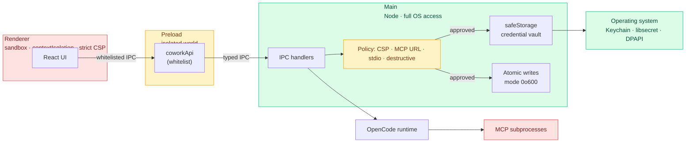

# Security Model

This page describes Open Cowork's security posture at a level that
answers the questions a careful downstream reviewer is most likely to
ask: where does user data live, how are credentials protected, what
prevents a malicious MCP or chart spec from escalating privileges, and
how is the supply chain verified.

Open Cowork is an Electron application that embeds the OpenCode
runtime. The runtime owns session execution and tool semantics; the
desktop layer owns UI, config, credential storage, and the process
boundary between the untrusted renderer and the trusted Node main
process.

## Process model

Electron enforces a three-process split:

- **Main process** (Node). Config loading, IPC, session registry, file
  I/O, process spawning, and credential storage. This is the only
  place with full OS access.
- **Preload script** (Node, isolated world). Exposes a hand-audited
  `coworkApi` surface via `contextBridge`. Every IPC channel is
  enumerated in `apps/desktop/src/preload/index.ts` — nothing outside
  that whitelist is reachable from the renderer.
- **Renderer process** (sandboxed Chromium). Runs with
  `contextIsolation: true`, `sandbox: true`, `nodeIntegration: false`,
  and a strict CSP. No direct filesystem, no Node modules, no arbitrary
  IPC — only the preload's typed methods.

`will-navigate` and `setWindowOpenHandler` both reject any navigation
whose target origin differs from the app's own shell, so even a
compromised renderer cannot redirect itself to an attacker-controlled
origin.



The two tinted regions are the boundary: untrusted code (renderer,
external MCPs) on the left, trusted code (main, OS keychain) on the
right, with the preload bridge and policy layer (yellow) as the only
connections between them. Every IPC call goes through the whitelist;
every credential write goes through `safeStorage`; every MCP gets its
own subprocess.

## Data at rest

User data is stored under Electron's `userData` path, which is branded
per install (`<appData>/<brand name>` — e.g.
`~/Library/Application Support/Open Cowork` on macOS). Within that
directory:

- **`sessions.json`** — session index (ids, titles, `updatedAt`, cached
  usage summary). Written atomically through
  `writeFileAtomic(path, body, { mode: 0o600 })` in `fs-atomic.ts`:
  the payload is written to `path.tmp-<pid>-<rand>`, `fsync`'d, then
  renamed over the stable name. A crash mid-write cannot truncate
  the existing index.
- **`settings.enc`** — the effective settings blob, including provider
  and integration credentials. In production it is only written when
  Electron `safeStorage` is available (Keychain on macOS, libsecret on
  Linux, DPAPI on Windows); otherwise the save fails closed rather than
  falling back to plaintext. Dev/test contexts may still use a
  plaintext `settings.json` fallback for local iteration.
- **`google-tokens.json`** — Google OAuth refresh/access tokens when a
  downstream build enables `auth.mode: google-oauth`. Production builds
  apply the same fail-closed policy as `settings.enc`: encrypted via
  `safeStorage` or not persisted at all.
- **Logs** — `<dataDir>/logs/open-cowork-YYYY-MM-DD.log`. Session
  ids are truncated via `shortSessionId()` before logging; full API
  keys are never emitted.

All writes go through `writeFileAtomic` with `mode: 0o600` so a stray
`chmod -R` isn't the last line of defense.

The fail-closed decision for `settings.enc` and `google-tokens.json` is
centralised in `secure-storage-policy.ts`: `resolveSecretStorageMode()`
returns one of `encrypted` (packaged or dev with `safeStorage` working),
`plaintext` (dev-only fallback when `safeStorage` is missing — e.g.
Linux without a keyring), or `unavailable` (packaged with no
`safeStorage`, where we refuse the write and surface an error rather
than leak credentials to disk). `auth.ts` and `settings.ts` both route
through this policy so they can't diverge.

## MCP sandbox boundaries

Custom MCPs are the most common extensibility point, and the one most
likely to be probed for holes. The runtime enforces three separate
policies:

### URL policy (HTTP MCPs)

`evaluateHttpMcpUrl` in `apps/desktop/src/main/mcp-url-policy.ts`
rejects:

- Non-`http`/`https` schemes.
- Loopback (`127.0.0.0/8`, `::1`, `localhost`) — blocks tunnels to
  local services that could exfiltrate data.
- Link-local (`169.254.0.0/16`, `fe80::/10`) — blocks cloud metadata
  endpoints (`169.254.169.254`).
- Private-network RFC1918 ranges (`10/8`, `172.16/12`, `192.168/16`)
  and IPv6 ULAs (`fc00::/7`) — blocks corporate-internal pivot.

The `allowPrivateNetwork` flag on `CustomMcpConfig` is the only way to
bypass the guard, and the UI surfaces a warning when it's set. This
closes SSRF vectors both at save time (`custom:add-mcp`) and at
test time (`custom:test-mcp`).

### stdio policy (stdio MCPs)

`validateCustomMcpStdioCommand` in `mcp-stdio-policy.ts` requires the
executable name (or absolute path) to match a safe-command shape before
the MCP can be saved. Shell metacharacters, `..` segments, and
redirection operators are all rejected.

Package runners such as `npx`, `bunx`, and `uvx` remain explicit trust
decisions. Adding an MCP that runs `npx some-package` is equivalent to
trusting that package publisher and whatever version resolution selects.
Prefer pinned package specs such as `some-package@1.2.3` for repeatable
MCP configuration.

### Runtime isolation

OpenCode spawns each MCP as its own subprocess. Each MCP sees only the
env it was configured with (plus an opt-in `GOOGLE_APPLICATION_CREDENTIALS`
when `googleAuth: true`), never the user's full shell env. Tool
responses are typed at the runtime boundary; a misbehaving MCP cannot
inject arbitrary IPC events into Open Cowork's renderer.

## Chart frame isolation

Chart rendering uses Vega, which compiles its specs with `new Function()`
(the reactive dataflow interpreter evaluates expressions at runtime).
That means the chart iframe *must* allow `unsafe-eval` — there is no
AOT path we can use without reimplementing Vega.

We scope the risk by keeping charts inside a dedicated iframe
(`chart-frame.html`) with a separate, stricter CSP than the main
renderer:

- `default-src 'none'`, `connect-src 'none'` in packaged builds —
  even arbitrary JS cannot exfiltrate over the network.
- `sandbox` attribute on the iframe tag (allows scripts + same-origin
  but blocks popups, forms, top-level navigation).
- `frame-ancestors 'self'` — only the host renderer can embed the
  chart; blocks click-jacking from untrusted origins.
- The chart-frame preload is empty — no `nodeIntegration`, no
  `coworkApi`, no filesystem, no IPC.
- Incoming chart specs pass through `VegaSpecSchema` validation before
  rendering. `data.url` is explicitly rejected so specs can only
  reference inline values the caller already had.
- The parent's `postMessage` handler checks both `event.origin` and
  `event.source === iframe.contentWindow` before trusting the payload
  (see `VegaChart.tsx`).

The rationale is also inlined as a comment block in
`apps/desktop/src/main/content-security-policy.ts` so that future
readers see it at the point of decision.

## Content Security Policy

The main renderer runs under a strict CSP:

```
default-src 'self'
script-src 'self'                                  (packaged)
style-src 'self' 'unsafe-inline'
img-src 'self' data: blob:
connect-src 'self'
font-src 'self' data:
object-src 'none'
base-uri 'self'
form-action 'self'
frame-ancestors 'none'
```

Dev mode loosens `script-src` with `'unsafe-inline'` and adds the Vite
HMR origin to `connect-src`; packaged builds do not set
`devServerUrl` and stay on the policy above. External images from
agent, MCP, or markdown content are blocked by default to avoid turning
message rendering into an HTTP beacon. Images should be attached as
local artifacts or data/blob URLs until a user-controlled remote-image
allowlist exists. There are two exceptions, both scoped to specific
URLs:

1. The chart iframe uses `buildChartFrameContentSecurityPolicy` (see
   above).
2. No other origin can navigate the renderer: `frame-ancestors 'none'`
   blocks embedding, `form-action 'self'` blocks redirect-via-POST,
   `will-navigate` in `main/index.ts` intercepts navigation attempts.

## Supply chain verification

Release artifacts are built from a pinned source tag through the
GitHub Actions workflow in `.github/workflows/release.yml`:

- Every action reference is SHA-pinned with a version comment, so a
  compromise of an upstream tag cannot push unreviewed code into our
  release.
- `actions/attest-build-provenance` emits a SLSA provenance attestation
  over every packaged artifact (DMG, zip, AppImage, deb).
- `anchore/sbom-action` generates both a CycloneDX (`sbom.cdx.json`)
  and an SPDX (`sbom.spdx.json`) SBOM, which are published alongside
  the binaries on each tagged release. Downstream consumers can feed
  either into their scanner of choice.
- `SHA256SUMS.txt` covers every artifact including the SBOMs, so a
  tampered SBOM is as visible as a tampered binary.
- Linux `.AppImage` and `.deb` artifacts are not GPG-signed in v0.0.0.
  Their authenticity model is the GitHub Release checksum file plus
  GitHub build provenance attestation. Add detached GPG signatures or
  an apt repository signing path before distributing through Linux
  package channels outside GitHub Releases.

Public upstream GitHub Releases require signed/notarized macOS artifacts.
Unsigned preview builds can still be produced as workflow artifacts when
the explicit preview override is enabled, but those runs fail loudly
before release publication. Downstream forks that need Developer ID /
Authenticode signing plug into the existing `dist:ci:mac` step. The
steps for signing are documented in `docs/packaging-and-releases.md`.

## Dependency posture

- `pnpm audit --prod --audit-level high` runs as part of the CI gate.
- Root `pnpm.overrides` entries are intentional:
  - `hono@<4.12.14` is forced to `>=4.12.14` to keep the transitive
    `@modelcontextprotocol/sdk` web stack above GHSA-458j-xx4x-4375.
  - `mermaid>uuid` is pinned to `^14.0.0` so Mermaid's transitive UUID
    dependency stays on the current major used by the rest of the bundle.
  - `electron-builder-squirrel-windows` is pinned while the package graph
    contains mixed Electron Builder helper versions.
- Renderer bundles are split per-feature so a CVE in a heavy, rarely
  loaded dependency (e.g. a Vega module) does not block a patch
  release of the shell.
- Monthly maintenance watches the OpenCode SDK for shape changes that
  could affect our event projector.

## Reporting a vulnerability

Please follow `SECURITY.md` at the repo root. It describes the
supported versions, the scope of what the security team will
triage as a vuln (vs. a feature request or a downstream-config
question), and the contact channel for coordinated disclosure.
