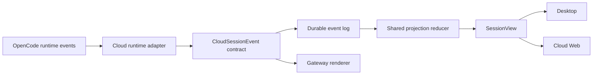

# Session Projection Contract

Open Cowork syncs product state through shared Cloud session event and
projection record types. The contract is versioned in
`packages/shared/src/cloud-session-contract.ts` and consumed by Desktop, Cloud
Web, and Gateway. OpenCode still owns runtime execution; Open Cowork only
normalizes runtime output into durable product events.

## Version

Current contract version: `1`.

Public shared types:

- `CloudSessionEventRecord`
- `CloudSessionProjectionEventRecord`
- `CloudSessionEventType`
- `CloudProjectedSessionEventType`

Changing the meaning of an existing event or projection field requires a
version bump, a migration or compatibility path for stored projections, and
tests proving older snapshots still hydrate safely. Adding a new event type is
allowed without a version bump only when older clients can ignore it without
losing required chat state.

## Event Flow

Rules:

- Raw OpenCode SDK events stop at the runtime adapter.
- Cloud workers append only canonical `CloudSessionEventType` values.
- Projection reducers live in shared code and produce the `SessionView` shape
  Desktop already consumes.
- Gateway renders only event types marked `channelRenderable` in the shared
  contract.
- `snapshot.required` and `channel.delivery` are control events, not projected
  session state.

## Projected Event Vocabulary

Projected events update durable session state:

- `session.created`
- `session.imported`
- `session.project_source.bound`
- `prompt.submitted`
- `assistant.message`
- `tool.call`
- `task.run`
- `permission.requested`
- `permission.resolved`
- `question.asked`
- `question.resolved`
- `todos.updated`
- `cost.updated`
- `artifact.created`
- `artifact.updated`
- `session.status`
- `session.idle`
- `session.aborted`
- `runtime.error`

Control events are delivered over Cloud APIs but do not update the session
projection:

- `snapshot.required`
- `channel.delivery`

## Extension Rules

When adding an event:

1. Add it to `CLOUD_SESSION_EVENT_CONTRACT` with facets, producers, consumers,
   channel renderability, and a short description.
2. If it is projected, update `reduceCloudSessionProjectionEvent`.
3. Add SDK normalization fixtures when it comes from OpenCode.
4. Add Desktop/Web/Gateway tests for every surface that consumes it.
5. Keep the Gateway renderer on canonical Cloud events. Do not render raw SDK
   event names in channel providers.

This contract is the compatibility boundary between synced product surfaces.
It should grow through typed events and tests, not through surface-specific
parsing of runtime internals.
