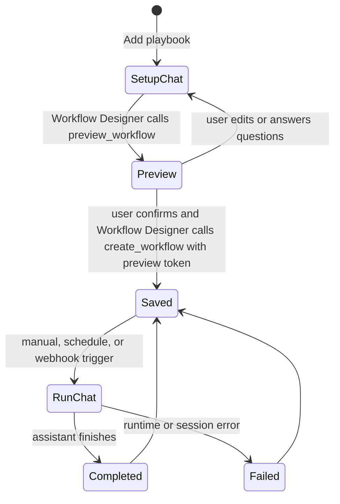

# Playbooks And Workflows

Playbooks are the Studio UI name for saved repeatable tasks. They are backed by
durable workflow definitions created from a normal OpenCode setup chat with the
Workflow Designer agent.

Workflows remain one noun in Open Cowork's shared
[Coordination Model](coordination-model.md). They are saved repeatable
automations. Projects and tasks coordinate multi-agent/team work, runs are
authority-scoped execution attempts, schedules trigger runs, and watches deliver
progress. A workflow may create runs, artifacts, questions, and permissions, but
it is not a separate runtime.

Workflow setup depends on the configured agent id `workflow-designer`.
Downstream builds that keep workflows enabled should keep that agent in
their app config, or intentionally update the workflow setup policy in code
and config together.

Playbooks appear across Desktop, Cloud, and Gateway deployments according to
the product mode. The release and packaging names for those modes are defined
in [Packaging and Gateway Product Modes](packaging-and-product-modes.md).

The product rule is simple:

- **OpenCode executes** sessions, agents, approvals, tools, skills, and
  streaming events.
- **Open Cowork remembers** the workflow definition, trigger schedule,
  webhook secret, run history, and links back to the setup/run chats.

There is no separate workflow runtime, inbox board, or hidden task engine.
Open Cowork does include a hidden built-in **Executive Assistant** agent for
workflow supervision, readiness checks, and run coordination; it is
workflow-only and is not shown in the normal chat agent picker.

`CoordinationTask` is durable product work. It is distinct from the session
`TaskRun` projection used to show OpenCode child-session delegation in chat.
Likewise, a `CoordinationProject` is a planning container and does not imply a
local project directory or host-path grant.

## How Creation Works

1. Open **Playbooks**.
2. Click **Add playbook**.
3. Open Cowork creates a normal chat with the `workflow-designer` agent.
4. You describe the repeatable task in plain language.
5. Workflow Designer asks follow-up questions until the task, tools, skills,
   coworker, and triggers are clear.
6. Workflow Designer calls the bundled `workflows_preview_workflow`
   tool and shows the proposed workflow.
7. After you explicitly confirm, Workflow Designer calls
   `workflows_create_workflow` with the preview token returned by the
   preview tool.

The saved playbook points back to that setup chat so you can reopen the
conversation that created it.

## What A Playbook Stores

A workflow stores:

- title
- repeatable instructions
- execution agent, usually `build` unless the setup chat chose another coworker
- linked skills and tools
- optional project directory
- manual, scheduled, and webhook triggers
- latest run status, summary, and linked run chat

The workflow definition is intentionally small. The detailed reasoning and
questions stay in the setup chat, where they belong.

## Triggers

Every playbook can run manually from the Playbooks page.

Scheduled triggers support:

- one-time
- daily
- weekly
- monthly

Webhook triggers expose a local HTTP URL. POST a JSON object to the copied URL
to start a run and pass trigger payload into the run prompt. The webhook secret
is sent in headers, not embedded in the URL, and can be regenerated from the
Playbooks page.

Supported auth is `Authorization: Bearer`, `x-open-cowork-webhook-secret`, or
timestamped HMAC.

The Playbooks page copies a ready-to-run bearer example:

```bash
curl -X POST 'http://127.0.0.1:47839/workflows/<workflow-id>' \
  -H 'content-type: application/json' \
  -H 'Authorization: Bearer <webhook-secret>' \
  --data '{"source":"manual"}'
```

For webhook senders that should not handle raw bearer secrets, sign the raw
JSON body with `HMAC-SHA256(secret, "<timestamp>.<raw-body>")` and send:

```bash
curl -X POST 'http://127.0.0.1:47839/workflows/<workflow-id>' \
  -H 'content-type: application/json' \
  -H 'x-open-cowork-timestamp: 2026-05-16T12:00:00.000Z' \
  -H 'x-open-cowork-signature: sha256=<hex-digest>' \
  --data '{"source":"manual"}'
```

Webhook payloads are bounded and must be JSON objects.

## Run Lifecycle



Each run is just another OpenCode session. The selected agent receives the
saved instructions plus the trigger payload. Open Cowork records the resulting
thread, status, and final summary.

## Playbooks Page

The Playbooks page is a control surface, not a second chat UI.

It shows:

- saved playbooks
- current status
- lead coworker
- linked skills/tools
- trigger summary
- webhook URL plus an authorization-header curl example
- latest run status and summary

Actions:

- **Add playbook** opens a setup chat.
- **Open setup chat** reopens the Workflow Designer setup chat.
- **Open latest run** reopens the exact execution chat represented by the
  displayed run summary.
- **Run** starts a manual run.
- **Pause/Resume** controls scheduled and webhook execution.
- **Archive** stops schedules and webhook triggers, then moves the playbook to
  the archived view without deleting its history.
- **Restore** returns an archived playbook to the active view; it does not run
  the playbook automatically.
- **Regenerate** rotates the webhook authorization secret after destructive
  confirmation, invalidating the previous secret.

## When To Use Playbooks

Use **chat** when the work is ad hoc or exploratory.

Use **playbooks** when:

- the same task should happen again
- a schedule or webhook should trigger it
- the task needs a remembered definition
- the result should be linked to durable run history

Examples:

- daily inbox summary
- weekly metrics report
- PR triage
- monthly customer-risk scan
- webhook-triggered ticket enrichment

## Boundary

Playbooks must stay a product layer over OpenCode.

They may compose coworkers (OpenCode agents), skills, tools, schedules, and
durable metadata. They must not reimplement OpenCode execution, tool semantics,
approvals, or native agent delegation.
