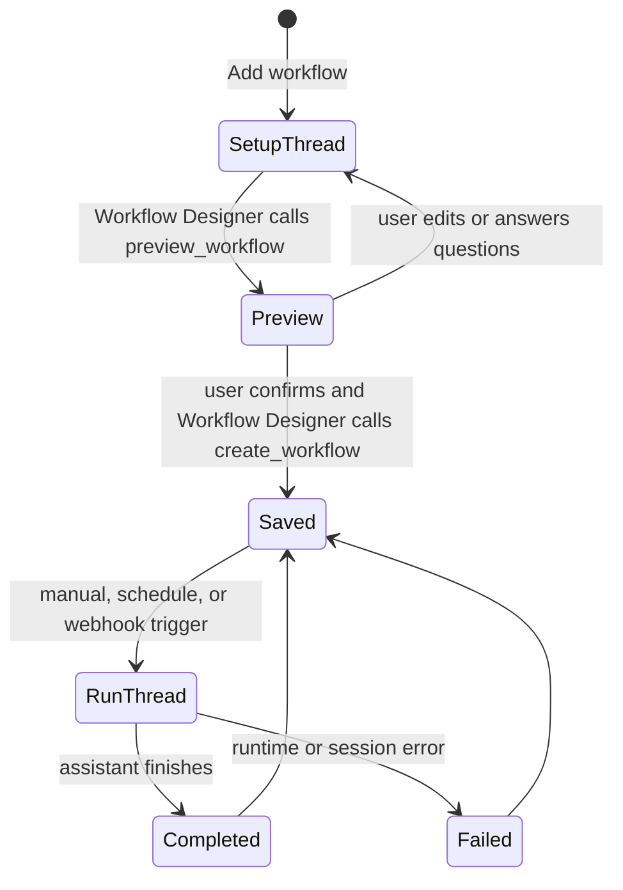

# Workflows

Workflows are saved repeatable tasks created from a normal OpenCode setup
thread with the Workflow Designer agent.

Workflows are one noun in Open Cowork's shared
[Coordination Model](coordination-model.md). They are saved repeatable
automations. Projects and tasks coordinate multi-agent/team work, runs are
authority-scoped execution attempts, schedules trigger runs, and watches deliver
progress. A workflow may create runs, artifacts, questions, and permissions, but
it is not a separate runtime.

Workflow setup depends on the configured agent id `workflow-designer`.
Downstream builds that keep workflows enabled should keep that agent in
their app config, or intentionally update the workflow setup policy in code
and config together.

The product rule is simple:

- **OpenCode executes** sessions, agents, approvals, tools, skills, and
  streaming events.
- **Open Cowork remembers** the workflow definition, trigger schedule,
  webhook secret, run history, and links back to the setup/run threads.

There is no separate workflow runtime, inbox board, or hidden task engine.
Open Cowork does include a hidden built-in **Executive Assistant** agent for
workflow supervision, readiness checks, and run coordination; it is
workflow-only and is not shown in the normal chat agent picker.

`CoordinationTask` is durable product work. It is distinct from the session
`TaskRun` projection used to show OpenCode child-session delegation in chat.
Likewise, a `CoordinationProject` is a planning container and does not imply a
local project directory or host-path grant.

## How Creation Works

1. Open **Workflows**.
2. Click **Add workflow**.
3. Open Cowork creates a normal thread with the `workflow-designer` agent.
4. You describe the repeatable task in plain language.
5. Workflow Designer asks follow-up questions until the task, tools, skills,
   agent, and triggers are clear.
6. Workflow Designer calls the bundled `mcp__workflows__preview_workflow`
   tool and shows the proposed workflow.
7. After you explicitly confirm, Workflow Designer calls
   `mcp__workflows__create_workflow`.

The saved workflow points back to that setup thread so you can reopen the
conversation that created it.

## What A Workflow Stores

A workflow stores:

- title
- repeatable instructions
- execution agent, usually `build` unless the setup thread chose another agent
- linked skills and tools
- optional project directory
- manual, scheduled, and webhook triggers
- latest run status, summary, and linked run thread

The workflow definition is intentionally small. The detailed reasoning and
questions stay in the setup thread, where they belong.

## Triggers

Every workflow can run manually from the Workflows page.

Scheduled triggers support:

- one-time
- daily
- weekly
- monthly

Webhook triggers expose a local HTTP URL. POST a JSON object to the copied URL
to start a run and pass trigger payload into the run prompt. The webhook secret
is sent in headers, not embedded in the URL, and can be regenerated from the
Workflows page.

Supported auth is `Authorization: Bearer`, `x-open-cowork-webhook-secret`, or
timestamped HMAC.

The Workflows page copies a ready-to-run bearer example:

```bash
curl -X POST 'http://127.0.0.1:47839/workflows/<workflow-id>' \
  -H 'content-type: application/json' \
  -H 'Authorization: Bearer <webhook-secret>' \
  --data '{"source":"manual"}'
```

For webhook senders that should not handle raw bearer secrets, sign the raw
JSON body with `HMAC-SHA256(secret, "<timestamp>.<raw-body>")` and send:

```bash
curl -X POST 'http://127.0.0.1:47839/workflows/<workflow-id>' \
  -H 'content-type: application/json' \
  -H 'x-open-cowork-timestamp: 2026-05-16T12:00:00.000Z' \
  -H 'x-open-cowork-signature: sha256=<hex-digest>' \
  --data '{"source":"manual"}'
```

Webhook payloads are bounded and must be JSON objects.

## Run Lifecycle



Each run is just another OpenCode session. The selected agent receives the
saved instructions plus the trigger payload. Open Cowork records the resulting
thread, status, and final summary.

## Workflows Page

The Workflows page is a control surface, not a second chat UI.

It shows:

- saved workflows
- current status
- execution agent
- linked skills/tools
- trigger summary
- webhook URL plus an authorization-header curl example
- latest run status and summary

Actions:

- **Add workflow** opens a setup thread.
- **Open setup** reopens the Workflow Designer setup thread.
- **Open latest run** reopens the most recent execution thread.
- **Run** starts a manual run.
- **Pause/Resume** controls scheduled and webhook execution.
- **Archive** hides a workflow without deleting its history.
- **Regenerate** rotates the webhook authorization secret.

## When To Use Workflows

Use **chat** when the work is ad hoc or exploratory.

Use **workflows** when:

- the same task should happen again
- a schedule or webhook should trigger it
- the task needs a remembered definition
- the result should be linked to durable run history

Examples:

- daily inbox summary
- weekly metrics report
- PR triage
- monthly customer-risk scan
- webhook-triggered ticket enrichment

## Boundary

Workflows must stay a product layer over OpenCode.

They may compose agents, skills, tools, schedules, and durable metadata. They
must not reimplement OpenCode execution, tool semantics, approvals, or native
agent delegation.
