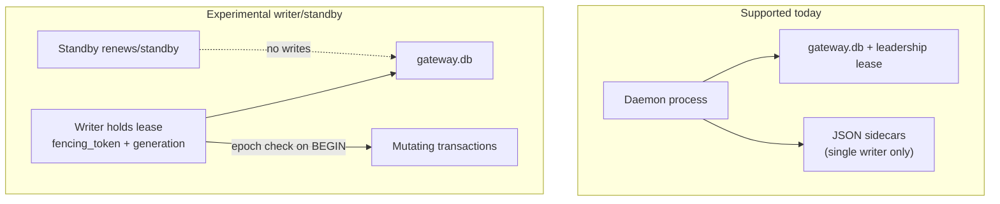

# Distributed ownership + fencing design (JOE-954)

**Status:** Design accepted for implementation sequencing; **not** production multi-replica ready.
**Depends on:** [Multi-Daemon Scaling Design Record](multi-daemon-scaling.md)
**Hazards:** [multi-writer-hazards](./multi-writer-hazards.md)
**Proving suite:** [distributed-ownership-proving](../../src/__tests__/distributed-ownership-proving.test.ts) + registry below

## Goal

Enable **experimental** multi-process writer/standby operation only when:

1. Coordination state is not JSON-sidecar multi-writer.
2. Scheduler/channel mutations require a **fencing token** from `daemon_leadership`.
3. The **proving suite** is green.
4. Helm still defaults to `replicaCount: 1`; experimental flag remains lab-only.

Local personal mode remains the default: one daemon, no cluster concepts required.

## Fencing model

### Lease fields (already in SQLite)

| Field | Purpose |
| --- | --- |
| `scope` | e.g. `gateway-local-writer` |
| `leader_id` / `instance_id` | Who holds the write lease |
| `fencing_token` | Must match on every mutating transaction epoch |
| `lease_expires_at` | Heartbeat expiry; stale → takeover path |

Work-store refuses stale epochs (`StaleWorkDbLeadershipError`). Channel claims already require writer leadership when enabled.

### Required before enabling experimental multi-replica in production marketing

| Step | State | Notes |
| --- | --- | --- |
| Leadership lease | **Implemented** | `daemon-leadership.ts` |
| Fenced SQLite mutations | **Implemented** | work-store epoch validation |
| Multi-process DB tests | **Implemented** | `multi-process-store.test.ts` |
| Channel-sync out of JSON multi-writer | **Partial** | Outbox SQLite companion exists; JSON still coordinates pendingInbound |
| sessions.json / events.json / telegram-polling migration | **Done (JOE-996)** | H3/H4/H8 → `operational-sidecar.sqlite` |
| channel-sync JSON coordination | **Open** | Hazard H1 |
| notification send leases | **Open** | Hazard H13 |
| Proving suite gate for Helm experimental flag | **This design** | Suite must pass; claims script fail-closed |
| Sidecar dual-write shadow then cutover | Planned | Follow multi-daemon state migration map |

## Store choice

| Option | Use |
| --- | --- |
| **SQLite WAL (current)** | Single host writer/standby on shared volume **only after** sidecars migrate; not multi-host NFS |
| **Postgres (future)** | Multi-host coordinator; requires CAS leases + repository ports already sketched in `work-store/repositories.ts` |

Do not run two writers on NFS-shared SQLite.

## experimentalDistributedOwnership

Helm `gateway.experimentalDistributedOwnership=true` means:

- Operator acknowledges lab/experimental risk.
- **Does not** mean multi-AZ HA or public production claim.
- Must only be used when proving suite is green **and** operators accept residual JSON sidecar risks listed in the hazard inventory until migrate items close.

Default remains `false`. Chart fails closed for `replicaCount > 1` without the flag.

## Proving suite definition (JOE-949)

Required evidence (registry: `docs/development/distributed-ownership-proving-registry.json`):

1. Helm template still fails for `replicaCount > 1` without experimental flag.
2. Daemon leadership unit tests pass.
3. Multi-process store contention tests pass.
4. Distributed-ownership proving tests pass (hazard inventory linked, claim language banned, suite completeness).
5. Claim-check script pass (`scripts/check-distributed-ownership-claims.mjs`).

Any PR that sets marketing language implying multi-AZ HA for Durable Gateway without completing migrate hazards must fail review / claim check.

## Rollout plan

1. Keep single-replica production.
2. Close remaining open migrate hazards (H1, H13). H3/H4/H8 migrated to `operational-sidecar.sqlite` (JOE-996 progressive slice).
3. Run proving suite in CI (`pnpm --filter cowork-gateway test` already includes multi-process + proving tests when present).
4. Lab: writer/standby with experimental flag only.
5. Only then revisit public multi-replica docs.

## Non-claims

Until the proving registry status is `ready` (all migrate hazards closed):

- No multi-AZ HA for Durable Gateway.
- No active-active multi-daemon on one state dir.
- No “just set replicaCount: 3” guidance outside lab experimental docs.
