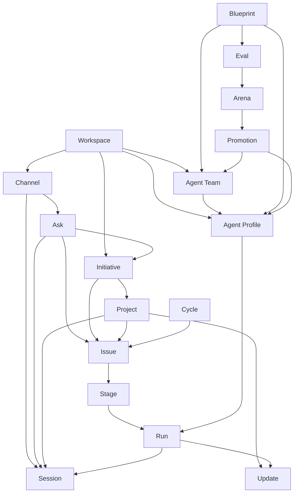

# Gateway Method

Gateway Method is the canonical product vocabulary and object model for OpenCode Gateway. It names the durable work graph that Gateway coordinates around OpenCode across TUI, Web, Telegram, WhatsApp, and future channels.

This page is a product-facing contract. It does not rename existing database tables, HTTP routes, or `gateway_*` MCP tools. Current implementation nouns remain compatibility aliases while public UX moves toward the Gateway Method vocabulary.

## Naming Contract

| Canonical noun | Current or proposed Gateway concept | Compatibility alias |
| --- | --- | --- |
| Workspace | Local Gateway installation: config directory, SQLite state, OpenCode profile, repo set, daemon, dashboard, and channel adapters. | config dir, Gateway instance |
| Channel | User-facing surface that can send asks and receive updates: OpenCode TUI/Web, Telegram, WhatsApp, and future adapters. | surface, adapter |
| Session | OpenCode conversation and message history. Gateway links sessions to channels, issues, projects, and supervisors but does not own the model runtime. | OpenCode session |
| Ask | Inbound request before it becomes durable Gateway work. It may remain a chat answer, become an issue, or become an initiative/project. | prompt, request |
| Initiative | Long-running strategic goal. Backed today by a `roadmaps` record plus completion proposals, supervisors, issues, events, and optional project bindings. | roadmap |
| Project | Scoped outcome under an initiative. Backed today by `project_bindings`, an initiative/roadmap, and usually a default supervisor session. Future storage may add a first-class `projects` record. | project binding, supervised roadmap |
| Issue | Atomic executable work item. Backed today by a `tasks` record, dependencies, gates, quality spec, runs, and events. | task |
| Cycle | Time-boxed focus window that pulls issues across projects or initiatives. Proposed storage: `cycles` and issue-cycle membership. | sprint, focus window |
| Stage | Deterministic phase in an issue workflow: `plan`, `implement`, `review`, `verify`, `audit`, `update`, or a project-defined stage. Backed by task `pipeline` and `currentStage`. | scheduler stage |
| Run | One OpenCode session attempt for one issue stage. Backed by the `runs` table and optional execution environment record. | run |
| Update | Structured progress or decision report from an agent, team, supervisor, or Gateway system. Backed today by stage results, supervisor results, workflow events, attention items, and dashboard/channel summaries. | event, digest, result |
| Agent Profile | Gateway profile that selects OpenCode model, agent, skills, MCP/tool permissions, heartbeat, token budget, role, and optional environment. Backed by `profiles` config. | scheduler profile, profile |
| Agent Team | Named mapping of workflow roles/stages to agent profiles, with capability requirements and quality defaults. Backed by `agentTeams` config and roadmap/task bindings. | team |
| Blueprint | Reusable recipe for profiles, teams, skills, MCPs, quality specs, environment selectors, and eval suites. Proposed storage: versioned blueprint documents or config bundles. | template, recipe |
| Eval | Controlled task or scenario used to measure a profile or team. Proposed storage: eval suite, eval case, run evidence, and score. | test scenario |
| Arena | Comparison run across agents, profiles, models, skills, or teams using one or more evals. Proposed storage: arena record with contestant runs and ranking evidence. | bake-off, comparison |
| Promotion | Marking an evaluated profile, team, blueprint, or model choice as trusted for a scope. Proposed storage: promotion record with evidence, approver, scope, and rollback path. | production approval |

Gateway should prefer canonical nouns in new docs, dashboard copy, channel UX, and future APIs. Existing implementation nouns stay valid where they are already part of compatibility surfaces.

## Compatibility Rules

- `roadmap` maps to Initiative. `gateway_roadmap_*`, `/roadmaps`, roadmap IDs, and existing database tables remain stable.
- `task` maps to Issue. `gateway_task_*`, `/tasks`, task IDs, task CLI commands, and existing database tables remain stable.
- `run` remains Run. `gateway_run_*`, `/runs`, and run IDs remain stable.
- `roadmap supervisor` maps to Initiative Supervisor or Project Supervisor depending on scope. `gateway_roadmap_supervisor_*` and `/roadmap-supervisors` remain stable.
- `channel binding` maps to Channel Link. `gateway_channel_binding_*`, `/channels/bindings`, and channel binding storage remain stable.
- New aliases may be added beside old names, but old MCP tools and HTTP routes must not be removed or silently repurposed.
- Migration should be additive: docs and UX can show "Initiative (roadmap)" or "Issue (task)" during transition, then make the compatibility term secondary once aliases are broadly available.

## Object Relationships

Relationship rules:

- A workspace contains one durable Gateway graph and one OpenCode integration boundary.
- Channels are projections into the graph; they do not create separate assistant runtimes.
- A session belongs to OpenCode and may be linked to a channel, project, issue, run, or supervisor.
- An ask becomes durable only when Gateway creates an initiative, project, or issue for it.
- An initiative can contain issues directly and can have one or more projects as scoped views or outcomes.
- A project resolves users to an initiative, a default supervisor session, optional channel links, and project-scoped notifications.
- An issue belongs to exactly one initiative today through `roadmapId`; future project membership may further scope the issue without breaking the initiative link.
- A cycle groups issues across initiatives and projects without owning the issue lifecycle.
- A run executes exactly one stage of one issue and records the profile/team/environment resolution used for that attempt.
- Profiles and teams are configuration contracts. They route OpenCode execution but never replace OpenCode agents, sessions, permissions, or questions.
- Evals, arenas, and promotions are governance objects for choosing trusted profiles, teams, and blueprints.

## Lifecycle States

### Initiative

Backed today by `RoadmapStatus`.

| State | Meaning |
| --- | --- |
| `active` | The initiative is open and may contain runnable or supervised issues. |
| `blocked` | Progress requires user, dependency, credential, budget, or safety action. |
| `done` | Completion evidence has been accepted and no active issue remains required. |
| `archived` | Hidden from active views; history remains available. |

Initiatives relate to issues, project bindings, supervisors, completion proposals, workflow events, optional agent teams, environments, and quality specs.

### Project

Backed today by a project binding plus an initiative/roadmap and usually a default supervisor. The project outcome inherits the initiative status; the project supervisor uses `active`, `paused`, `blocked`, `completed`, or `archived`.

| State | Meaning |
| --- | --- |
| `active` | The project resolves from at least one alias or channel and may be supervised. |
| `paused` | The supervisor should not wake, but the project remains visible and bindable. |
| `blocked` | The supervisor or related initiative cannot make progress without action. |
| `completed` | The scoped outcome is complete; durable history remains. |
| `archived` | Removed from active project resolution and notifications. |

Projects relate to one initiative, one default supervisor session, optional watcher sessions, channel links, notifications, issues, completion proposals, and updates.

### Issue

Backed today by `WorkStatus`.

| State | Meaning |
| --- | --- |
| `pending` | Ready for scheduling once dependencies, gates, time windows, and capacity allow it. |
| `running` | One stage run is active. |
| `done` | All required stages completed with accepted evidence. |
| `blocked` | Requires intervention or exceeded automatic retry/progress rules. |
| `paused` | Intentionally held by an operator or policy. |
| `cancelled` | Stopped and should not be scheduled. |
| `archived` | Hidden from active work views. |

Issue readiness is separate from lifecycle: `runnable`, `blocked`, `waiting`, `scheduled`, `paused`, `running`, or `done`.

Issues relate to one initiative today, optional project/cycle membership, dependencies, human gates, quality specs, stages, runs, workflow events, channel links, and optional agent-team overrides.

### Cycle

Proposed storage should use a first-class cycle record and issue membership records.

| State | Meaning |
| --- | --- |
| `planned` | Scope is being assembled but dispatch behavior is unchanged. |
| `active` | The cycle is the current focus window and may drive dashboard/channel filtering. |
| `closing` | Work is being reviewed for carry-over, completion, or follow-up. |
| `completed` | The cycle report is final. |
| `archived` | Hidden from active planning views. |

Cycles relate to issues, initiatives, projects, updates, and cycle-level metrics. They must not override issue status.

### Session

Sessions are OpenCode-owned. Gateway stores links and derives Gateway-visible session state from OpenCode session data, runs, supervisors, and channel links.

| State | Meaning |
| --- | --- |
| `linked` | Gateway has a durable reference to the session through a channel, issue, run, project, or supervisor. |
| `active` | The session is currently receiving or producing work for a run, ask, or supervisor turn. |
| `idle` | Linked and available for context, but no active Gateway run or supervisor turn is using it. |
| `attention` | The session has pending OpenCode-native questions, permissions, or Gateway attention items. |
| `closed` | OpenCode reports the session ended or Gateway has aborted the active session. |
| `archived` | No longer shown in active Gateway views; OpenCode may still retain history. |

Sessions relate to channels, asks, projects, supervisors, runs, OpenCode questions, OpenCode permissions, and updates.

### Run

Backed today by `RunStatus`.

| State | Meaning |
| --- | --- |
| `running` | The stage attempt has an active OpenCode session. |
| `passed` | The stage result passed and Gateway advanced the issue. |
| `failed` | The stage result failed and may retry or block the issue. |
| `blocked` | The stage result explicitly requested human or external action. |
| `errored` | Gateway, provider, environment, or transport failure prevented a normal stage result. |

Runs relate to one issue, one stage, one OpenCode session, one resolved profile, optional team attribution, optional execution environment, artifacts, evidence, costs, tokens, and runtime metrics.

### Agent Profile

Backed today by `profiles` config. Gateway currently treats profile presence and references as the source of truth rather than storing a profile status enum.

| State | Meaning |
| --- | --- |
| `draft` | Proposed profile configuration not yet used by scheduler stages or teams. |
| `active` | Profile exists in config and may be selected by stages, teams, or tasks. |
| `deprecated` | Still valid for compatibility, but new teams/stages should not select it. |
| `archived` | Removed from active config after references are cleared. |

Profiles relate to OpenCode agents, models, skills, permissions, environments, teams, stages, runs, evals, arenas, and promotions.

### Agent Team

Backed today by `agentTeams` config and roadmap/task bindings. Mutating teams is gated when applied through HTTP/MCP.

| State | Meaning |
| --- | --- |
| `draft` | Team definition is being validated and is not applied. |
| `proposed` | A valid change is waiting on a Gateway human gate. |
| `active` | Team exists in config and can resolve roles to profiles. |
| `bound` | Team is actively referenced by an initiative or issue. |
| `deprecated` | Existing references may finish, but new work should choose another team. |
| `archived` | Removed from active config after references are cleared. |

Teams relate to profiles, capability requirements, quality defaults, initiatives, issues, runs, evals, arenas, and promotions.

### Eval

Eval storage is proposed. Existing quality specs and tests are inputs, not a full eval system.

| State | Meaning |
| --- | --- |
| `draft` | Scenario, expected evidence, and scoring rules are being authored. |
| `queued` | Ready to run against a selected profile, team, or blueprint. |
| `running` | Eval execution is active. |
| `passed` | Required score/evidence threshold was met. |
| `failed` | Required threshold was missed or a blocker invalidated the run. |
| `archived` | Historical only. |

Evals relate to blueprints, profiles, teams, runs, artifacts, scoring evidence, arenas, and promotions.

### Arena

Arena storage is proposed.

| State | Meaning |
| --- | --- |
| `draft` | Contestants, evals, scoring, and budget are being assembled. |
| `queued` | Ready to dispatch comparison runs. |
| `running` | One or more contestant eval runs are active. |
| `completed` | Results and rankings are final. |
| `inconclusive` | The comparison did not produce enough valid evidence. |
| `archived` | Historical only. |

Arenas relate to evals, contestants, runs, scorecards, updates, and promotions.

### Promotion

Promotion storage is proposed and should be approval-oriented.

| State | Meaning |
| --- | --- |
| `proposed` | Evidence recommends a profile, team, blueprint, or model choice for a scope. |
| `pending_approval` | Waiting for a human gate or policy approval. |
| `approved` | Approved but not yet applied as the trusted default. |
| `active` | Trusted for the declared production scope. |
| `revoked` | Explicitly withdrawn because of failures, drift, or changed policy. |
| `superseded` | Replaced by a newer promotion. |
| `archived` | Historical only. |

Promotions relate to evals, arenas, profiles, teams, blueprints, approvers, scopes, rollout notes, and rollback plans.

## Surface Vocabulary

| Noun | CLI | MCP | Dashboard | Docs | Channel commands |
| --- | --- | --- | --- | --- | --- |
| Workspace | Use for setup, doctor, config, and local environment framing. | Use in descriptions for health/config/state tools; no rename required. | Use for global status and settings. | Canonical. | Use in help/status when explaining the local Gateway instance. |
| Channel | Use for Telegram/WhatsApp setup and diagnostics. | Keep `gateway_channel_*`; describe as Channel and Channel Link. | Use Channel and Channel Link. | Canonical. | Use Channel in help; commands remain slash-based. |
| Session | Use OpenCode session in diagnostics. | Keep `gateway_opencode_session_*`. | Use Session with OpenCode qualifier where helpful. | Canonical. | Use Session in `/open`, `/current`, and status text. |
| Ask | Use for future inbox/intake commands. | Proposed future `ask` tools may use canonical noun. | Use for inbound request queues if added. | Canonical. | Use for free-form inbound messages before durable work exists. |
| Initiative | Use Initiative in future planning commands; keep existing task-oriented CLI and any roadmap references compatible. | Keep `gateway_roadmap_*`; docs should label Initiative (roadmap). | Prefer Initiative in new views, with roadmap ID shown for compatibility. | Canonical with roadmap alias. | Prefer `/initiative` when added; keep `/roadmaps` and `/project` compatibility. |
| Project | Use for project assistant commands and aliases. | Keep `gateway_project_*` and `gateway_project_binding_*`. | Canonical for supervised scoped outcomes. | Canonical. | `/project` is canonical. |
| Issue | Add as alias for task commands; keep `opencode-gateway task` compatibility. | Keep `gateway_task_*`; docs should label Issue (task). | Prefer Issue in new active-work views, with task ID shown for compatibility. | Canonical with task alias. | Prefer `/issues` when added; keep `/tasks`, `/done`, `/block`, `/retry`, `/cancel`. |
| Cycle | Future CLI planning/filter commands. | Future cycle tools should use `gateway_cycle_*`. | Use for time-boxed planning once implemented. | Canonical proposed object. | Future `/cycle` command family. |
| Stage | Use in diagnostics and scheduler config. | Existing scheduler/run/task tools keep stage fields. | Use for pipelines and run attribution. | Canonical. | Use sparingly in status/digest output. |
| Run | Use in diagnostics and logs. | Keep `gateway_run_*`. | Canonical for execution attempts. | Canonical. | Use in `/latest`, `/status`, and attention text. |
| Update | Future CLI digest/report command. | Existing events and supervisor/task result tools may describe output as updates. | Canonical for progress feed. | Canonical. | Use in digests and notifications. |
| Agent Profile | Use Profile in config commands. | Keep `gateway_profile_*`. | Canonical. | Canonical. | Mention profiles only in advanced status/debug output. |
| Agent Team | Use Team in config commands. | Keep `gateway_agent_team_*`. | Canonical. | Canonical. | Mention teams only when work is team-routed or blocked. |
| Blueprint | Future import/export/apply commands. | Future blueprint tools should use `gateway_blueprint_*`. | Use for reusable setup recipes. | Canonical proposed object. | Advanced/admin commands only. |
| Eval | Future eval commands. | Future eval tools should use `gateway_eval_*`. | Use for profile/team quality evidence. | Canonical proposed object. | Advanced/admin commands only. |
| Arena | Future arena commands. | Future arena tools should use `gateway_arena_*`. | Use for comparisons and rankings. | Canonical proposed object. | Advanced/admin commands only. |
| Promotion | Future promotion commands. | Future promotion tools should use `gateway_promotion_*`. | Use for trusted production routing state. | Canonical proposed object. | Advanced/admin commands only. |

## Implementation Guidance

New implementation issues should use the canonical nouns in user-facing copy and specs, but keep current stable storage/API names unless the issue explicitly introduces an additive alias.

Recommended migration order:

1. Docs and dashboard copy introduce `Initiative (roadmap)` and `Issue (task)`.
2. CLI and channel commands add aliases while preserving existing commands.
3. MCP and HTTP can add additive aliases only after tests prove old names still behave identically.
4. Storage migrations are out of scope for vocabulary adoption unless a later issue creates a new object, such as Cycle, Eval, Arena, Promotion, or Blueprint.
5. Release notes should call out new aliases as additions, not breaking renames.

When in doubt, Gateway Method names describe the product model and existing names describe compatibility contracts.
