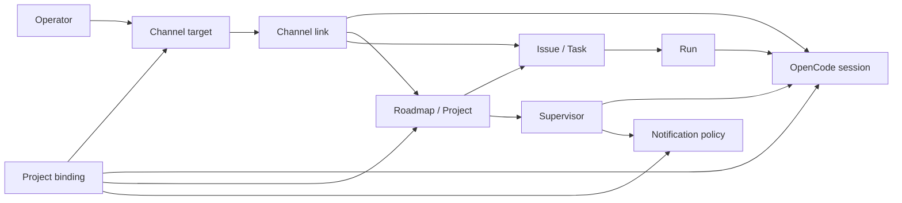

# Identity Graph

The identity graph is the canonical model for cross-channel continuity. OpenCode Web, OpenCode TUI, Telegram, WhatsApp, and future channel adapters are surfaces over one Gateway work graph, not separate workspaces.

Gateway owns durable identity links, work records, routing decisions, notification preferences, and audit events. OpenCode remains the source of truth for sessions, message history, questions, permissions, agents, skills, tools, and model execution.

Channel implementations must preserve these identity rules through the [Channel Adapter Contract](channel-adapter-contract.md).

## Canonical Nodes

| Node | Canonical record | Purpose |
| --- | --- | --- |
| Operator | Trusted local operator or allowed channel sender | Human actor allowed to address Gateway through a surface. Gateway does not persist a separate user table yet; the operator is inferred from local HTTP/MCP or trusted channel target. |
| Channel target | `provider`, `chatId`, optional `threadId` | Addressable external surface such as one Telegram chat/topic or WhatsApp sender. |
| Channel link | `ChannelBindingRecord` | Durable link from a channel target to an OpenCode session, task, or roadmap. |
| OpenCode session | OpenCode `sessionId` | Runtime conversation and message history owned by OpenCode. Gateway stores references only. |
| Project binding | `ProjectBindingRecord` | Stable alias and optional surface binding from operator context to one roadmap and one project assistant session. |
| Initiative / Project / Issue | Roadmap, task, and future external planning IDs | Durable work grouping. Today Gateway represents project work with `RoadmapRecord` and `WorkTaskRecord`; Linear initiative/project/issue IDs may be carried in metadata or descriptions until a dedicated external ID table exists. |
| Run | `RunRecord` | One scheduler dispatch for one task stage into one OpenCode session. |
| Supervisor | `RoadmapSupervisorRecord` | Durable controller for roadmap-level review and decisions, backed by one OpenCode session. |
| Source channel | Channel metadata on inbound prompts and sync checkpoints | The surface that originated a message, used to avoid echoing the same inbound text back to its source and to label cross-surface messages. |
| Notification policy | `ProjectBindingRecord.notificationMode`, `mutedUntil`, `quietHours`, `RoadmapSupervisorRecord.notificationPolicyRef` | Per-surface delivery preference and supervisor-level policy reference. |

## Relationships

The graph has two important invariants:

- A Gateway work object may reference an OpenCode session, but Gateway does not copy or replace OpenCode message history.
- A channel target must be trusted before Gateway resolves or mutates any binding for that target.

## Resolution Order

Context resolution must be deterministic and must return `resolved`, `ambiguous`, or `not_found`. It must not silently choose between multiple plausible projects.

1. Bound channel target: if `provider` and `chatId` are present, look for a project binding with the same `provider`, `chatId`, and normalized `threadId`. This is the highest-priority signal because it captures the active chat/topic.
2. Explicit alias: normalize the alias and resolve it through project bindings. One match resolves; multiple matches are ambiguous; zero matches is `not_found`.
3. Explicit session: if an OpenCode session ID is supplied and exactly one project binding references it, resolve that binding. Multiple bindings for the same session are ambiguous. No binding falls through.
4. Explicit initiative/project/issue: resolve exact durable IDs. Today this means roadmap ID first; issue/task-level commands should resolve the task and then its roadmap. Future external Linear IDs should map to their imported Gateway roadmap or task before falling back.
5. Single active supervisor: when no stronger signal exists, resolve only if there is exactly one active roadmap supervisor. Multiple active supervisors are ambiguous; none is `not_found`.
6. Ambiguity or not found: return candidates where useful and ask the operator for an alias, roadmap ID, session ID, or rebind command.

The current `resolveProjectContext` implementation already follows the core project resolver shape: bound channel, explicit alias, explicit session, explicit roadmap ID, single active supervisor, ambiguity/not found. Future resolver work should preserve that behavior while extending command-specific task or external issue resolution.

## Ambiguity Behavior

Ambiguity is a product state, not an exception path. User-facing surfaces should show the shortest disambiguating choices and avoid side effects.

| Scenario | Behavior |
| --- | --- |
| Alias matches multiple bindings | Return `ambiguous` with candidate aliases, roadmap IDs, and scopes. |
| Session has multiple project bindings | Return `ambiguous`; require alias or roadmap ID. |
| Multiple active supervisors and no explicit context | Return `ambiguous`; require alias, roadmap ID, or session ID. |
| Channel target has no binding but alias is supplied | Resolve the alias if trusted; optionally offer to bind the current channel. |
| Channel target has a binding and an unrelated alias is supplied | Bound channel wins for project command defaults. Rebinding requires explicit `--rebind` or `allowRebind=true`. |
| Missing OpenCode session for a known run or supervisor | Preserve Gateway records, report missing session recovery, and use the documented recovery flow rather than creating a replacement session implicitly. |

Commands that mutate work must fail closed on ambiguity. Read-only commands may show candidates, links, and recovery hints.

## Trust Boundaries

Gateway should resolve identity only after the request source is authenticated or trusted.

- Local OpenCode Web/TUI and MCP traffic is trusted through local HTTP origin/host checks or configured HTTP bearer token rules.
- Telegram and WhatsApp traffic is trusted only when `isTrustedChannelTarget(provider, chatId, threadId, config)` returns true.
- If a provider credential is configured, Gateway fails closed unless the provider has an allowlist entry or the explicit test-only unsafe allow-all flag is set.
- Public exposure should be limited to documented webhook routes. The daemon should remain bound to `127.0.0.1` unless exposed mode is explicitly configured.
- A trusted target may access only the work graph reachable from its bound channel target, explicit alias/session/project identifiers, or globally unambiguous supervisor fallback.
- A channel link is not a credential. Forwarding a session or roadmap ID to another channel does not make that channel trusted.
- Cross-channel sync may deliver assistant output to all bindings for a session/project, but it must suppress the originating inbound message for the source channel and label user messages that came from another surface.
- Notification policy is per surface. Muting or digesting one channel target must not mute the OpenCode session or another channel target unless they share the same project binding by explicit rebind.

## Current Code Mapping

| Graph concept | Current module or type |
| --- | --- |
| Channel target trust | `src/security.ts` `isTrustedChannelTarget`, `channelTargetLabel`, HTTP security helpers |
| Channel link | `src/channel-sessions.ts`, `src/work-store.ts` `ChannelBindingRecord`, `channel_bindings` table |
| Project binding | `src/work-store.ts` `ProjectBindingRecord`, `upsertProjectBinding`, `resolveProjectContext`; `src/project-ux.ts` formatters |
| Project / initiative | `src/work-store.ts` `RoadmapRecord`; roadmap supervision docs and APIs |
| Issue / task | `src/work-store.ts` `WorkTaskRecord` and dependency records |
| OpenCode session helpers | `src/daemon-routes/opencode.ts`, `src/opencode-requests.ts`, OpenCode SDK calls in scheduler/supervisor code |
| Run | `src/work-store.ts` `RunRecord`, `startWorkTaskRun`, recovery helpers |
| Supervisor | `src/work-store.ts` `RoadmapSupervisorRecord`, `src/supervisor.ts`, `src/wakeup.ts` |
| Source channel and sync | `src/channel-sync.ts` pending inbound records, delivery checkpoints, source-channel suppression |
| Notification policy | `src/attention-routing.ts`, project binding notification fields, supervisor notification policy reference |
| API surfaces | `docs/api/http-api.md`, `docs/api/mcp-tools.md`, `docs/api/channel-commands.md` |

## Test Plan

The resolver implementation should keep these cases executable:

| Case | Setup | Expected result |
| --- | --- | --- |
| Same-session continuation | Bind Telegram and OpenCode Web to the same OpenCode session; send from one surface and sync to the other. | The existing session receives the prompt, OpenCode history remains canonical, and source-channel echo is suppressed. |
| Project-bound session | Bind a channel target to a project alias, roadmap, and supervisor session. | `/project status`, `/project open`, and task commands resolve the bound roadmap before any alias fallback. |
| Missing session recovery | A running `RunRecord` or active supervisor references an OpenCode session that no longer exists. | Gateway reports the missing session and uses run/supervisor recovery; it does not silently create a substitute session with lost history. |
| Untrusted channel rejection | Configure Telegram, WhatsApp, or Discord alpha credentials without a matching allowlist entry. | Inbound commands and project/channel binding mutations are rejected before context resolution. |
| Ambiguous binding | Create duplicate alias matches, multiple project bindings for one session, or multiple active supervisors without explicit context. | Resolver returns `ambiguous` with candidates and no mutation is applied. |
| OpenCode deep links | Resolve a project or channel binding to an OpenCode session and request `/open` or `opencode_session_web_url`. | Gateway returns OpenCode Web/TUI links for the resolved session, or deterministic fallback text when Web route metadata is unavailable, without copying session messages. |

## Non-Goals

- No Discord-specific project resolver or command language is defined here; the Discord alpha adapter uses the same trusted channel target and project/session resolver shape.
- No migration from OpenCode session history into Gateway storage.
- No new user account table. Operator identity is still inferred from trusted local access or trusted channel target until a later account model exists.
- No broad schema migration for external Linear entities. External IDs can be mapped in follow-up implementation work.
