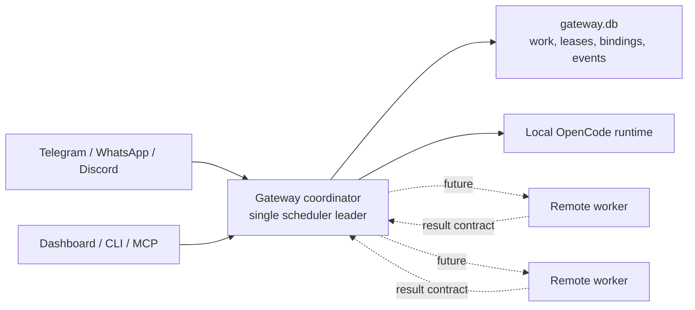

# Multi-Daemon Scaling Design Record

Status: accepted design record; implementation is future work. (This record dates from the M18 milestone tranche; the original milestone documents live in Git history — see the [Decision Log](../history/decision-log.md).)

Gateway is currently a local, single-operator control plane. It can run unattended and recover work after restarts, but it is not yet a multi-host or hosted/team scheduler. This record defines what is true today, what architecture Gateway should grow toward next, and which state must become durable before more than one daemon can safely participate.

**Operator runbook (audit 2026-07-21 / JOE-931):** Never run two full daemons against one state directory. The open-cowork Helm chart fails closed when `replicaCount > 1` unless experimental distributed ownership is explicitly enabled. Chart fail-closed must not be bypassed for production.

**Follow-on design:** [Distributed ownership + fencing](distributed-ownership-design.md) (JOE-954).
**Hazard inventory:** [gateway-multi-writer-hazards-2026-07-21](../../../../docs/evidence/gateway-multi-writer-hazards-2026-07-21.md) (JOE-948).
**Proving suite:** registry `docs/development/distributed-ownership-proving-registry.json` (JOE-949); claim gate `scripts/check-distributed-ownership-claims.mjs` (JOE-963).

## Decision

Gateway should keep local personal mode as the default product and should not support active-active multi-daemon operation in the current local beta.

The recommended next scalable architecture is a staged model:

1. Keep one scheduler leader responsible for mutating durable work state.
2. Move JSON sidecar coordination state into `gateway.db` before enabling more than one daemon.
3. Add an explicit daemon leadership lease for local or same-state-dir HA experiments.
4. Introduce remote execution workers only after coordinator-owned state mutation and idempotent result submission are defined.
5. Treat hosted/team operation as a separate product phase with explicit authn/authz, tenancy, audit, and operational SLO work.

This gives Gateway a safe path to scale without turning today's local app into an implicit cluster.

## Current Guarantees

Gateway is designed for one daemon process per user profile.

| Area | Current guarantee |
| --- | --- |
| Task dispatch | A task run starts only if SQLite still sees the task as `pending` with no `currentRunId`. |
| Run lifecycle | Active runs have durable owner, generation, and expiration lease fields. Expired leases can be recovered before new work dispatches. |
| Scheduler cycle | Heartbeats, event wakeups, and manual scheduler triggers share one in-process cycle promise inside one daemon. |
| Capacity | Global, stage, and profile concurrency limits are enforced before dispatch from the current durable queue state. |
| Losing dispatch races | If an unused OpenCode session is created before the SQLite transition loses, Gateway aborts that session and does not prompt it. |
| Channel request notifications | Question and permission notifications use a per-target in-process lock plus a durable notification event. |
| Delegation and supervisor receipts | Delegation receipts and supervisor wakeup receipts are durable SQLite tables with idempotency keys. |

The durable center of the product is `gateway.db`. This is where tasks, runs, roadmaps, supervisors, workflow events, channel bindings, delegation receipts, and supervisor wakeup receipts belong.

## Current Failure Modes

These failure modes are acceptable for the current local deployment model but must be fixed before multi-daemon support.

| Area | Failure mode under multiple daemons |
| --- | --- |
| Scheduler cycle lock | The in-process cycle promise only protects one daemon. Two daemons can both enter scheduling logic, relying on later SQLite task transitions to decide the winner. |
| Channel sync | `channel-sync.json` checkpoints and `pendingInbound` entries are file sidecars. Concurrent writers can overwrite each other and may duplicate or skip relays. |
| Recent events | `events.json` is an operational activity view, not an append-only cluster event log. Concurrent writes are last-writer-wins. |
| Session sidecar | `sessions.json` is a recent Gateway/OpenCode session projection. Multiple daemons can diverge about which process owns or can open a session. |
| Notification locks | Several send paths have process-local in-flight guards. Duplicate visible notifications remain possible when two daemons handle the same event. |
| OpenCode runtime ownership | OpenCode sessions are local runtime assets. A remote daemon cannot assume another host can inspect, prompt, or abort that session. |
| Backups | Backup and restore capture current durable files plus sidecars, but sidecars are not safe multi-writer coordination state. |

## Recommended Architecture

The next architecture should be "single elected coordinator, optional remote workers".

The coordinator is the only process that:

- dispatches scheduler stages;
- mutates tasks, runs, roadmaps, supervisors, gates, and workflow events;
- advances channel checkpoints;
- records notification success markers;
- reconciles OpenCode session ownership;
- evaluates readiness and operator-visible queue state.

Remote workers, when added, should be stateless execution participants. They may receive a scoped work packet and return a signed or otherwise authenticated result packet, but they should not directly mutate `gateway.db` or sidecar state. The coordinator validates the result, applies idempotency, writes evidence, and advances the durable state machine.

For local personal mode, the coordinator and worker remain the same process. No operator should need to understand clustering to keep using Gateway locally.

## Rejected Alternatives

| Alternative | Decision | Reason |
| --- | --- | --- |
| Multiple full daemons against one state directory | Rejected | SQLite protects some task transitions, but JSON sidecars, process-local locks, channel sync, and OpenCode session ownership are not safe multi-writer surfaces. |
| Active-active schedulers using only current run leases | Rejected | Run leases prevent some duplicate work but do not fence channel sends, sidecar checkpoints, scheduler snapshots, or supervisor wakeups comprehensively. |
| External queue first | Deferred | A queue helps dispatch throughput but does not solve the state model, channel checkpointing, result idempotency, tenancy, or local simplicity. |
| Distributed file share around SQLite and sidecars | Rejected | File locking, rename semantics, and sidecar last-writer behavior are too platform-dependent for a robust product contract. |
| Hosted/team launch in the current local beta | Rejected | Hosted/team requires separate security, tenancy, audit, billing/governance, upgrade, SLO, incident, and data-retention work. |

## State Migration Map

| Surface | Current owner | Required change before multi-daemon |
| --- | --- | --- |
| Scheduler leadership | Process memory plus run/supervisor leases in SQLite | Add a durable `daemon_instances` or `scheduler_leadership` lease with owner, generation, expiration, heartbeat, and fencing token. |
| Task and run state | `gateway.db` | Keep as the durable source of truth. Continue using transactional transitions and extend tests around leadership fencing. |
| Channel checkpoints | `channel-sync.json` | Move delivery checkpoints, `seenMessageIds`, and `pendingInbound` into SQLite tables. Keep JSON only as a transitional compatibility shadow if needed. |
| Recent events | `events.json` plus workflow events in SQLite | Store operator activity that affects recovery, replay, or audit in SQLite. Keep bounded JSON only as a derived cache or remove it. |
| Session projection | `sessions.json` | Persist worker/session projection in SQLite with runtime owner, source daemon, last seen time, and recovery state. |
| Notification locks | Process-local maps plus workflow events | Replace in-flight locks with durable send leases and dedupe receipts keyed by route, target, subject, and policy window. |
| OpenCode sessions | Local OpenCode runtime | Add explicit runtime affinity. A worker can only act on sessions owned by its runtime, and the coordinator must route commands accordingly. |
| Configuration | `config.json` | Keep local config simple. Cluster or hosted config should be opt-in and fail closed unless leadership, auth, and state migrations are complete. |
| Observability | Readiness, traces, alerts, and sidecar counts | Add leader ID, daemon ID, worker ID, lease age, fencing generation, sidecar migration status, duplicate suppression counts, and stale leader alerts. |
| Backup and restore | `gateway.db` plus JSON sidecars | Update backups after sidecar migration so durability-critical state is in the database and restore can prove leadership and checkpoint consistency. |

## Scheduler Changes

Before multiple daemons can run safely, scheduler entry must be fenced by a durable leader lease.

The scheduler should:

- acquire or renew leadership before each cycle;
- record a fencing generation on cycle start;
- re-check leadership before dispatching visible side effects;
- derive capacity from the latest durable run state, not stale process projections;
- write all dispatch decisions through existing task/run transactions;
- expose stale leader, lease age, and cycle generation in readiness.

The existing run lease model should remain. Leadership decides who may schedule. Run leases decide whether an already-dispatched stage is still owned and recoverable.

## Channel Sync Changes

Channel sync cannot be active-active while checkpoints live in a JSON sidecar.

The channel sync migration should:

- store per-target delivery checkpoints in SQLite;
- store inbound echo-suppression windows in SQLite;
- acquire durable send leases before visible provider sends;
- write success markers only after provider delivery succeeds or a skip is proven;
- keep provider-specific idempotency keys when available, while preserving Gateway-owned receipts;
- expose checkpoint lag and duplicate suppression metrics in readiness.

During migration, Gateway may dual-write JSON and SQLite for one release, but the SQLite row must become authoritative before any multi-daemon mode is enabled.

## Remote Worker Contract

Remote workers should not be introduced until a minimal result contract exists.

The contract should include:

- a work packet with task, run, stage, environment, allowed tools, expected artifacts, and deadline;
- a worker identity and runtime affinity;
- a result packet with status, evidence references, redacted logs, artifacts, and final state proposal;
- an idempotency key for every result submission;
- coordinator-side validation before any task state mutation;
- a cancellation and timeout path that does not require the worker to be trusted with database writes.

This keeps deterministic Gateway primitives intact even when execution moves away from the local daemon.

## Migration Phases

### Phase 0: Current Local Beta Product

Support one local daemon, one trusted operator, and explicit channel allowlists. Document that active-active multi-daemon operation is unsupported. Continue scaling by tuning one daemon's concurrency.

### Phase 1: Durable Sidecar Migration

Move channel sync, session projection, and recovery-relevant recent events into SQLite tables behind compatibility APIs. Add migration tests and backup/restore drill coverage. JSON sidecars should either become derived caches or be removed from coordination paths.

### Phase 2: Local Leadership Lease

The durable scheduler leadership lease and daemon-instance health reporting are implemented (`src/daemon-leadership.ts`), including owner, generation, fencing token, and lease expiry. The lease primitive enables safer same-machine restart and supervised failover. Multi-daemon operation stays deferred, and the lease still does not imply hosted/team support.

### Phase 3: Coordinator-Owned Remote Workers

Define the remote worker result contract and route all durable mutations through the coordinator. Workers execute scoped stages and return evidence; the coordinator owns idempotency, transitions, notifications, and recovery.

### Phase 4: Hosted/Team Architecture

Only after the previous phases should Gateway consider hosted or team operation. That phase needs a separate initiative covering tenant isolation, RBAC, audit retention, encryption, billing/governance, external database or queue choices, deploy topology, incident response, and SLOs.

## Non-Goals For The Current Local Beta

The current local beta does not include:

- hosted/team deployment;
- active-active scheduler support;
- multiple daemons writing the same state directory;
- remote worker execution;
- external queue adoption;
- migration from SQLite to a network database;
- public API exposure beyond the documented exposed-mode route policy.

## Concrete Follow-Ups

These follow-ups are dependency-aware and should stay behind this design record:

1. Persist channel-sync checkpoints and pending inbound state in `gateway.db`, with JSON shadow-read compatibility and backup/restore drill coverage.
2. Persist the `sessions.json` worker/session projection in `gateway.db`, including runtime owner, last seen time, recovery status, and OpenCode session affinity.
3. Add a scheduler leadership lease and daemon-instance health projection, then expose leader age, generation, and stale-leader warnings in readiness.
4. Define the remote worker work/result packet contract and require coordinator-only durable state mutation.

The existing work-store modularization and migration harness should land before these changes so each migration has deterministic fixtures and rollback evidence.

## Review Gate Checklist

Any future PR that claims multi-daemon or hosted readiness must prove:

- JSON sidecars are not used as multi-writer coordination state.
- Visible channel sends have durable leases and success receipts.
- Scheduler leadership is fenced and observable.
- Remote workers cannot directly mutate durable state.
- Local personal mode remains the simplest supported deployment.
- Security, tenancy, and audit requirements are handled by a separate hosted/team design.
