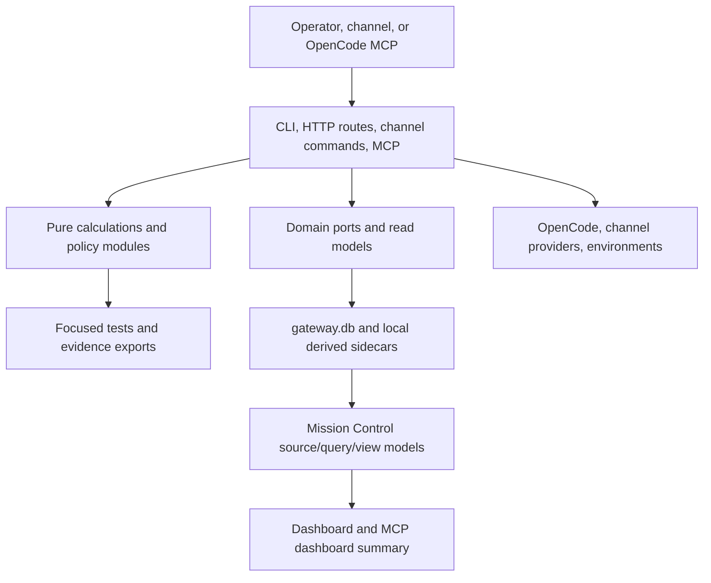
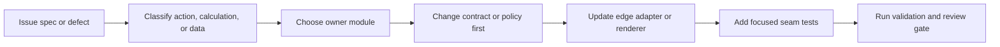

# Architecture Handoff Map

This map turns the deep-module architecture work into navigation guidance for maintainers and
production agents. Use it when deciding where a change belongs. (Earlier design documents that
motivated it live in Git history — see the [Decision Log](../history/decision-log.md).)

This map covers codebase leverage only. It does not expand Gateway's product boundary beyond the
current local-first public beta. Hosted, SaaS, multi-tenant, compliance-certified,
marketplace-safe, and unattended production operation remain unclaimed unless later decision
records prove them.

## How To Read This Map

- **Action** code touches the outside world: files, SQLite writes, HTTP requests, channel sends,
  OpenCode sessions, audit rows, and CLI output.
- **Calculation** code makes deterministic decisions from explicit inputs.
- **Data** code carries typed contracts across module boundaries.
- A **deep module** hides implementation complexity behind a smaller interface.
- An **adapter** translates Gateway contracts to OpenCode, providers, SQLite, HTTP, or local files.
- A **seam** is the tested boundary where future agents should add fakes, policies, or fixtures.

## Runtime Handoff

The useful rule is: actions stay at the edges, calculations stay behind explicit inputs, and data
contracts cross seams. If a route, adapter, or renderer starts deciding policy locally, add or use a
deep module before spreading that rule.

## Module Map

| Area | Action owner | Calculation/data owner | Adapter or port | Primary tests | Do not edit directly when... |
| --- | --- | --- | --- | --- | --- |
| Orchestration timeline | `src/scheduler.ts`, `src/daemon-routes/work.ts` | `src/orchestration-kernel.ts` | OpenCode/session, environment, and work-store calls in scheduler | `src/__tests__/orchestration-kernel.test.ts`, `src/__tests__/scheduler.test.ts` | A change is only capacity hold, retry timing, transient runtime classification, or failure-timeline planning. Change the kernel first. |
| Channel command and render delivery | `src/channel-commands.ts`, provider send paths under `src/channels/` | `src/channels/renderer.ts`, `src/channels/capabilities.ts` | Telegram, WhatsApp, Discord, and future provider adapters | `src/__tests__/channel-commands.test.ts`, `src/__tests__/channel-renderer.test.ts`, provider tests | A change is provider-neutral command metadata, native action payload preservation, fallback rendering, or capability status. Change the shared renderer/capability contract first. |
| Channel readiness policy | `src/readiness.ts`, `src/service-health.ts`, channel setup routes | `src/channel-service-policy.ts`, `src/channel-connectors.ts` | Provider connector registry | `src/__tests__/channel-service-policy.test.ts`, `src/__tests__/service-health.test.ts`, `src/__tests__/channel-connectors.test.ts`, `src/__tests__/evidence-export.test.ts` | A channel should appear ready, degraded, blocked, stale, or partial. Change the policy calculation first, then the surface copy. |
| Mission Control query and view model | `src/dashboard.ts`, `src/daemon-routes/system.ts`, `src/mcp.ts` | `src/mission-control-view-model.ts`, `src/mission-data.ts` | Mission data source adapters and OpenCode localhost fetches | `src/__tests__/mission-control-view-model.test.ts`, `src/__tests__/dashboard.test.ts`, `src/__tests__/mcp.test.ts` | A change is dashboard windowing, source freshness, source severity, safe next actions, evidence selection, empty/degraded rendering, or MCP/dashboard summary alignment. Change the view-model calculation first. |
| Work-store mutation locality | `src/work-store.ts`, `src/storage.ts` | `src/work-store/schema.ts`, `src/work-store/repositories.ts`, `src/work-store/run-lease-port.ts`, `src/work-store/bindings-port.ts` | SQLite-backed domain ports | `src/__tests__/work-store-run-lease-port.test.ts`, `src/__tests__/work-store-bindings-port.test.ts`, `src/__tests__/work-store-invariants.test.ts`, `src/__tests__/storage.test.ts` | Scheduler, channel/HTTP project binding, or future backend work needs run, lease, dispatch, schema, repository, project binding, channel binding, or context-resolution ownership. Use the port instead of new table-level caller logic. |
| HTTP JSON body contracts | `src/daemon-router.ts`, route modules under `src/daemon-routes/` | `parseJsonBody()` object-root validation, route-specific validators | Local HTTP, webhook entrypoints that parse JSON, dashboard actions | `src/__tests__/security.test.ts`, route-specific daemon tests | A route accepts unknown JSON. Validate the body root at the router and add route-owned required-field checks before mutation. |
| Security policy decisions | `src/security-policy.ts`, `src/security.ts` | Central policy facade, HTTP compatibility wrapper | HTTP exposed mode, MCP/channel/worker/secret policy callers | `src/__tests__/security-policy.test.ts`, `src/__tests__/security.test.ts` | A change decides allow/deny/preview/requires-human/degraded for a security-sensitive action. Add reason-coded policy evidence first, then adapt the caller. |
| Delegation progress test seam | Delivery action paths in `src/delegation-progress.ts`, `src/daemon.ts`, `src/daemon-routes/work.ts` | `src/delegation-progress-read-model.ts` | Production store read model plus the `src/__tests__/helpers/fake-delegation-progress-read-model.ts` fake | `src/__tests__/delegation-progress-read-model.test.ts`, `src/__tests__/delegation-progress.test.ts` | A test needs ordering, dedupe, retry cooldown, or parent-session failure coverage without broad SQLite setup. Use the read-model fake. |
| Evidence, redaction, and claim safety | CLI, readiness, docs, evidence exports, incident bundles | `src/evidence-export.ts`, `src/operational-redaction.ts`, readiness/security policy modules | Local evidence files and audit/event projections | `src/__tests__/evidence-export.test.ts`, `src/__tests__/security.test.ts`, readiness tests | A change affects release claims, private transcript text, provider targets, tokens, webhook URLs, or evidence refs. Change the shared redaction/policy path first. |

## Module Handoff Flow

If the owner module is unclear, start from `docs/concepts/codebase-boundaries.md`, then this page
and its Boundary Register Addendum below. Do not start by splitting files; start by finding the
contract that should own the behavior.

## Where To Make A Change

The high-risk boundary ownership index lives in the Boundary Register Addendum table below. Use it as
the current quick index before editing channel actions, operational redaction,
work-store repository boundaries, or Mission Control view-model seams. Cross-boundary crossings are
enforced by focused guards in `src/__tests__/domain-boundaries.test.ts` (for example, provider
adapters must not fork canonical command semantics and readiness must not expose raw denial probes).

| Need | Start here | Then update | Evidence gate |
| --- | --- | --- | --- |
| Change retry timing, capacity hold behavior, or runtime failure classification | `src/orchestration-kernel.ts` | `src/scheduler.ts` only to execute the plan | Kernel tests plus scheduler regression coverage |
| Change task run, lease, dispatch receipt, or recovery mutation behavior | `src/work-store/run-lease-port.ts` | `src/work-store.ts` internals only if the port cannot express the operation | Run/lease port contract tests plus work-store invariant harness |
| Change project/channel binding, mirrored channel row, or project context-resolution behavior | `src/work-store/bindings-port.ts` | `src/work-store.ts` internals only if the port cannot express the operation | Bindings port contract tests plus channel command/daemon route coverage |
| Add a provider command, button, menu item, or fallback rendering rule | `src/channel-commands.ts`, `src/channels/renderer.ts`, `src/channels/capabilities.ts` | Provider adapter only for provider-specific send/receive behavior | Channel command, renderer, adapter contract, and provider tests |
| Change whether a channel is ready, degraded, stale, blocked, or proof-pending | `src/channel-service-policy.ts` | `src/readiness.ts`, `src/service-health.ts`, docs copy | Policy tests plus readiness/service-health tests |
| Change Mission Control high-volume data, dashboard source state, or MCP summary text | `src/mission-control-view-model.ts` | `src/dashboard.ts`, `src/mission-data.ts`, `src/mcp.ts` | View-model tests plus dashboard/MCP alignment tests |
| Test delegation progress ordering, retries, or dedupe without a real store | `src/delegation-progress-read-model.ts` | `src/__tests__/helpers/fake-delegation-progress-read-model.ts` fixtures | Read-model and delegation-progress tests |
| Change redacted evidence or release-claim wording | `src/operational-redaction.ts`, `src/evidence-export.ts`, relevant decision doc | README, readiness, docs, dashboard copy only after policy agrees | Redaction sweep, claim sweep, strict docs build |

## Boundary Register Addendum

| Boundary | Owner | Status | Change rule |
| --- | --- | --- | --- |
| Channel action registry | `src/channel-actions.ts` | stable | Add or rename operator actions in the canonical registry first, then update provider rendering and evidence. |
| Operational redaction boundary | `src/operational-redaction.ts` | stable | Change redaction patterns in the shared helper, then prove evidence/export surfaces remain value-free. |
| Work-store repository boundary | `src/work-store/repositories.ts` | deferred/high risk | Do not split broad work-store mutation paths without a dedicated storage-locality issue, backup compatibility evidence, and rollback plan. |
| Mission Control view-model boundary | `src/mission-control-view-model.ts` | deferred | Keep dashboard/MCP rendering behind typed view models; defer deeper source-state extraction to a dedicated issue. |

## What Not To Edit Directly

- Do not put scheduler timeline calculations directly into HTTP routes, CLI commands, or dashboard code.
- Do not let provider adapters decide Gateway command semantics or silently reshape command payloads.
- Do not mark channel readiness green from adapter-local booleans; use connector state, proof evidence,
  prerequisites, and policy output.
- Do not make Mission Control render code a second business-rule engine; feed it typed view models.
- Do not add new storage callers that know table ordering, lease generation, or receipt side effects
  when a domain port exists.
- Do not commit raw live channel text, phone numbers, chat IDs, webhook URLs, provider payloads,
  bearer tokens, private local paths, or private prompt/transcript text.
- Do not use this maintainability guidance to claim hosted, SaaS, multi-tenant,
  compliance-certified, marketplace-safe, or unattended production readiness.

## Production-Agent Checklist

1. Read the issue spec, this handoff map, and the boundary-register row for the affected area.
2. Name the action, calculation, and data boundary before editing.
3. Change the owner module before changing edge adapters.
4. Add the narrowest interface-level test that proves the contract.
5. Keep docs and release copy bounded to current evidence.
6. Run focused validation, full verification when source behavior changes, strict docs for docs changes,
   redaction/claim sweeps, and the local-only read-only review gate.
7. Update Linear with commit, validation, evidence, residual risk, and any deferred claim.

## Evidence Links

Historical record: the original deep-module design documents live in Git history (see the
[Decision Log](../history/decision-log.md)).

- [Work-Store Safety Harness](work-store-safety.md)
- [Adapter SDK](adapter-sdk.md)
- [Mission Control](../concepts/mission-control.md)
- [Codebase Boundaries](../concepts/codebase-boundaries.md)
- [Module Boundary And Dependency Budget](module-boundary-budget.md)
