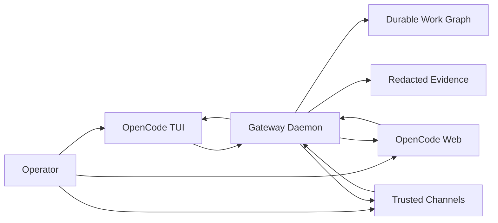

# Operator Mental Model

OpenCode Gateway is a local durable control plane for OpenCode work. It does not replace OpenCode. It keeps the work graph, receipts, scheduler state, channels, evidence, and recovery paths durable while OpenCode remains the runtime for sessions, agents, skills, tools, models, permissions, questions, Web, and TUI.

Use this page before the deeper release ledgers. It explains what to do first, which surface owns each decision, and how to read current capability status.

## One-Screen Contract



| Surface | Owns | Operator reading |
| --- | --- | --- |
| OpenCode | Sessions, message history, agents, skills, MCP servers, tools, model execution, questions, permissions, Web, and TUI. | If the model is thinking, asking for a permission, or rendering a session, OpenCode is the source of truth. |
| Gateway | Durable Initiatives, Projects, Issues, Runs, scheduler decisions, channel bindings, receipts, evidence, dashboard projections, backups, recovery, and deterministic `gateway_*` tools. | If work must survive restarts, report progress, be scheduled, be proven, or be recovered, Gateway owns the control plane. |
| Channels | Ingress and notifications for trusted operator targets. | Telegram is the mature external beta path. WhatsApp is implemented but still requires provider setup. Discord remains scaffolded. |

## First Workflow

1. Install and configure Gateway.

    ```bash
    npm install
    npm run build
    npm link
    opencode-gateway setup
    ```

2. Start the local daemon and inspect readiness.

    ```bash
    opencode-gateway start
    opencode-gateway readiness
    opencode-gateway status
    ```

3. Open Mission Control at `http://127.0.0.1:4097/dashboard`.

4. Create durable work.

    ```bash
    opencode-gateway project new beta-demo --title "Beta demo" --task "Create one durable delegated task"
    ```

5. Work from OpenCode TUI or Web with `gateway-assistant`, or use the deterministic Gateway MCP tools directly.

6. Bind a trusted channel only when you want chat ingress or progress receipts.

    ```bash
    opencode-gateway channel status --json
    ```

7. Delegate scoped work when it needs a durable run, review, verification, evidence, or progress callbacks.

8. Monitor with Mission Control, `opencode-gateway status`, `opencode-gateway task list`, channel receipts, and exported evidence.

9. Recover from rough edges by using `/open`, TUI fallback commands, Mission Control, readiness output, support bundles, and redacted evidence exports. A Web link is a convenience, not the only recovery path.

## Release And Support Handoff

Before inviting a beta operator or sharing support evidence, run the local release operations path and keep the output bounded to redacted summaries:

```bash
npm run release:artifacts -- --json
opencode-gateway doctor
opencode-gateway readiness
opencode-gateway backup create --label before-support
opencode-gateway backup verify <path>
```

The current release-operations boundary covers local install/update/package/support handoff with manual bounds and signed image provenance for tagged container releases (machine-checked by the claim registry — see the [Decision Log](../history/decision-log.md)). It does not certify production, hosted/team operation, signed npm/package marketplace provenance, one-command uninstall, WhatsApp/Discord live readiness, universal-channel readiness, or elapsed soak.

## Capability States

Use these states when reading docs, Mission Control, channel status, readiness, and Linear evidence.

| State | Meaning | Claim boundary |
| --- | --- | --- |
| `supported` | The local product path is implemented and has deterministic validation or accepted live evidence. | Safe to use with documented local setup and caveats. |
| `partial` | The path works, but needs manual setup, explicit fallback, or UX polish. | Safe for beta testing only with named limitations. |
| `waived` | The operator intentionally chose not to prove or enable that capability for this run. | Do not market it as ready. Keep the waiver attached to the evidence. |
| `blocked` | The capability must not be treated as ready until the blocker is resolved. | Stop readiness or release claims for that surface. |
| `unknown` | Gateway has metadata but no current proof or probe result. | Gather evidence before using it as a decision input. |
| `future` | The capability is planned or scaffolded but not a current product promise. | Do not imply availability. |

## Current Operator Matrix

| Capability | State | What the operator can do now | What remains bounded |
| --- | --- | --- | --- |
| Local durable work graph | `supported` | Create Initiatives, Projects, Issues, Runs, receipts, evidence, backups, and recovery records. | Hosted/team and multi-tenant workspaces are not part of the default product. |
| OpenCode TUI | `supported` | Use native OpenCode sessions and Gateway MCP tools from the local terminal. | Gateway does not own TUI state or permission prompts. |
| OpenCode Web | `partial` | Open Gateway-provided session links and use fallback TUI/Mission Control/session evidence when a route is stale. | Web session storage and permission modals remain OpenCode-owned. |
| Telegram | `partial` | Use trusted bindings, typed commands, rich cards, progress/final receipts, gates, and alerts. | Argument autocomplete and some permission flows remain bounded. |
| WhatsApp | `partial` for implementation, `blocked` for beta readiness | Use guided direct Cloud API setup, verifier diagnostics, trust, and binding when provider prerequisites exist. | No current live readiness claim without credentials, callback verification, trust, and binding. |
| Discord | `future` | Inspect private-alpha adapter metadata and provider-neutral contract shape. | No beta user onboarding or live readiness claim. |
| Mission Control | `partial` | Inspect health, readiness, channels, active work, runs, gates, alerts, evidence, backups, and recovery signals. | The guided setup/recovery cockpit is still being polished. |
| Agent profiles and teams | `supported` for contracts, `partial` for operator UX | Compose profiles, teams, blueprints, grants, evals, scorecards, and promotion evidence. | Visual team building, arena workflows, and beta-friendly promotion UI remain future polish. |

## Evidence Rules

- Treat `opencode-gateway readiness` and `opencode-gateway channel status --json` as current-machine truth, not marketing copy.
- Treat fixture evidence as regression evidence only. It never promotes a provider to live readiness.
- Export redacted evidence for delegated work receipts, parent-session visibility, support handoff, and recovery decisions.
- Never put raw tokens, raw chat IDs, raw provider payloads, private transcript text, webhook signatures, or local personal paths into Git, docs, Linear, or screenshots.

## OpenAgents Influence

OpenAgents inspired clearer event, module, catalog, supervision, artifact, and onboarding patterns. Gateway adopts those lessons only as local OpenCode-native control-plane improvements. It does not claim OpenAgents parity, hosted collaboration, a general agent SDK, a universal agent runtime, or universal channel readiness.

## Next Reading

- [Quick Start](quickstart.md)
- [Product Contract](../concepts/product-contract.md)
- [Surface Capability Matrix](../concepts/product-contract.md#surface-capability-matrix)
- [Decision Log](../history/decision-log.md)
- [Channels](../configuration/channels.md)
- [Running Gateway](../operations/running.md)
- [Security](../operations/security.md)
