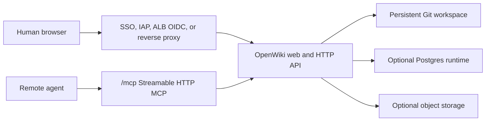

# Hosted Humans And Agents

Use this cookbook when OpenWiki is reachable through a company hostname and both
people and agents need access. The production shape is deliberately split:
humans authenticate at an organization SSO or reverse-proxy boundary, while
remote agents authenticate to Streamable HTTP MCP with scoped service-account
bearer tokens. Local personal agents should keep using stdio MCP by default.

OpenWiki does not implement native username/password login, browser sessions, or
first-party OIDC. The identity provider, TLS edge, DNS, secrets, IAM, backups,
and monitoring remain operator-owned.

## Reference Topology



The hosted baseline is provider-neutral:

- container image pinned by digest
- `OPENWIKI_PUBLIC_ORIGIN=https://wiki.example.com`
- persistent POSIX Git workspace
- trusted SSO or reverse proxy for browser writes
- scoped service-account tokens for hosted HTTP MCP agents
- Postgres for queue, write coordination, search serving, sessions, and
  rate-limit windows before running more than one web or worker replica
- object storage and provider-native backup evidence for hosted captures,
  attachments, and restore drills

Do not expose a write-capable hosted OpenWiki directly to the public internet
without an authentication boundary. Static export is the preferred public
read-only path.

## Human Auth Path

The proxy authenticates the browser and injects OpenWiki identity headers only
after stripping all inbound client-supplied `x-openwiki-*` headers.

Required server-side environment:

```sh
OPENWIKI_TRUST_AUTH_HEADERS=1
OPENWIKI_TRUST_AUTH_HEADERS_SECRET=<long-random-shared-secret>
OPENWIKI_PUBLIC_ORIGIN=https://wiki.example.com
```

If the proxy also owns forwarded origin and client IP headers, enable it
explicitly:

```sh
OPENWIKI_TRUST_PROXY_ORIGIN=1
OPENWIKI_TRUST_PROXY_ORIGIN_SECRET=<long-random-shared-secret>
```

Forward these headers from the trusted boundary only:

| Header | Purpose |
| --- | --- |
| `x-openwiki-proxy-secret` | Shared proxy-to-app secret. |
| `x-openwiki-actor` | Stable actor id, such as `actor:user:alice`. |
| `x-openwiki-role` | Human role, usually `viewer`, `contributor`, or `reviewer`. |
| `x-openwiki-groups` | Directory groups mapped to OpenWiki groups. |
| `x-openwiki-principals` | Extra principals such as `group:finance`. |
| `x-openwiki-scopes` | Optional narrow scopes for managed internal callers. |

Browser write protection and CSRF defense use same-origin `Origin` checks
against the request host or `OPENWIKI_PUBLIC_ORIGIN`. Keep
`OPENWIKI_TRUST_PROXY_ORIGIN` disabled unless the proxy strips untrusted
forwarded headers and adds `x-openwiki-proxy-secret`.

`group:all-users` means authenticated users behind the trusted boundary. It
does not mean anonymous internet users.

## Agent Auth Path

Local personal agents should connect through stdio MCP:

```sh
openwiki --root ~/wiki mcp install opencode --mode proposal
```

Hosted agents use Streamable HTTP MCP at `/mcp` with service-account bearer
tokens. Start with proposal mode:

```sh
openwiki --root /data/wiki auth token create \
  --profile proposal-agent \
  --id service:proposal-agent \
  --actor actor:agent:proposal-agent \
  --expires-in-days 30

openwiki --root /data/wiki agent configure \
  --client generic \
  --transport http \
  --server-url https://wiki.example.com \
  --tools proposal \
  --token-env OPENWIKI_PROPOSAL_TOKEN \
  --config-out ./openwiki.remote-mcp.json
```

Use `--profile hosted-readonly-agent` and `--tools read` for research-only
agents. Use `--profile inbox-submitter` for webhook or personal-agent inbox
submission, and `--profile inbox-curator` for trusted inbox workers that process
Space-scoped inbox items without receiving proposal-apply or publish scopes.
Reserve `--tools write` and the `maintainer-automation` profile for short-lived
internal automation with audit logging, network policy, and an explicit
maintainer owner.

Hosted inbox patterns:

- Per-user inbox: the service account or trusted SSO identity submits without
  `target_space_id`; OpenWiki records `owner_actor_id` from the authenticated
  actor and only that actor or an inbox admin can read it.
- Shared Space inbox: submit with `target_space_id` only when the actor has
  contributor access to that Space. OpenWiki rejects attempts to submit into
  another user's inbox unless the token carries `wiki:inbox:admin`.
- Processing: inbox curator or maintainer automation tokens can process
  authorized items into sources and proposals. Applying proposals remains a
  separate governed write operation.

Rotate and revoke tokens by account id:

```sh
openwiki --root /data/wiki auth token rotate service:proposal-agent \
  --profile proposal-agent \
  --expires-in-days 30

openwiki --root /data/wiki auth token revoke service:proposal-agent
```

Name each agent with its own service account, for example
`service:research-agent`, `service:proposal-agent`, or `service:ci-reviewer`.
Do not share one maintainer token across unrelated tools.

## Runtime Controls

Hosted HTTP MCP should set explicit limits:

```sh
OPENWIKI_RATE_LIMIT_ENABLED=1
OPENWIKI_RATE_LIMIT_MCP=120
OPENWIKI_MCP_TOOL_OUTPUT_MAX_BYTES=1048576
OPENWIKI_REQUEST_LOGS=1
```

Use the Postgres operational-state backend when more than one web replica can
serve `/mcp`:

```sh
OPENWIKI_OPERATIONAL_STATE_BACKEND=postgres
OPENWIKI_WRITE_COORDINATOR_BACKEND=postgres
OPENWIKI_QUEUE_BACKEND=postgres
```

Without shared operational state, Streamable HTTP MCP sessions and rate-limit
windows are process-local. That is acceptable for local single-process testing,
but it is not production grade for multi-replica hosted deployments.

## Deployment Profiles

### Cloud Run Or Equivalent

Use Cloud Run style platforms for read-mostly or preview deployments unless you
provide a real POSIX Git workspace. Put OpenWiki behind IAP or an equivalent
identity-aware proxy, block direct origin access, set `OPENWIKI_PUBLIC_ORIGIN`
to the external HTTPS hostname, and use service-account bearer tokens for hosted
agents. Cloud storage FUSE alone is not a production writable Git backend.

### Kubernetes Or Helm

Use ingress plus an SSO proxy such as oauth2-proxy, Envoy external auth, IAP, or
an enterprise gateway. Mount a persistent Git workspace, run with a digest-pinned
image, use Postgres for write coordination and operational state, and keep the
app service private to the cluster or authenticated ingress.

### Docker Or Compose

Use Docker or Compose for a small private team behind a trusted reverse proxy,
VPN, or private network. Configure the same trusted headers and service-account
tokens as Kubernetes. Before expanding beyond one process, move rate/session
state, write coordination, and queues to Postgres.

### Local Personal

Keep local personal usage on loopback and stdio MCP. HTTP MCP can be useful for
testing clients, but it is not the default local agent path.

## Preflight

Run preflight with the same environment shape the server will use:

```sh
OPENWIKI_TRUST_AUTH_HEADERS=1 \
OPENWIKI_TRUST_AUTH_HEADERS_SECRET=<long-random-shared-secret> \
OPENWIKI_TRUST_PROXY_ORIGIN=1 \
OPENWIKI_TRUST_PROXY_ORIGIN_SECRET=<long-random-shared-secret> \
OPENWIKI_RATE_LIMIT_ENABLED=1 \
OPENWIKI_OPERATIONAL_STATE_BACKEND=postgres \
OPENWIKI_WRITE_COORDINATOR_BACKEND=postgres \
openwiki --root /data/wiki deploy preflight \
  --deploy-profile hosted-enterprise \
  --public-origin https://wiki.example.com \
  --image ghcr.io/joe-broadhead/open-wiki@sha256:<digest>
```

The automated checks cover public origin, trusted proxy secrets, rate limits,
image digest pinning, write coordination, operational state, backup readiness,
and hosted MCP token readiness. These checks do not prove that your identity
provider is correctly configured.

Manual checks that remain operator-owned:

- DNS and TLS terminate at the intended authenticated edge.
- The OpenWiki origin is unreachable except from the proxy or private network.
- The identity proxy validates issuer, audience, signature, expiration, and
  session state.
- The proxy strips inbound `x-openwiki-*` and untrusted forwarded headers.
- Secrets live in a secret manager and are not committed to Git or exposed to
  browser clients.
- Provider IAM, network policy, monitoring, backup schedules, and restore
  rehearsals are configured.

## Smoke Checks

After deployment:

1. Visit `/readyz` and `/metrics` through the authenticated hostname.
2. Sign in through SSO and confirm the top bar identity chip shows the expected
   actor, role, group, or principal.
3. Create a proposal from the web UI and verify audit history records the actor.
4. Call `/mcp?tools=proposal` with a proposal service-account bearer token and
   run `tools/list`.
5. Repeat the MCP call with an invalid token and confirm it fails.
6. Run `openwiki backup create --verify`, then `openwiki backup rehearse latest`
   against an empty restore target.

For a repeatable hosted runtime contract check, run the hosted readiness
evidence runner against the same Postgres-backed environment shape:

```sh
pnpm evidence:hosted-readiness -- --dry-run

OPENWIKI_DATABASE_URL="postgres://..." \
OPENWIKI_HOSTED_EVIDENCE_PROVIDER="aws|gcp|local|other" \
OPENWIKI_HOSTED_EVIDENCE_REGION="..." \
pnpm evidence:hosted-readiness -- --enforce
```

The runner writes `artifacts/openwiki-hosted-readiness-evidence.json`. Live
mode creates a temporary hosted fixture, migrates and fully syncs Postgres,
starts two HTTP replicas, verifies Postgres-backed index/search/page/graph
reads, proves Streamable HTTP MCP sessions work across replicas, runs a
Postgres-queued worker job, verifies Postgres write-lock contention, and proves
rate-limit windows are shared through Postgres operational state. It records
the database URL only by environment-variable name.

## Failure Modes

| Symptom | Likely Cause | Check |
| --- | --- | --- |
| Browser write returns 403 | CORS/origin mismatch or missing `OPENWIKI_PUBLIC_ORIGIN` | Compare browser URL, proxy host, and `OPENWIKI_PUBLIC_ORIGIN`. |
| Trusted identity ignored | Proxy secret mismatch | Check `x-openwiki-proxy-secret` and `OPENWIKI_TRUST_AUTH_HEADERS_SECRET`. |
| User appears anonymous | Missing identity headers | Inspect proxy mapping for `x-openwiki-actor`, role, groups, and principals. |
| MCP request denied | Bad token scopes or expired token | Inspect `openwiki auth token list` and recreate with the correct profile. |
| MCP session works on one replica only | Missing shared operational state | Set `OPENWIKI_OPERATIONAL_STATE_BACKEND=postgres`. |
| Requests suddenly fail with 429 | Rate limit exhaustion | Tune `OPENWIKI_RATE_LIMIT_MCP` and keep per-agent tokens separate. |
| Data disappears after restart | Missing persistent storage | Mount a durable POSIX Git workspace and verify backup state. |
