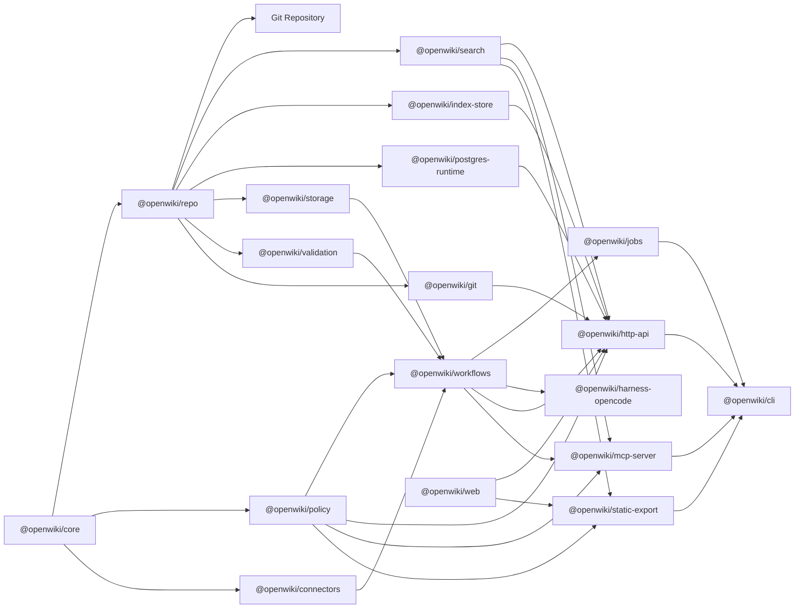

# Architecture

OpenWiki separates durable records from serving layers.

The repository is canonical. Adapters should not invent separate data contracts;
they should expose the same records, operations, and policies.
