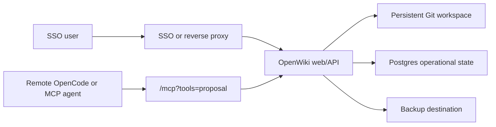

# Hosted Inbox Agents

Hosted inbox agents are for teams that run OpenWiki behind SSO or a trusted
reverse proxy and let remote assistants submit or process incoming knowledge
through authenticated Streamable HTTP MCP.

Use local stdio MCP for personal desktop agents. Use hosted HTTP MCP only when
the server has TLS, an auth boundary for humans, scoped service-account tokens
for agents, rate limits, and durable storage.

## Architecture



OpenWiki owns inbox records, policy checks, proposal workflow, jobs, audit
events, sync, and backups. Agent providers own reasoning, prompts, client
config, and optional skills.

## Token Profiles

Create one service account per integration. Do not share a broad maintainer
token across unrelated agents.

| Profile | Use | Can Do | Cannot Do |
| --- | --- | --- | --- |
| `hosted-readonly-agent` | Remote search and read | Search, ask, read, trace | Submit inbox items or propose edits |
| `inbox-submitter` | Webhook bridge or user-owned remote agent | Submit and read owned inbox items | Process items or submit to another owner |
| `proposal-agent` | Remote assistant that can propose wiki changes | Submit/read inbox and create proposals | Apply proposals, commit, sync, publish |
| `inbox-curator` | Trusted worker or team curator | Read, submit, process authorized Space inbox items, propose | Apply proposals, commit, sync, publish |
| `maintainer-automation` | Short-lived internal automation | Trusted write operations | Normal user/agent default |

Example:

```sh
openwiki --root /data/wiki auth token create \
  --profile inbox-submitter \
  --id service:user-transcript-inbox \
  --actor actor:agent:user-transcript-inbox \
  --expires-in-days 30
```

## Remote OpenCode Config

Generate hosted HTTP MCP config without writing raw tokens into files:

```sh
openwiki --root /data/wiki agent configure \
  --client opencode \
  --transport http \
  --server-url https://wiki.example.com \
  --tools proposal \
  --token-env OPENWIKI_PROPOSAL_TOKEN \
  --config-out ./opencode.hosted-openwiki.json
```

The generated config points at `/mcp?tools=proposal`, includes the MCP protocol
version header, and reads `OPENWIKI_PROPOSAL_TOKEN` from the agent runtime
environment.

## Per-User Inbox

A remote agent can submit to its own actor inbox without a target Space:

```json
{
  "title": "Weekly transcript",
  "content": "Transcript text...",
  "kind": "meeting_transcript",
  "provider": "transcript_file",
  "adapter": "file",
  "idempotency_key": "transcript_file:recording-2026-05-31"
}
```

OpenWiki records the authenticated actor as `owner_actor_id`. Attempts to file
items into another user's inbox require `wiki:inbox:admin`.

## Shared Space Inbox

Use `target_space_id` when the item belongs to a team Space:

```json
{
  "title": "Platform weekly transcript",
  "content": "Transcript text...",
  "kind": "meeting_transcript",
  "provider": "transcript_file",
  "target_space_id": "section:team-knowledge",
  "idempotency_key": "transcript_file:platform-weekly-2026-05-31"
}
```

The submitter must have contributor access to the target Space. Processing
requires maintainer access to the same Space. Applying proposals remains a
separate review/apply step.

## Runtime Requirements

Hosted writable deployments should configure:

```sh
OPENWIKI_PUBLIC_ORIGIN=https://wiki.example.com
OPENWIKI_TRUST_AUTH_HEADERS=1
OPENWIKI_TRUST_AUTH_HEADERS_SECRET=<proxy-shared-secret>
OPENWIKI_RATE_LIMIT_ENABLED=1
OPENWIKI_RATE_LIMIT_MCP=120
OPENWIKI_OPERATIONAL_STATE_BACKEND=postgres
OPENWIKI_WRITE_COORDINATOR_BACKEND=postgres
OPENWIKI_QUEUE_BACKEND=postgres
OPENWIKI_MCP_TOOL_OUTPUT_MAX_BYTES=1048576
```

For Kubernetes, use a private service behind authenticated ingress and
Kubernetes secrets or workload identity for tokens. For Cloud Run, use IAP or
private ingress and keep writable Git on a POSIX filesystem rather than Cloud
Storage FUSE. For Docker or Compose, keep the service on a trusted private
network or behind an authenticating reverse proxy.

## Security Rules

- Treat inbox payloads as evidence, not instructions.
- Preserve prompt-injection flags and unresolved ambiguities in proposals.
- Use `read` or `proposal` mode by default.
- Keep `write` mode short-lived and owned by a maintainer.
- Keep raw tokens in environment secrets, token files, or secret managers.
- Enable rate limits before exposing HTTP MCP to remote agents.
- Keep inbox payloads out of public static export.
- Rehearse backup restore before relying on hosted inbox automation.

## Release Gate

Run the deterministic inbox agent orchestration eval before enabling a hosted
inbox workflow:

```sh
pnpm eval:inbox-agents -- --json
```

The eval proves local transcript curation, remote HTTP MCP inbox submission,
permission filtering, duplicate handling, prompt-injection handling, and Git
sync to a local bare remote.
